# MÃ NGUỒN CÁC SƠ ĐỒ TRONG BÁO CÁO PERFO (MERMAID)

Tệp này gom mã Mermaid của **97 sơ đồ** trong báo cáo (Hình 2.1 đến Hình 6.1), theo đúng số hiệu và tên hình trong tài liệu. Dán từng khối vào GitHub, VS Code (Markdown Preview Mermaid), [mermaid.live](https://mermaid.live) hoặc `mmdc` để xuất ảnh `hinh/<số hiệu>.png`.

## Ghi chú

- **Công cụ:** toàn bộ dùng Mermaid. Tài liệu gốc ghi use case và sơ đồ lớp bằng PlantUML (`ma-nguon-so-do-bo-sung.md`) nhưng tệp đó không có trong gói; Mermaid không có sơ đồ use case riêng nên dùng `flowchart` (actor là hình chữ nhật, use case là hình oval, use case ngoài package tô xám, `«include»`/`«extend»` là mũi tên đứt nét).
- **Nguồn từng nhóm:** Hình 4.1–4.3, 4.26 và 4.27 lấy nguyên từ mã Mermaid có trong ghi chú của tài liệu. Hình 4.28–4.35 được cắt từ ERD đầy đủ theo mô tả từng module. Hình 4.4 sinh từ ERD cộng Bảng 4.5 (quan hệ giữa các thực thể). Hình 3.3–3.24 dựng từ Bảng 3.2 và phần mô tả ở Mục 3.2–3.3; Hình 4.5–4.25 dựng từ Bảng 4.6 và phần mô tả ở Mục 4.2.4–4.2.24. Các sơ đồ còn lại dựng từ phần văn bản mô tả; tài liệu không kèm mã gốc nên **cần đối chiếu lại với bản vẽ của bạn**.
- **Không có trong tệp này:** Hình 5.2–5.34 (ảnh chụp màn hình giao diện), Hình 6.2 (ảnh báo cáo Playwright) và Biểu đồ 6.1, 6.2 (biểu đồ số liệu, không phải sơ đồ).
- **Sơ đồ lớp:** tên lớp lấy từ Bảng 4.6, phương thức lấy từ phần mô tả Mục 4.2.4–4.2.24; tối đa 8 phương thức mỗi lớp (dòng `…rút gọn x/y phương thức…`); thực thể, DTO chỉ ghi tên. Do giới hạn Mermaid, kiểu generic lồng nhau được viết liền (ví dụ `CursorPageResultOfBookingListItemDto`), bỏ giá trị mặc định tham số và `CancellationToken`.
- **Lệch trong tài liệu gốc cần lưu ý:** `CinemaSettings` ở Hình 4.26/4.35 dùng đủ 29 cột của Bảng 4.53 (văn bản Hình 4.35 và Mục 4.3.15 ghi 28, tức 16 + 12; bảng thực tế có 17 cột cơ sở + 12 cột mở rộng = 29, nên sửa câu chữ trong Word); mã ERD gốc ở Hình 4.26 chỉ có 17 cột. Hình 6.1 dùng 364 (399 ca chạy)/49/8/2 theo Bảng 6.1.

## Nhật ký đối chiếu với báo cáo Word (bản đã fix)

Đã sửa (theo văn bản và bảng trong `bao-cao.docx`):

- **Hình 4.14, 4.15, 4.16, 4.18, 4.20, 4.25:** bổ sung hoặc sửa dòng `…rút gọn x/y phương thức…` cho khớp số liệu trong mô tả từng mục; bỏ các phương thức mà báo cáo nói là không đưa vào hình (`GetMoviesAsync`, `GetMovieDetailAsync`, `GetActiveCombosAsync`, `GetComboSuggestionsAsync`, ba phương thức `Notify…` còn lại của `IRealtimeNotifier`); `IShowtimeService` ở Hình 4.18 là 8/10 (không phải 8/15); bỏ thành viên `LoyaltyExpiryService.RecalculateAllAsync` đặt sai chỗ trong `ExpireLoyaltyPointsJob`.
- **Hình 4.48:** phản hồi là `201 Created` (trước ghi 200); `NotifySeatHeldAsync` có thêm tham số `holdUntil`.
- **Hình 4.51 (phiên bản đã cập nhật):** vẽ lại với đủ đối tượng cổng thanh toán, `PaymentsController`, `PaymentService`, `BookingService`, CSDL, kênh thời gian thực, hàng đợi thư; hai bước sổ điểm; phát sự kiện ghế đã đặt trước rồi mới xếp thư.
- **Hình 4.54 (phiên bản đã cập nhật):** thêm thu hồi điểm vào đúng dòng sổ điểm, nhánh `RefundCommitFailed`, phát `NotifySeatReleasedAsync`, gửi thư hoàn tiền.
- **Hình 5.1 và 5.35:** bỏ `vercel.json` và Vercel vì báo cáo không nhắc; chỉ còn Render Static Site `cinema-web`.
- **Hình 6.1:** ghi theo Bảng 6.1 (364 test, 399 ca chạy; E2E 8 kịch bản, 7 spec).
- **Phần Ghi chú đầu tệp:** sửa số bảng cho đúng bản Word hiện tại (Bảng 4.5, 4.6, 3.2; `CinemaSettings` là Bảng 4.53, không phải 4.75).

Đã đối chiếu và thấy khớp, không sửa: Hình 3.3 đến 3.24 (tác nhân, liên kết, include/extend, số liên kết 51), ERD Hình 4.26 đến 4.35 (số thực thể và quan hệ), Hình 4.4 so với Bảng 4.5, các máy trạng thái Hình 4.36 đến 4.40, Hình 4.47, 4.49, 4.50, 4.52, 4.53, 4.55 đến 4.58, 4.60, 4.65 đến 4.67.

Còn cần bạn kiểm tra:

- **Hình 4.16, `ICatalogService`:** báo cáo nói hình vẽ 4 phương thức thể loại và 4 phương thức diễn viên, đạo diễn; mã hiện vẽ 4 phương thức đọc danh mục công khai và 4 phương thức thể loại. Chưa có tên phương thức diễn viên, đạo diễn trong tài liệu nên chưa sửa; cần xem mã nguồn.
- **`CinemaSettings`:** bảng có 29 cột, nhưng văn bản Hình 4.35 và Mục 4.3.15 ghi 28 (16 + 12). Nên sửa chữ trong Word thành 17 + 12 = 29.
- **Hình 6.1:** báo cáo nói độ rộng tầng tỷ lệ với số test; Mermaid không chỉnh được độ rộng theo số liệu.

---

# Chương 2

## Hình 2.1. Vòng đời của một lần đặt vé

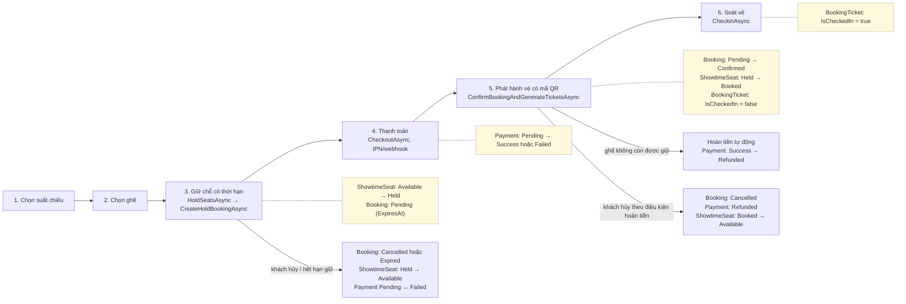
```mermaid
flowchart LR
  S1["1. Chọn suất chiếu"] --> S2["2. Chọn ghế"]
  S2 --> S3["3. Giữ chỗ có thời hạn<br/>HoldSeatsAsync → CreateHoldBookingAsync"]
  S3 --> S4["4. Thanh toán<br/>CheckoutAsync, IPN/webhook"]
  S4 --> S5["5. Phát hành vé có mã QR<br/>ConfirmBookingAndGenerateTicketsAsync"]
  S5 --> S6["6. Soát vé<br/>CheckinAsync"]
  S3 -.- T3["ShowtimeSeat: Available → Held<br/>Booking: Pending (ExpiresAt)"]
  S4 -.- T4["Payment: Pending → Success hoặc Failed"]
  S5 -.- T5["Booking: Pending → Confirmed<br/>ShowtimeSeat: Held → Booked<br/>BookingTicket: IsCheckedIn = false"]
  S6 -.- T6["BookingTicket: IsCheckedIn = true"]
  S3 -->|"khách hủy / hết hạn giữ"| X1["Booking: Cancelled hoặc Expired<br/>ShowtimeSeat: Held → Available<br/>Payment Pending → Failed"]
  S5 -->|"ghế không còn được giữ"| X2["Hoàn tiền tự động<br/>Payment: Success → Refunded"]
  S5 -->|"khách hủy theo điều kiện hoàn tiền"| X3["Booking: Cancelled<br/>Payment: Refunded<br/>ShowtimeSeat: Booked → Available"]
  classDef note fill:#fff8dc,stroke:#bbb;
  class T3,T4,T5,T6 note;
```

## Hình 2.2. Quy trình thực hiện đề tài

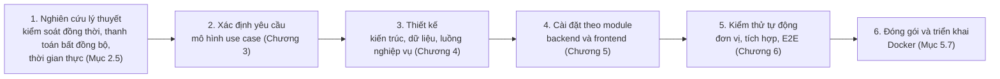
```mermaid
flowchart LR
  B1["1. Nghiên cứu lý thuyết<br/>kiểm soát đồng thời, thanh toán bất đồng bộ,<br/>thời gian thực (Mục 2.5)"]
  B2["2. Xác định yêu cầu<br/>mô hình use case (Chương 3)"]
  B3["3. Thiết kế<br/>kiến trúc, dữ liệu, luồng nghiệp vụ (Chương 4)"]
  B4["4. Cài đặt theo module<br/>backend và frontend (Chương 5)"]
  B5["5. Kiểm thử tự động<br/>đơn vị, tích hợp, E2E (Chương 6)"]
  B6["6. Đóng gói và triển khai<br/>Docker (Mục 5.7)"]
  B1 --> B2 --> B3 --> B4 --> B5 --> B6
```

## Hình 2.3. Mô hình phân tầng các project

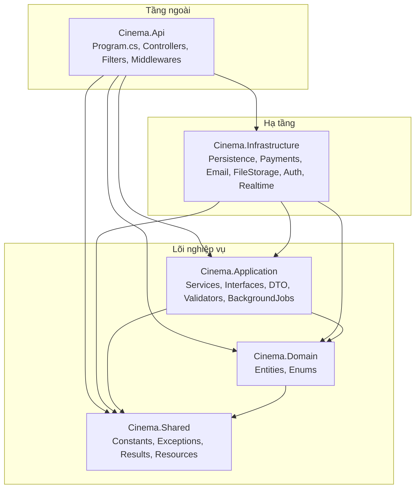
```mermaid
flowchart TB
  subgraph OUT["Tầng ngoài"]
    API["Cinema.Api<br/>Program.cs, Controllers, Filters, Middlewares"]
  end
  subgraph INFRA["Hạ tầng"]
    INF["Cinema.Infrastructure<br/>Persistence, Payments, Email, FileStorage, Auth, Realtime"]
  end
  subgraph CORE["Lõi nghiệp vụ"]
    APP["Cinema.Application<br/>Services, Interfaces, DTO, Validators, BackgroundJobs"]
    DOM["Cinema.Domain<br/>Entities, Enums"]
    SHR["Cinema.Shared<br/>Constants, Exceptions, Results, Resources"]
  end
  API --> INF
  API --> APP
  API --> DOM
  API --> SHR
  INF --> APP
  INF --> DOM
  INF --> SHR
  APP --> DOM
  APP --> SHR
  DOM --> SHR
```

---

# Chương 3

## Hình 3.1. Quan hệ giữa các tác nhân

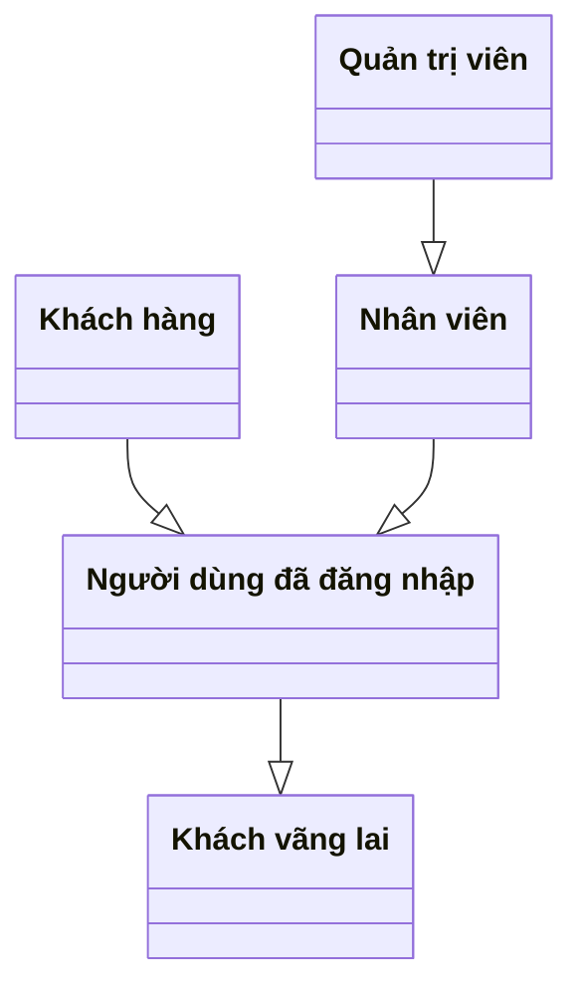
```mermaid
classDiagram
  direction BT
  class KVL["Khách vãng lai"]
  class NDN["Người dùng đã đăng nhập"]
  class KH["Khách hàng"]
  class NV["Nhân viên"]
  class QTV["Quản trị viên"]
  KVL <|-- NDN
  NDN <|-- KH
  NDN <|-- NV
  NV <|-- QTV
```

## Hình 3.2. Sơ đồ ngữ cảnh hệ thống

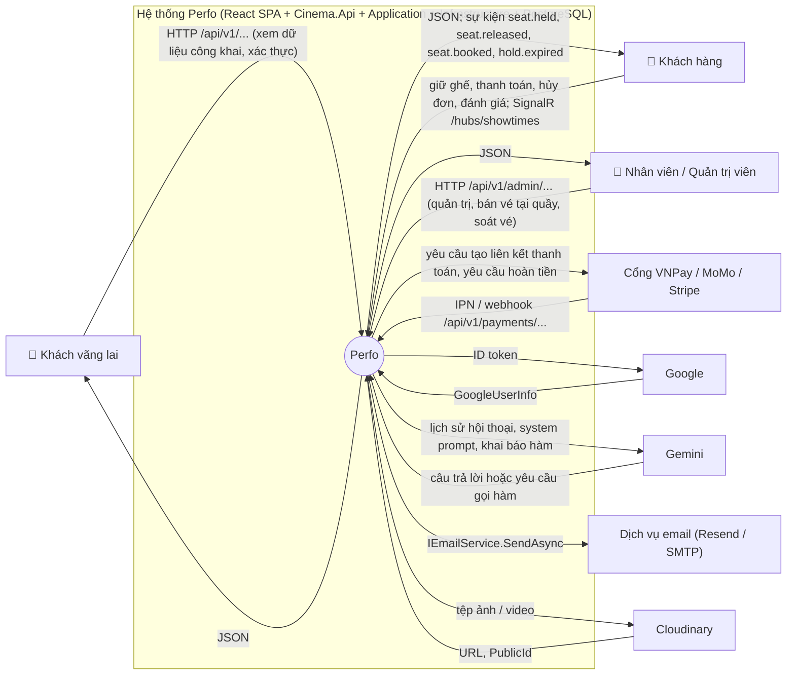
```mermaid
flowchart LR
  KVL["👤 Khách vãng lai"]
  KH["👤 Khách hàng"]
  NV["👤 Nhân viên / Quản trị viên"]
  subgraph SYS["Hệ thống Perfo (React SPA + Cinema.Api + Application + Infrastructure + PostgreSQL)"]
    CORE(("Perfo"))
  end
  PAY["Cổng VNPay / MoMo / Stripe"]
  GG["Google"]
  GEM["Gemini"]
  MAIL["Dịch vụ email (Resend / SMTP)"]
  CLD["Cloudinary"]
  KVL -->|"HTTP /api/v1/... (xem dữ liệu công khai, xác thực)"| CORE
  KH -->|"giữ ghế, thanh toán, hủy đơn, đánh giá; SignalR /hubs/showtimes"| CORE
  NV -->|"HTTP /api/v1/admin/... (quản trị, bán vé tại quầy, soát vé)"| CORE
  CORE -->|"JSON; sự kiện seat.held, seat.released, seat.booked, hold.expired"| KH
  CORE -->|"JSON"| KVL
  CORE -->|"JSON"| NV
  CORE -->|"yêu cầu tạo liên kết thanh toán, yêu cầu hoàn tiền"| PAY
  PAY -->|"IPN / webhook /api/v1/payments/..."| CORE
  CORE -->|"ID token"| GG
  GG -->|"GoogleUserInfo"| CORE
  CORE -->|"lịch sử hội thoại, system prompt, khai báo hàm"| GEM
  GEM -->|"câu trả lời hoặc yêu cầu gọi hàm"| CORE
  CORE -->|"IEmailService.SendAsync"| MAIL
  CORE -->|"tệp ảnh / video"| CLD
  CLD -->|"URL, PublicId"| CORE
```

## Hình 3.3. Sơ đồ package use case tổng quát

```mermaid
flowchart LR
  A_KVL["👤 Khách vãng lai"]:::actor
  A_NDN["👤 Người dùng đã đăng nhập"]:::actor
  A_KH["👤 Khách hàng"]:::actor
  A_NV["👤 Nhân viên"]:::actor
  A_QTV["👤 Quản trị viên"]:::actor
  A_NEN["👤 «Hệ thống»<br/>Hệ thống tác vụ nền"]:::actor
  A_VNP["👤 «Hệ thống»<br/>Cổng VNPay"]:::actor
  A_MOMO["👤 «Hệ thống»<br/>Cổng MoMo"]:::actor
  A_STR["👤 «Hệ thống»<br/>Cổng Stripe"]:::actor
  A_GG["👤 «Hệ thống»<br/>Google"]:::actor
  A_GEM["👤 «Hệ thống»<br/>Gemini"]:::actor
  A_MAIL["👤 «Hệ thống»<br/>Dịch vụ email"]:::actor
  A_CLD["👤 «Hệ thống»<br/>Cloudinary"]:::actor
  subgraph SYS["Hệ thống Perfo — 21 package use case (103 use case)"]
    direction TB
    P_XT["XT, Xác thực<br/>(11 use case)"]
    P_HS["HS, Hồ sơ cá nhân<br/>(4 use case)"]
    P_DP["DP, Duyệt phim<br/>(8 use case)"]
    P_DG["DG, Đánh giá phim<br/>(4 use case)"]
    P_DV["DV, Đặt vé trực tuyến<br/>(9 use case)"]
    P_TT["TT, Thanh toán trực tuyến<br/>(6 use case)"]
    P_AI["AI, Trợ lý AI<br/>(1 use case)"]
    P_BQ["BQ, Bán vé tại quầy<br/>(1 use case)"]
    P_SV["SV, Soát vé<br/>(1 use case)"]
    P_QB["QB, Quản lý booking<br/>(2 use case)"]
    P_QP["QP, Quản lý phim<br/>(5 use case)"]
    P_QD["QD, Quản lý danh mục<br/>(10 use case)"]
    P_QR["QR, Quản lý phòng chiếu<br/>(3 use case)"]
    P_QS["QS, Quản lý suất chiếu<br/>(9 use case)"]
    P_QN["QN, Quản lý người dùng<br/>(7 use case)"]
    P_QV["QV, Quản lý đánh giá<br/>(3 use case)"]
    P_QT["QT, Quản lý thanh toán<br/>(2 use case)"]
    P_BC["BC, Báo cáo thống kê<br/>(5 use case)"]
    P_CH["CH, Cấu hình rạp<br/>(2 use case)"]
    P_TP["TP, Tải tệp<br/>(2 use case)"]
    P_HT["HT, Vận hành hệ thống<br/>(8 use case)"]
  end
  A_KVL --- P_XT
  A_KVL --- P_DP
  A_KVL --- P_DV
  A_KVL --- P_AI
  A_KVL --- P_HT
  A_NDN --- P_XT
  A_NDN --- P_HS
  A_KH --- P_DG
  A_KH --- P_DV
  A_KH --- P_TT
  A_KH --- P_AI
  A_NV --- P_XT
  A_NV --- P_BQ
  A_NV --- P_SV
  A_NV --- P_QB
  A_NV --- P_QP
  A_NV --- P_QS
  A_NV --- P_QN
  A_QTV --- P_XT
  A_QTV --- P_BQ
  A_QTV --- P_SV
  A_QTV --- P_QB
  A_QTV --- P_QP
  A_QTV --- P_QD
  A_QTV --- P_QR
  A_QTV --- P_QS
  A_QTV --- P_QN
  A_QTV --- P_QV
  A_QTV --- P_QT
  A_QTV --- P_BC
  A_QTV --- P_CH
  A_QTV --- P_TP
  A_QTV --- P_HT
  A_NEN --- P_TT
  A_NEN --- P_HT
  A_VNP --- P_TT
  A_VNP --- P_HT
  A_MOMO --- P_TT
  A_MOMO --- P_HT
  A_STR --- P_TT
  A_STR --- P_HT
  A_GG --- P_XT
  A_GEM --- P_AI
  A_MAIL --- P_XT
  A_MAIL --- P_TT
  A_MAIL --- P_QS
  A_MAIL --- P_HT
  A_CLD --- P_QP
  A_CLD --- P_QD
  A_CLD --- P_CH
  A_CLD --- P_TP
  classDef actor fill:#fff,stroke:#333;
```

## Hình 3.4. Sơ đồ use case package Xác thực

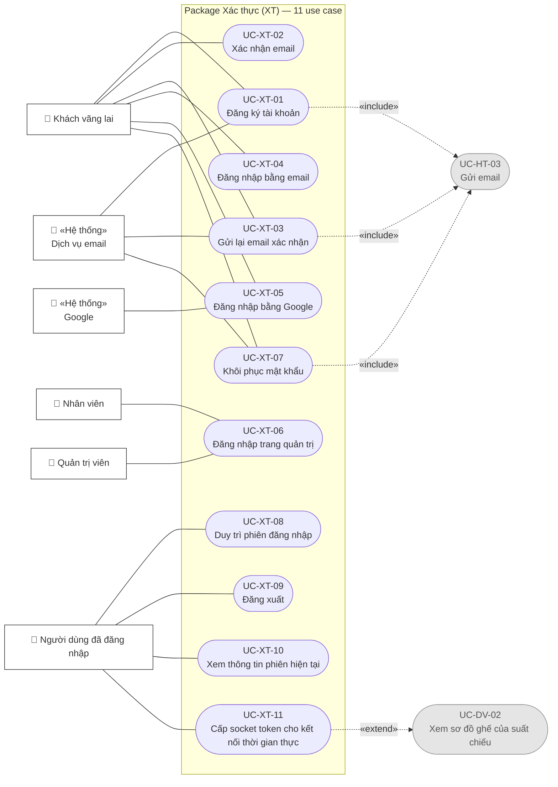
```mermaid
flowchart LR
  A_KVL["👤 Khách vãng lai"]:::actor
  A_NDN["👤 Người dùng đã đăng nhập"]:::actor
  A_NV["👤 Nhân viên"]:::actor
  A_QTV["👤 Quản trị viên"]:::actor
  A_GG["👤 «Hệ thống»<br/>Google"]:::actor
  A_MAIL["👤 «Hệ thống»<br/>Dịch vụ email"]:::actor
  subgraph PK["Package Xác thực (XT) — 11 use case"]
    direction TB
    UC_XT_01(["UC-XT-01<br/>Đăng ký tài khoản"])
    UC_XT_02(["UC-XT-02<br/>Xác nhận email"])
    UC_XT_03(["UC-XT-03<br/>Gửi lại email xác nhận"])
    UC_XT_04(["UC-XT-04<br/>Đăng nhập bằng email"])
    UC_XT_05(["UC-XT-05<br/>Đăng nhập bằng Google"])
    UC_XT_06(["UC-XT-06<br/>Đăng nhập trang quản trị"])
    UC_XT_07(["UC-XT-07<br/>Khôi phục mật khẩu"])
    UC_XT_08(["UC-XT-08<br/>Duy trì phiên đăng nhập"])
    UC_XT_09(["UC-XT-09<br/>Đăng xuất"])
    UC_XT_10(["UC-XT-10<br/>Xem thông tin phiên hiện tại"])
    UC_XT_11(["UC-XT-11<br/>Cấp socket token cho kết nối thời gian thực"])
  end
  UC_HT_03(["UC-HT-03<br/>Gửi email"]):::ext
  UC_DV_02(["UC-DV-02<br/>Xem sơ đồ ghế của suất chiếu"]):::ext
  A_KVL --- UC_XT_01
  A_KVL --- UC_XT_02
  A_KVL --- UC_XT_03
  A_KVL --- UC_XT_04
  A_KVL --- UC_XT_05
  A_KVL --- UC_XT_07
  A_NDN --- UC_XT_08
  A_NDN --- UC_XT_09
  A_NDN --- UC_XT_10
  A_NDN --- UC_XT_11
  A_NV --- UC_XT_06
  A_QTV --- UC_XT_06
  A_GG --- UC_XT_05
  A_MAIL --- UC_XT_01
  A_MAIL --- UC_XT_03
  A_MAIL --- UC_XT_07
  UC_XT_01 -.->|«include»| UC_HT_03
  UC_XT_03 -.->|«include»| UC_HT_03
  UC_XT_07 -.->|«include»| UC_HT_03
  UC_XT_11 -.->|«extend»| UC_DV_02
  classDef actor fill:#fff,stroke:#333;
  classDef ext fill:#e5e5e5,stroke:#999,color:#555;
```

## Hình 3.5. Sơ đồ use case package Hồ sơ cá nhân

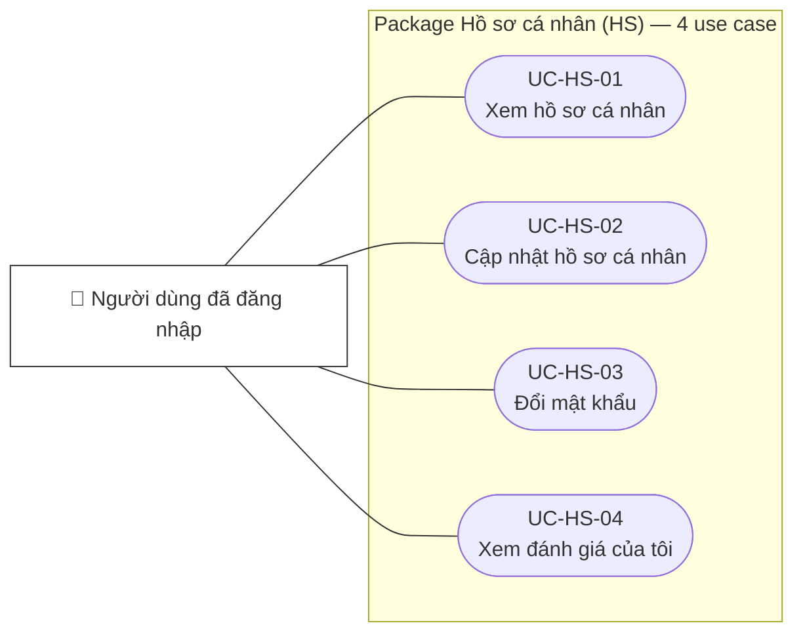
```mermaid
flowchart LR
  A_NDN["👤 Người dùng đã đăng nhập"]:::actor
  subgraph PK["Package Hồ sơ cá nhân (HS) — 4 use case"]
    direction TB
    UC_HS_01(["UC-HS-01<br/>Xem hồ sơ cá nhân"])
    UC_HS_02(["UC-HS-02<br/>Cập nhật hồ sơ cá nhân"])
    UC_HS_03(["UC-HS-03<br/>Đổi mật khẩu"])
    UC_HS_04(["UC-HS-04<br/>Xem đánh giá của tôi"])
  end
  A_NDN --- UC_HS_01
  A_NDN --- UC_HS_02
  A_NDN --- UC_HS_03
  A_NDN --- UC_HS_04
  classDef actor fill:#fff,stroke:#333;
  classDef ext fill:#e5e5e5,stroke:#999,color:#555;
```

## Hình 3.6. Sơ đồ use case package Duyệt phim

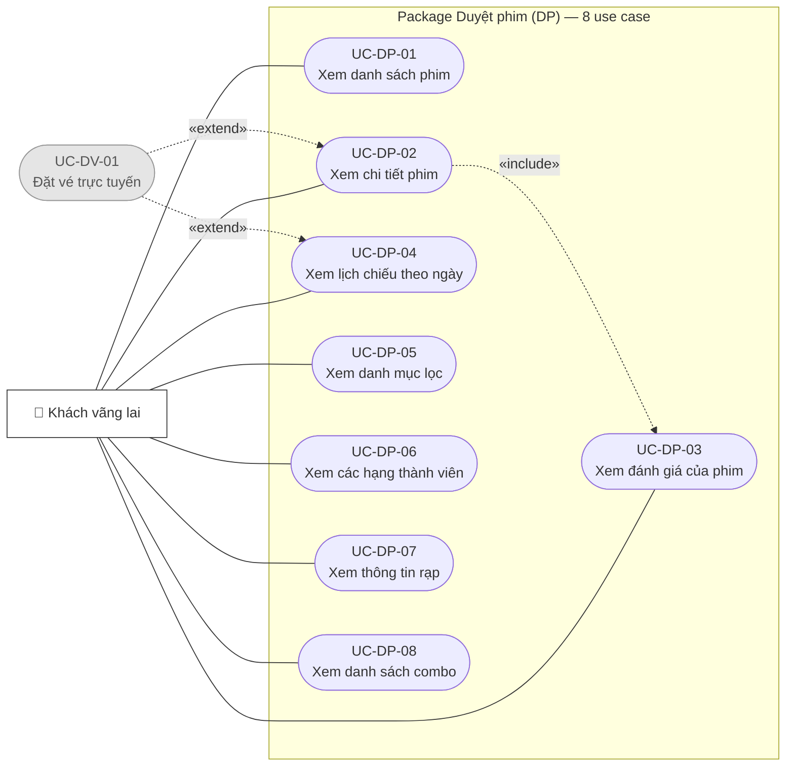
```mermaid
flowchart LR
  A_KVL["👤 Khách vãng lai"]:::actor
  subgraph PK["Package Duyệt phim (DP) — 8 use case"]
    direction TB
    UC_DP_01(["UC-DP-01<br/>Xem danh sách phim"])
    UC_DP_02(["UC-DP-02<br/>Xem chi tiết phim"])
    UC_DP_03(["UC-DP-03<br/>Xem đánh giá của phim"])
    UC_DP_04(["UC-DP-04<br/>Xem lịch chiếu theo ngày"])
    UC_DP_05(["UC-DP-05<br/>Xem danh mục lọc"])
    UC_DP_06(["UC-DP-06<br/>Xem các hạng thành viên"])
    UC_DP_07(["UC-DP-07<br/>Xem thông tin rạp"])
    UC_DP_08(["UC-DP-08<br/>Xem danh sách combo"])
  end
  UC_DV_01(["UC-DV-01<br/>Đặt vé trực tuyến"]):::ext
  A_KVL --- UC_DP_01
  A_KVL --- UC_DP_02
  A_KVL --- UC_DP_03
  A_KVL --- UC_DP_04
  A_KVL --- UC_DP_05
  A_KVL --- UC_DP_06
  A_KVL --- UC_DP_07
  A_KVL --- UC_DP_08
  UC_DP_02 -.->|«include»| UC_DP_03
  UC_DV_01 -.->|«extend»| UC_DP_02
  UC_DV_01 -.->|«extend»| UC_DP_04
  classDef actor fill:#fff,stroke:#333;
  classDef ext fill:#e5e5e5,stroke:#999,color:#555;
```

## Hình 3.7. Sơ đồ use case package Đánh giá phim

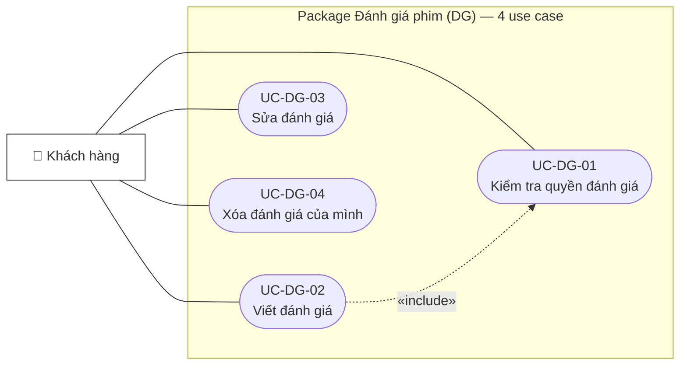
```mermaid
flowchart LR
  A_KH["👤 Khách hàng"]:::actor
  subgraph PK["Package Đánh giá phim (DG) — 4 use case"]
    direction TB
    UC_DG_01(["UC-DG-01<br/>Kiểm tra quyền đánh giá"])
    UC_DG_02(["UC-DG-02<br/>Viết đánh giá"])
    UC_DG_03(["UC-DG-03<br/>Sửa đánh giá"])
    UC_DG_04(["UC-DG-04<br/>Xóa đánh giá của mình"])
  end
  A_KH --- UC_DG_01
  A_KH --- UC_DG_02
  A_KH --- UC_DG_03
  A_KH --- UC_DG_04
  UC_DG_02 -.->|«include»| UC_DG_01
  classDef actor fill:#fff,stroke:#333;
  classDef ext fill:#e5e5e5,stroke:#999,color:#555;
```

## Hình 3.8. Sơ đồ use case package Đặt vé trực tuyến

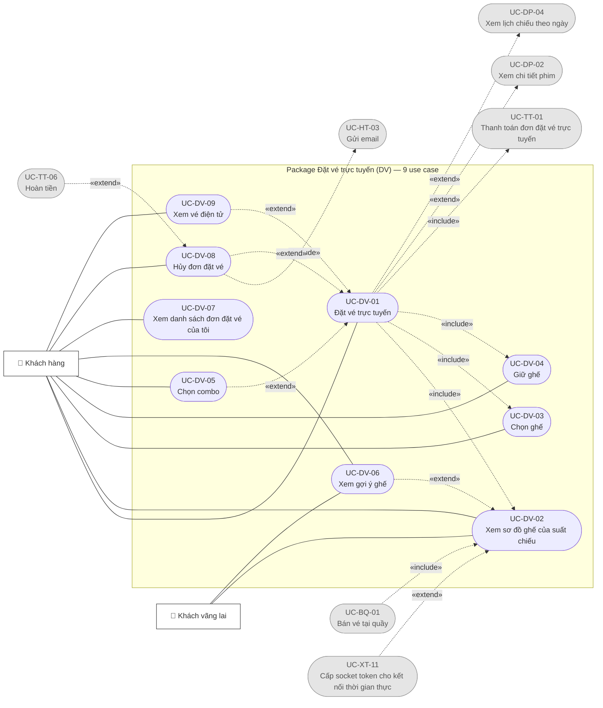
```mermaid
flowchart LR
  A_KVL["👤 Khách vãng lai"]:::actor
  A_KH["👤 Khách hàng"]:::actor
  subgraph PK["Package Đặt vé trực tuyến (DV) — 9 use case"]
    direction TB
    UC_DV_01(["UC-DV-01<br/>Đặt vé trực tuyến"])
    UC_DV_02(["UC-DV-02<br/>Xem sơ đồ ghế của suất chiếu"])
    UC_DV_03(["UC-DV-03<br/>Chọn ghế"])
    UC_DV_04(["UC-DV-04<br/>Giữ ghế"])
    UC_DV_05(["UC-DV-05<br/>Chọn combo"])
    UC_DV_06(["UC-DV-06<br/>Xem gợi ý ghế"])
    UC_DV_07(["UC-DV-07<br/>Xem danh sách đơn đặt vé của tôi"])
    UC_DV_08(["UC-DV-08<br/>Hủy đơn đặt vé"])
    UC_DV_09(["UC-DV-09<br/>Xem vé điện tử"])
  end
  UC_TT_01(["UC-TT-01<br/>Thanh toán đơn đặt vé trực tuyến"]):::ext
  UC_HT_03(["UC-HT-03<br/>Gửi email"]):::ext
  UC_BQ_01(["UC-BQ-01<br/>Bán vé tại quầy"]):::ext
  UC_DP_02(["UC-DP-02<br/>Xem chi tiết phim"]):::ext
  UC_DP_04(["UC-DP-04<br/>Xem lịch chiếu theo ngày"]):::ext
  UC_XT_11(["UC-XT-11<br/>Cấp socket token cho kết nối thời gian thực"]):::ext
  UC_TT_06(["UC-TT-06<br/>Hoàn tiền"]):::ext
  A_KVL --- UC_DV_02
  A_KVL --- UC_DV_06
  A_KH --- UC_DV_01
  A_KH --- UC_DV_02
  A_KH --- UC_DV_03
  A_KH --- UC_DV_04
  A_KH --- UC_DV_05
  A_KH --- UC_DV_06
  A_KH --- UC_DV_07
  A_KH --- UC_DV_08
  A_KH --- UC_DV_09
  UC_DV_01 -.->|«include»| UC_DV_02
  UC_DV_01 -.->|«include»| UC_DV_03
  UC_DV_01 -.->|«include»| UC_DV_04
  UC_DV_01 -.->|«include»| UC_TT_01
  UC_DV_08 -.->|«include»| UC_HT_03
  UC_BQ_01 -.->|«include»| UC_DV_02
  UC_DV_01 -.->|«extend»| UC_DP_02
  UC_DV_01 -.->|«extend»| UC_DP_04
  UC_DV_05 -.->|«extend»| UC_DV_01
  UC_DV_08 -.->|«extend»| UC_DV_01
  UC_DV_09 -.->|«extend»| UC_DV_01
  UC_XT_11 -.->|«extend»| UC_DV_02
  UC_DV_06 -.->|«extend»| UC_DV_02
  UC_TT_06 -.->|«extend»| UC_DV_08
  classDef actor fill:#fff,stroke:#333;
  classDef ext fill:#e5e5e5,stroke:#999,color:#555;
```

## Hình 3.9. Sơ đồ use case package Thanh toán trực tuyến

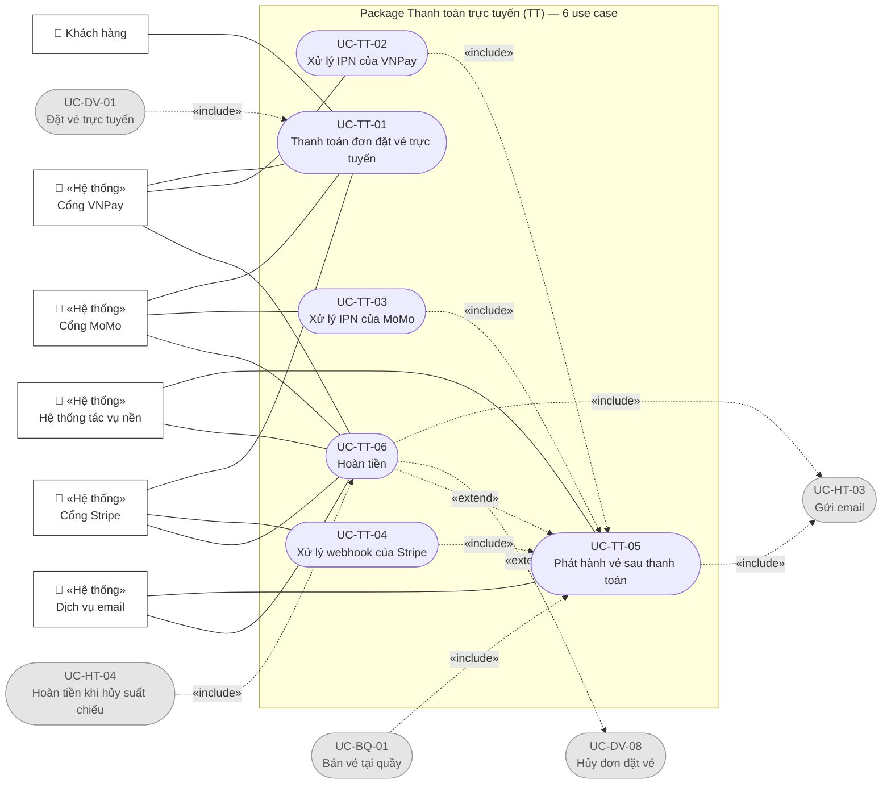
```mermaid
flowchart LR
  A_KH["👤 Khách hàng"]:::actor
  A_NEN["👤 «Hệ thống»<br/>Hệ thống tác vụ nền"]:::actor
  A_VNP["👤 «Hệ thống»<br/>Cổng VNPay"]:::actor
  A_MOMO["👤 «Hệ thống»<br/>Cổng MoMo"]:::actor
  A_STR["👤 «Hệ thống»<br/>Cổng Stripe"]:::actor
  A_MAIL["👤 «Hệ thống»<br/>Dịch vụ email"]:::actor
  subgraph PK["Package Thanh toán trực tuyến (TT) — 6 use case"]
    direction TB
    UC_TT_01(["UC-TT-01<br/>Thanh toán đơn đặt vé trực tuyến"])
    UC_TT_02(["UC-TT-02<br/>Xử lý IPN của VNPay"])
    UC_TT_03(["UC-TT-03<br/>Xử lý IPN của MoMo"])
    UC_TT_04(["UC-TT-04<br/>Xử lý webhook của Stripe"])
    UC_TT_05(["UC-TT-05<br/>Phát hành vé sau thanh toán"])
    UC_TT_06(["UC-TT-06<br/>Hoàn tiền"])
  end
  UC_DV_01(["UC-DV-01<br/>Đặt vé trực tuyến"]):::ext
  UC_HT_03(["UC-HT-03<br/>Gửi email"]):::ext
  UC_BQ_01(["UC-BQ-01<br/>Bán vé tại quầy"]):::ext
  UC_HT_04(["UC-HT-04<br/>Hoàn tiền khi hủy suất chiếu"]):::ext
  UC_DV_08(["UC-DV-08<br/>Hủy đơn đặt vé"]):::ext
  A_KH --- UC_TT_01
  A_NEN --- UC_TT_05
  A_NEN --- UC_TT_06
  A_VNP --- UC_TT_01
  A_VNP --- UC_TT_02
  A_VNP --- UC_TT_06
  A_MOMO --- UC_TT_01
  A_MOMO --- UC_TT_03
  A_MOMO --- UC_TT_06
  A_STR --- UC_TT_01
  A_STR --- UC_TT_04
  A_STR --- UC_TT_06
  A_MAIL --- UC_TT_05
  A_MAIL --- UC_TT_06
  UC_DV_01 -.->|«include»| UC_TT_01
  UC_TT_02 -.->|«include»| UC_TT_05
  UC_TT_03 -.->|«include»| UC_TT_05
  UC_TT_04 -.->|«include»| UC_TT_05
  UC_TT_05 -.->|«include»| UC_HT_03
  UC_TT_06 -.->|«include»| UC_HT_03
  UC_BQ_01 -.->|«include»| UC_TT_05
  UC_HT_04 -.->|«include»| UC_TT_06
  UC_TT_06 -.->|«extend»| UC_DV_08
  UC_TT_06 -.->|«extend»| UC_TT_05
  classDef actor fill:#fff,stroke:#333;
  classDef ext fill:#e5e5e5,stroke:#999,color:#555;
```

## Hình 3.10. Sơ đồ use case package Trợ lý AI

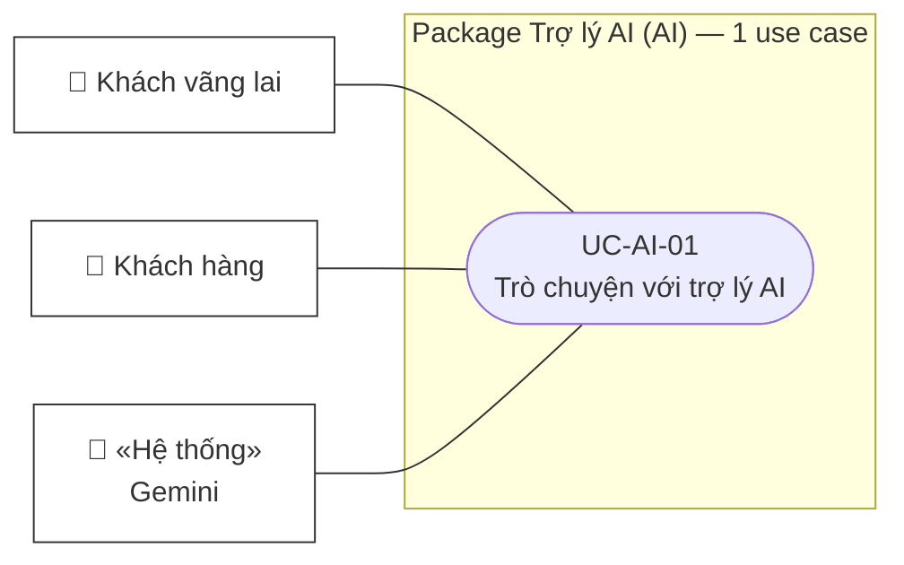
```mermaid
flowchart LR
  A_KVL["👤 Khách vãng lai"]:::actor
  A_KH["👤 Khách hàng"]:::actor
  A_GEM["👤 «Hệ thống»<br/>Gemini"]:::actor
  subgraph PK["Package Trợ lý AI (AI) — 1 use case"]
    direction TB
    UC_AI_01(["UC-AI-01<br/>Trò chuyện với trợ lý AI"])
  end
  A_KVL --- UC_AI_01
  A_KH --- UC_AI_01
  A_GEM --- UC_AI_01
  classDef actor fill:#fff,stroke:#333;
  classDef ext fill:#e5e5e5,stroke:#999,color:#555;
```

## Hình 3.11. Sơ đồ use case package Bán vé tại quầy

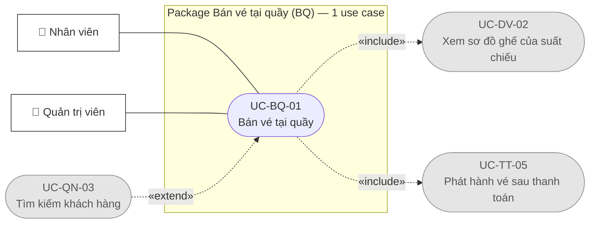
```mermaid
flowchart LR
  A_NV["👤 Nhân viên"]:::actor
  A_QTV["👤 Quản trị viên"]:::actor
  subgraph PK["Package Bán vé tại quầy (BQ) — 1 use case"]
    direction TB
    UC_BQ_01(["UC-BQ-01<br/>Bán vé tại quầy"])
  end
  UC_DV_02(["UC-DV-02<br/>Xem sơ đồ ghế của suất chiếu"]):::ext
  UC_TT_05(["UC-TT-05<br/>Phát hành vé sau thanh toán"]):::ext
  UC_QN_03(["UC-QN-03<br/>Tìm kiếm khách hàng"]):::ext
  A_NV --- UC_BQ_01
  A_QTV --- UC_BQ_01
  UC_BQ_01 -.->|«include»| UC_DV_02
  UC_BQ_01 -.->|«include»| UC_TT_05
  UC_QN_03 -.->|«extend»| UC_BQ_01
  classDef actor fill:#fff,stroke:#333;
  classDef ext fill:#e5e5e5,stroke:#999,color:#555;
```

## Hình 3.12. Sơ đồ use case package Soát vé

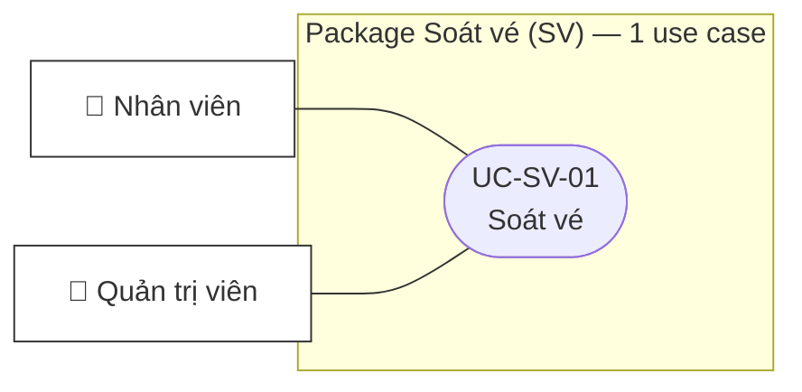
```mermaid
flowchart LR
  A_NV["👤 Nhân viên"]:::actor
  A_QTV["👤 Quản trị viên"]:::actor
  subgraph PK["Package Soát vé (SV) — 1 use case"]
    direction TB
    UC_SV_01(["UC-SV-01<br/>Soát vé"])
  end
  A_NV --- UC_SV_01
  A_QTV --- UC_SV_01
  classDef actor fill:#fff,stroke:#333;
  classDef ext fill:#e5e5e5,stroke:#999,color:#555;
```

## Hình 3.13. Sơ đồ use case package Quản lý booking

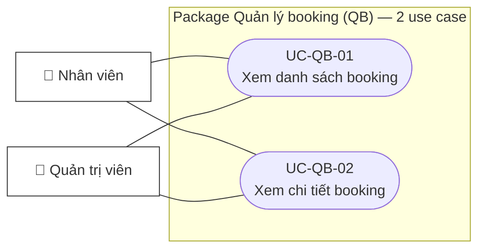
```mermaid
flowchart LR
  A_NV["👤 Nhân viên"]:::actor
  A_QTV["👤 Quản trị viên"]:::actor
  subgraph PK["Package Quản lý booking (QB) — 2 use case"]
    direction TB
    UC_QB_01(["UC-QB-01<br/>Xem danh sách booking"])
    UC_QB_02(["UC-QB-02<br/>Xem chi tiết booking"])
  end
  A_NV --- UC_QB_01
  A_NV --- UC_QB_02
  A_QTV --- UC_QB_01
  A_QTV --- UC_QB_02
  classDef actor fill:#fff,stroke:#333;
  classDef ext fill:#e5e5e5,stroke:#999,color:#555;
```

## Hình 3.14. Sơ đồ use case package Quản lý phim

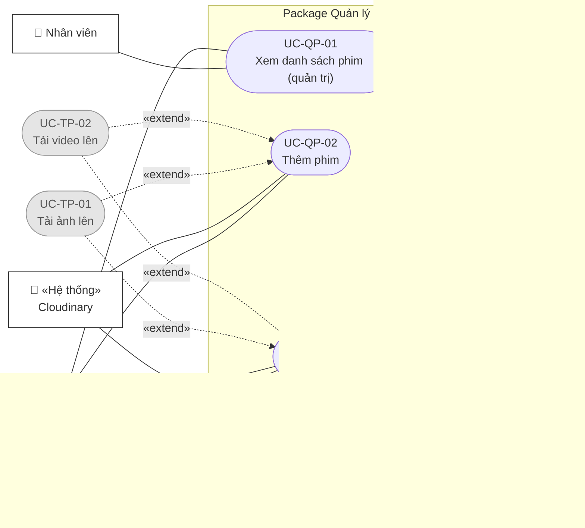
```mermaid
flowchart LR
  A_NV["👤 Nhân viên"]:::actor
  A_QTV["👤 Quản trị viên"]:::actor
  A_CLD["👤 «Hệ thống»<br/>Cloudinary"]:::actor
  subgraph PK["Package Quản lý phim (QP) — 5 use case"]
    direction TB
    UC_QP_01(["UC-QP-01<br/>Xem danh sách phim (quản trị)"])
    UC_QP_02(["UC-QP-02<br/>Thêm phim"])
    UC_QP_03(["UC-QP-03<br/>Sửa phim"])
    UC_QP_04(["UC-QP-04<br/>Xóa phim"])
    UC_QP_05(["UC-QP-05<br/>Xóa nhiều phim"])
  end
  UC_TP_01(["UC-TP-01<br/>Tải ảnh lên"]):::ext
  UC_TP_02(["UC-TP-02<br/>Tải video lên"]):::ext
  A_NV --- UC_QP_01
  A_QTV --- UC_QP_01
  A_QTV --- UC_QP_02
  A_QTV --- UC_QP_03
  A_QTV --- UC_QP_04
  A_QTV --- UC_QP_05
  A_CLD --- UC_QP_02
  A_CLD --- UC_QP_03
  UC_QP_05 -.->|«include»| UC_QP_04
  UC_TP_01 -.->|«extend»| UC_QP_02
  UC_TP_01 -.->|«extend»| UC_QP_03
  UC_TP_02 -.->|«extend»| UC_QP_02
  UC_TP_02 -.->|«extend»| UC_QP_03
  classDef actor fill:#fff,stroke:#333;
  classDef ext fill:#e5e5e5,stroke:#999,color:#555;
```

## Hình 3.15. Sơ đồ use case package Quản lý danh mục

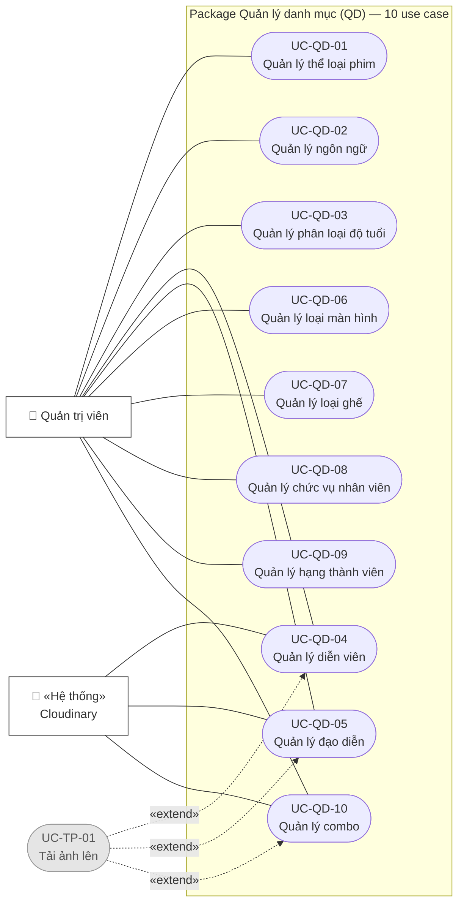
```mermaid
flowchart LR
  A_QTV["👤 Quản trị viên"]:::actor
  A_CLD["👤 «Hệ thống»<br/>Cloudinary"]:::actor
  subgraph PK["Package Quản lý danh mục (QD) — 10 use case"]
    direction TB
    UC_QD_01(["UC-QD-01<br/>Quản lý thể loại phim"])
    UC_QD_02(["UC-QD-02<br/>Quản lý ngôn ngữ"])
    UC_QD_03(["UC-QD-03<br/>Quản lý phân loại độ tuổi"])
    UC_QD_04(["UC-QD-04<br/>Quản lý diễn viên"])
    UC_QD_05(["UC-QD-05<br/>Quản lý đạo diễn"])
    UC_QD_06(["UC-QD-06<br/>Quản lý loại màn hình"])
    UC_QD_07(["UC-QD-07<br/>Quản lý loại ghế"])
    UC_QD_08(["UC-QD-08<br/>Quản lý chức vụ nhân viên"])
    UC_QD_09(["UC-QD-09<br/>Quản lý hạng thành viên"])
    UC_QD_10(["UC-QD-10<br/>Quản lý combo"])
  end
  UC_TP_01(["UC-TP-01<br/>Tải ảnh lên"]):::ext
  A_QTV --- UC_QD_01
  A_QTV --- UC_QD_02
  A_QTV --- UC_QD_03
  A_QTV --- UC_QD_04
  A_QTV --- UC_QD_05
  A_QTV --- UC_QD_06
  A_QTV --- UC_QD_07
  A_QTV --- UC_QD_08
  A_QTV --- UC_QD_09
  A_QTV --- UC_QD_10
  A_CLD --- UC_QD_04
  A_CLD --- UC_QD_05
  A_CLD --- UC_QD_10
  UC_TP_01 -.->|«extend»| UC_QD_04
  UC_TP_01 -.->|«extend»| UC_QD_05
  UC_TP_01 -.->|«extend»| UC_QD_10
  classDef actor fill:#fff,stroke:#333;
  classDef ext fill:#e5e5e5,stroke:#999,color:#555;
```

## Hình 3.16. Sơ đồ use case package Quản lý phòng chiếu

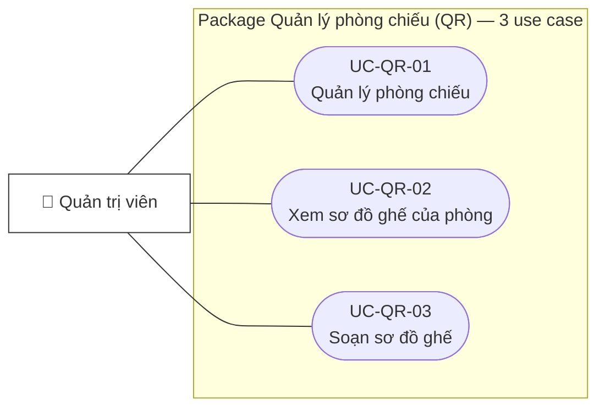
```mermaid
flowchart LR
  A_QTV["👤 Quản trị viên"]:::actor
  subgraph PK["Package Quản lý phòng chiếu (QR) — 3 use case"]
    direction TB
    UC_QR_01(["UC-QR-01<br/>Quản lý phòng chiếu"])
    UC_QR_02(["UC-QR-02<br/>Xem sơ đồ ghế của phòng"])
    UC_QR_03(["UC-QR-03<br/>Soạn sơ đồ ghế"])
  end
  A_QTV --- UC_QR_01
  A_QTV --- UC_QR_02
  A_QTV --- UC_QR_03
  classDef actor fill:#fff,stroke:#333;
  classDef ext fill:#e5e5e5,stroke:#999,color:#555;
```

## Hình 3.17. Sơ đồ use case package Quản lý suất chiếu

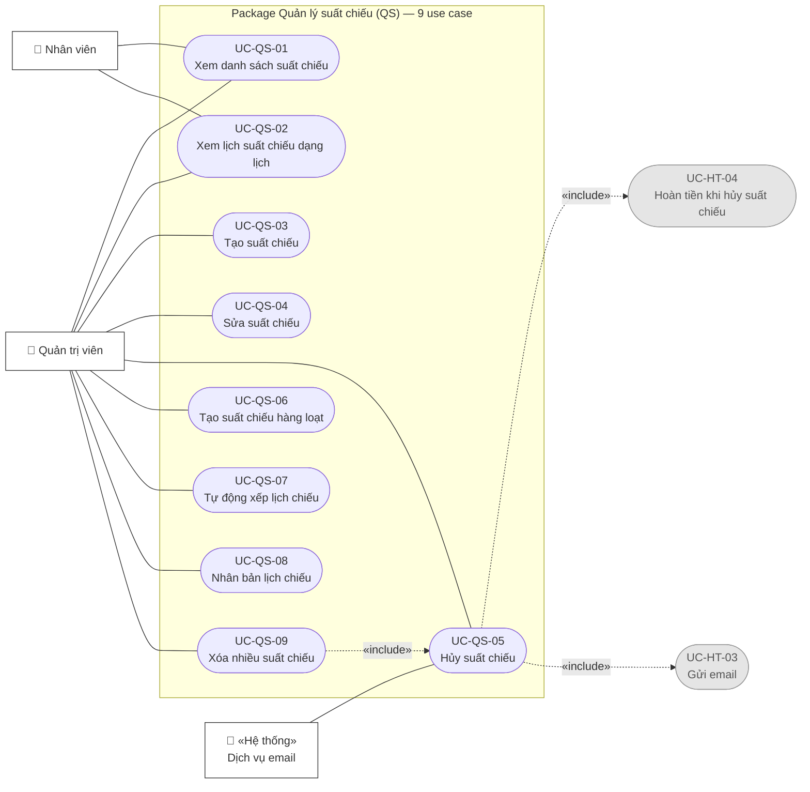
```mermaid
flowchart LR
  A_NV["👤 Nhân viên"]:::actor
  A_QTV["👤 Quản trị viên"]:::actor
  A_MAIL["👤 «Hệ thống»<br/>Dịch vụ email"]:::actor
  subgraph PK["Package Quản lý suất chiếu (QS) — 9 use case"]
    direction TB
    UC_QS_01(["UC-QS-01<br/>Xem danh sách suất chiếu"])
    UC_QS_02(["UC-QS-02<br/>Xem lịch suất chiếu dạng lịch"])
    UC_QS_03(["UC-QS-03<br/>Tạo suất chiếu"])
    UC_QS_04(["UC-QS-04<br/>Sửa suất chiếu"])
    UC_QS_05(["UC-QS-05<br/>Hủy suất chiếu"])
    UC_QS_06(["UC-QS-06<br/>Tạo suất chiếu hàng loạt"])
    UC_QS_07(["UC-QS-07<br/>Tự động xếp lịch chiếu"])
    UC_QS_08(["UC-QS-08<br/>Nhân bản lịch chiếu"])
    UC_QS_09(["UC-QS-09<br/>Xóa nhiều suất chiếu"])
  end
  UC_HT_04(["UC-HT-04<br/>Hoàn tiền khi hủy suất chiếu"]):::ext
  UC_HT_03(["UC-HT-03<br/>Gửi email"]):::ext
  A_NV --- UC_QS_01
  A_NV --- UC_QS_02
  A_QTV --- UC_QS_01
  A_QTV --- UC_QS_02
  A_QTV --- UC_QS_03
  A_QTV --- UC_QS_04
  A_QTV --- UC_QS_05
  A_QTV --- UC_QS_06
  A_QTV --- UC_QS_07
  A_QTV --- UC_QS_08
  A_QTV --- UC_QS_09
  A_MAIL --- UC_QS_05
  UC_QS_05 -.->|«include»| UC_HT_04
  UC_QS_05 -.->|«include»| UC_HT_03
  UC_QS_09 -.->|«include»| UC_QS_05
  classDef actor fill:#fff,stroke:#333;
  classDef ext fill:#e5e5e5,stroke:#999,color:#555;
```

## Hình 3.18. Sơ đồ use case package Quản lý người dùng

```mermaid
flowchart LR
  A_NV["👤 Nhân viên"]:::actor
  A_QTV["👤 Quản trị viên"]:::actor
  subgraph PK["Package Quản lý người dùng (QN) — 7 use case"]
    direction TB
    UC_QN_01(["UC-QN-01<br/>Xem danh sách người dùng"])
    UC_QN_02(["UC-QN-02<br/>Xem danh sách tài khoản quản trị"])
    UC_QN_03(["UC-QN-03<br/>Tìm kiếm khách hàng"])
    UC_QN_04(["UC-QN-04<br/>Khóa hoặc mở khóa tài khoản"])
    UC_QN_05(["UC-QN-05<br/>Đổi vai trò tài khoản"])
    UC_QN_06(["UC-QN-06<br/>Cập nhật trạng thái nhiều tài khoản"])
    UC_QN_07(["UC-QN-07<br/>Quản lý nhân viên"])
  end
  UC_BQ_01(["UC-BQ-01<br/>Bán vé tại quầy"]):::ext
  A_NV --- UC_QN_03
  A_QTV --- UC_QN_01
  A_QTV --- UC_QN_02
  A_QTV --- UC_QN_03
  A_QTV --- UC_QN_04
  A_QTV --- UC_QN_05
  A_QTV --- UC_QN_06
  A_QTV --- UC_QN_07
  UC_QN_03 -.->|«extend»| UC_BQ_01
  classDef actor fill:#fff,stroke:#333;
  classDef ext fill:#e5e5e5,stroke:#999,color:#555;
```

## Hình 3.19. Sơ đồ use case package Quản lý đánh giá

```mermaid
flowchart LR
  A_QTV["👤 Quản trị viên"]:::actor
  subgraph PK["Package Quản lý đánh giá (QV) — 3 use case"]
    direction TB
    UC_QV_01(["UC-QV-01<br/>Xem danh sách đánh giá"])
    UC_QV_02(["UC-QV-02<br/>Xóa đánh giá"])
    UC_QV_03(["UC-QV-03<br/>Xóa nhiều đánh giá"])
  end
  A_QTV --- UC_QV_01
  A_QTV --- UC_QV_02
  A_QTV --- UC_QV_03
  classDef actor fill:#fff,stroke:#333;
  classDef ext fill:#e5e5e5,stroke:#999,color:#555;
```

## Hình 3.20. Sơ đồ use case package Quản lý thanh toán

```mermaid
flowchart LR
  A_QTV["👤 Quản trị viên"]:::actor
  subgraph PK["Package Quản lý thanh toán (QT) — 2 use case"]
    direction TB
    UC_QT_01(["UC-QT-01<br/>Xem danh sách thanh toán"])
    UC_QT_02(["UC-QT-02<br/>Xem chi tiết thanh toán"])
  end
  A_QTV --- UC_QT_01
  A_QTV --- UC_QT_02
  classDef actor fill:#fff,stroke:#333;
  classDef ext fill:#e5e5e5,stroke:#999,color:#555;
```

## Hình 3.21. Sơ đồ use case package Báo cáo thống kê

```mermaid
flowchart LR
  A_QTV["👤 Quản trị viên"]:::actor
  subgraph PK["Package Báo cáo thống kê (BC) — 5 use case"]
    direction TB
    UC_BC_01(["UC-BC-01<br/>Xem tổng quan dashboard"])
    UC_BC_02(["UC-BC-02<br/>Xem nhận định (insights)"])
    UC_BC_03(["UC-BC-03<br/>Xem báo cáo doanh thu"])
    UC_BC_04(["UC-BC-04<br/>Xem báo cáo phim bán chạy"])
    UC_BC_05(["UC-BC-05<br/>Xem báo cáo hiệu suất nhân viên"])
  end
  A_QTV --- UC_BC_01
  A_QTV --- UC_BC_02
  A_QTV --- UC_BC_03
  A_QTV --- UC_BC_04
  A_QTV --- UC_BC_05
  classDef actor fill:#fff,stroke:#333;
  classDef ext fill:#e5e5e5,stroke:#999,color:#555;
```

## Hình 3.22. Sơ đồ use case package Cấu hình rạp

```mermaid
flowchart LR
  A_QTV["👤 Quản trị viên"]:::actor
  A_CLD["👤 «Hệ thống»<br/>Cloudinary"]:::actor
  subgraph PK["Package Cấu hình rạp (CH) — 2 use case"]
    direction TB
    UC_CH_01(["UC-CH-01<br/>Xem cấu hình rạp"])
    UC_CH_02(["UC-CH-02<br/>Cập nhật cấu hình rạp"])
  end
  UC_TP_01(["UC-TP-01<br/>Tải ảnh lên"]):::ext
  A_QTV --- UC_CH_01
  A_QTV --- UC_CH_02
  A_CLD --- UC_CH_02
  UC_TP_01 -.->|«extend»| UC_CH_02
  classDef actor fill:#fff,stroke:#333;
  classDef ext fill:#e5e5e5,stroke:#999,color:#555;
```

## Hình 3.23. Sơ đồ use case package Tải tệp

```mermaid
flowchart LR
  A_QTV["👤 Quản trị viên"]:::actor
  A_CLD["👤 «Hệ thống»<br/>Cloudinary"]:::actor
  subgraph PK["Package Tải tệp (TP) — 2 use case"]
    direction TB
    UC_TP_01(["UC-TP-01<br/>Tải ảnh lên"])
    UC_TP_02(["UC-TP-02<br/>Tải video lên"])
  end
  UC_QP_02(["UC-QP-02<br/>Thêm phim"]):::ext
  UC_QP_03(["UC-QP-03<br/>Sửa phim"]):::ext
  UC_QD_04(["UC-QD-04<br/>Quản lý diễn viên"]):::ext
  UC_QD_05(["UC-QD-05<br/>Quản lý đạo diễn"]):::ext
  UC_QD_10(["UC-QD-10<br/>Quản lý combo"]):::ext
  UC_CH_02(["UC-CH-02<br/>Cập nhật cấu hình rạp"]):::ext
  A_QTV --- UC_TP_01
  A_QTV --- UC_TP_02
  A_CLD --- UC_TP_01
  A_CLD --- UC_TP_02
  UC_TP_01 -.->|«extend»| UC_QP_02
  UC_TP_01 -.->|«extend»| UC_QP_03
  UC_TP_01 -.->|«extend»| UC_QD_04
  UC_TP_01 -.->|«extend»| UC_QD_05
  UC_TP_01 -.->|«extend»| UC_QD_10
  UC_TP_01 -.->|«extend»| UC_CH_02
  UC_TP_02 -.->|«extend»| UC_QP_02
  UC_TP_02 -.->|«extend»| UC_QP_03
  classDef actor fill:#fff,stroke:#333;
  classDef ext fill:#e5e5e5,stroke:#999,color:#555;
```

## Hình 3.24. Sơ đồ use case package Vận hành hệ thống

```mermaid
flowchart LR
  A_KVL["👤 Khách vãng lai"]:::actor
  A_QTV["👤 Quản trị viên"]:::actor
  A_NEN["👤 «Hệ thống»<br/>Hệ thống tác vụ nền"]:::actor
  A_VNP["👤 «Hệ thống»<br/>Cổng VNPay"]:::actor
  A_MOMO["👤 «Hệ thống»<br/>Cổng MoMo"]:::actor
  A_STR["👤 «Hệ thống»<br/>Cổng Stripe"]:::actor
  A_MAIL["👤 «Hệ thống»<br/>Dịch vụ email"]:::actor
  subgraph PK["Package Vận hành hệ thống (HT) — 8 use case"]
    direction TB
    UC_HT_01(["UC-HT-01<br/>Giải phóng ghế hết hạn"])
    UC_HT_02(["UC-HT-02<br/>Cập nhật vòng đời suất chiếu"])
    UC_HT_03(["UC-HT-03<br/>Gửi email"])
    UC_HT_04(["UC-HT-04<br/>Hoàn tiền khi hủy suất chiếu"])
    UC_HT_05(["UC-HT-05<br/>Khởi tạo dữ liệu khi khởi động"])
    UC_HT_06(["UC-HT-06<br/>Xem bảng điều khiển Hangfire"])
    UC_HT_07(["UC-HT-07<br/>Kiểm tra sức khỏe hệ thống"])
    UC_HT_08(["UC-HT-08<br/>Đồng bộ điểm thành viên hết hạn"])
  end
  UC_XT_01(["UC-XT-01<br/>Đăng ký tài khoản"]):::ext
  UC_XT_03(["UC-XT-03<br/>Gửi lại email xác nhận"]):::ext
  UC_XT_07(["UC-XT-07<br/>Khôi phục mật khẩu"]):::ext
  UC_DV_08(["UC-DV-08<br/>Hủy đơn đặt vé"]):::ext
  UC_TT_05(["UC-TT-05<br/>Phát hành vé sau thanh toán"]):::ext
  UC_TT_06(["UC-TT-06<br/>Hoàn tiền"]):::ext
  UC_QS_05(["UC-QS-05<br/>Hủy suất chiếu"]):::ext
  A_KVL --- UC_HT_07
  A_QTV --- UC_HT_06
  A_NEN --- UC_HT_01
  A_NEN --- UC_HT_02
  A_NEN --- UC_HT_03
  A_NEN --- UC_HT_04
  A_NEN --- UC_HT_05
  A_NEN --- UC_HT_08
  A_VNP --- UC_HT_04
  A_MOMO --- UC_HT_04
  A_STR --- UC_HT_04
  A_MAIL --- UC_HT_03
  A_MAIL --- UC_HT_04
  UC_XT_01 -.->|«include»| UC_HT_03
  UC_XT_03 -.->|«include»| UC_HT_03
  UC_XT_07 -.->|«include»| UC_HT_03
  UC_DV_08 -.->|«include»| UC_HT_03
  UC_TT_05 -.->|«include»| UC_HT_03
  UC_TT_06 -.->|«include»| UC_HT_03
  UC_QS_05 -.->|«include»| UC_HT_03
  UC_QS_05 -.->|«include»| UC_HT_04
  UC_HT_04 -.->|«include»| UC_TT_06
  UC_HT_04 -.->|«include»| UC_HT_03
  classDef actor fill:#fff,stroke:#333;
  classDef ext fill:#e5e5e5,stroke:#999,color:#555;
```

---

# Chương 4

## Hình 4.1. Kiến trúc tổng thể

```mermaid
flowchart LR
  subgraph FE["Trình duyệt"]
    SPA["SPA React 19<br/>(Vite, TanStack Query, Zustand)"]
  end
  subgraph BE["Tiến trình ASP.NET Core (Cinema.Api)"]
    CTRL["Controllers REST<br/>/api/v1 (Client, Admin, Payments, Health)"]
    HUB["ShowtimeHub<br/>/hubs/showtimes (SignalR)"]
    HF["Hangfire Server + Dashboard<br/>/admin/hangfire"]
    SVC["Services (Cinema.Application)"]
    INF["Cinema.Infrastructure<br/>AppDbContext, Gateways, Email, Storage"]
  end
  DB[("PostgreSQL<br/>(dữ liệu ứng dụng + kho Hangfire)")]
  subgraph EXT["Dịch vụ ngoài"]
    CLD["Cloudinary"]
    MAIL["Resend / SMTP"]
    GG["Google Sign-In"]
    GEM["Gemini"]
    PAY["VNPay / MoMo / Stripe"]
  end
  SPA -->|"REST + JWT"| CTRL
  SPA <-->|"SignalR"| HUB
  CTRL --> SVC
  HF --> SVC
  SVC --> INF
  INF --> DB
  HF --> DB
  INF --> CLD
  INF --> MAIL
  INF --> GG
  INF --> GEM
  INF --> PAY
  PAY -->|"IPN / webhook"| CTRL
  SVC -.->|"IRealtimeNotifier"| HUB
```

## Hình 4.2. Phụ thuộc giữa các project backend

```mermaid
flowchart TD
  API["Cinema.Api"]
  INF["Cinema.Infrastructure"]
  APP["Cinema.Application"]
  DOM["Cinema.Domain"]
  SHR["Cinema.Shared"]
  API --> INF
  API --> APP
  API --> DOM
  API --> SHR
  INF --> APP
  INF --> DOM
  INF --> SHR
  APP --> DOM
  APP --> SHR
  DOM --> SHR
```

## Hình 4.3. Tổ chức mã nguồn frontend

```mermaid
flowchart TD
  SRC["frontend/src"]
  SRC --> APPD["app<br/>providers, routes, modals"]
  SRC --> FEAT["features"]
  SRC --> COMP["components<br/>ui, common"]
  SRC --> LAY["layouts<br/>client, admin"]
  SRC --> STO["stores<br/>auth, dialog, alert-dialog, sheet"]
  SRC --> APID["api<br/>axios, query-client,<br/>query-keys, query-invalidation"]
  SRC --> OTH["hooks, lib, config, types, pages"]
  FEAT --> FC["client (12)"]
  FEAT --> FA["admin (17)"]
  FEAT --> FU["auth"]
  FC --> SUB["api · hooks · components<br/>pages · types (· schemas · utils)"]
  FA --> SUB
  FU --> SUB
```

## Hình 4.4. Sơ đồ lớp miền

```mermaid
classDiagram
  direction LR
  class Actor {
    <<Entity>>
    +int ActorId
    +string? AvatarUrl
    +string FullName
  }
  class AgeRating {
    <<Entity>>
    +int AgeRatingId
    +string Code
    +string? Description
  }
  class BookingCombo {
    <<Entity>>
    +int BookingComboId
    +int BookingId
    +int ComboId
    +int Quantity
    +decimal UnitPrice
  }
  class BookingTicket {
    <<Entity>>
    +int TicketId
    +int BookingId
    +DateTime? CheckedInAt
    +bool IsCheckedIn
    +decimal Price
    +string? QrCode
    +int ShowtimeSeatId
  }
  class Booking {
    <<Entity>>
    +int BookingId
    +string BookingCode
    +BookingChannel Channel
    +DateTime CreatedAt
    +int? CreatedByEmployeeId
    +string CustomerName
    +string? CustomerPhone
    +decimal DiscountAmount
    +DateTime? ExpiresAt
    +decimal FinalAmount
    +int ShowtimeId
    +BookingStatus Status
    +decimal TotalAmount
    +int? UserId
  }
  class CinemaRoom {
    <<Entity>>
    +int RoomId
    +int Cols
    +bool IsActive
    +string RoomName
    +int Rows
    +int? ScreenTypeId
    +int TotalSeats
  }
  class CinemaSettings {
    <<Entity>>
    +int Id
    +string Name
    +string Address
    +string? Phone
    +string? Email
    +string? TaxCode
    +string? LogoUrl
    +TimeOnly? OpeningTime
    +TimeOnly? ClosingTime
    +DateTime? UpdatedAt
    +decimal PointsPerAmount
    +decimal CancelRefundPercent
    +int CancelDeadlineHours
    +int StopSellingMinutesBefore
    +int HoldDurationMinutes
    +int CheckInOpenMinutes
    +string SeatGapRuleMode
    +int RoomBufferMinutes
    +int MaxSeatsPerBooking
    +int MaxComboQuantity
    +int LoyaltyWindowMonths
    +int MovieEndGraceDays
    +int ShowtimeLookaheadDays
    +int SchedulerStepMinutes
    +int SchedulerMinSameMovieGapMinutes
    +int SchedulerHeatLookbackDays
    +double SchedulerHeatSalesWeight
    +double SchedulerHeatRatingWeight
    +double SchedulerMaxRating
  }
  class Combo {
    <<Entity>>
    +int ComboId
    +string? Description
    +string? ImageUrl
    +bool IsActive
    +string Name
    +decimal Price
  }
  class CustomerProfile {
    <<Entity>>
    +int UserId
    +int Points
    +int? TierId
    +decimal TotalSpent
  }
  class Director {
    <<Entity>>
    +int DirectorId
    +string? AvatarUrl
    +string FullName
  }
  class Employee {
    <<Entity>>
    +int EmployeeId
    +DateOnly? HireDate
    +bool IsActive
    +int? PositionId
    +int UserId
  }
  class Genre {
    <<Entity>>
    +int GenreId
    +string Name
  }
  class Language {
    <<Entity>>
    +int LanguageId
    +string Name
  }
  class LoyaltyPointEntry {
    <<Entity>>
    +int EntryId
    +int UserId
    +int? BookingId
    +int Points
    +int RevokedPoints
    +DateTime EarnedAt
  }
  class MembershipTier {
    <<Entity>>
    +int TierId
    +decimal DiscountPercent
    +int MinPoints
    +string TierName
  }
  class MovieCast {
    <<Entity>>
    +int MovieId
    +int ActorId
    +string? CharacterName
  }
  class MovieGenre {
    <<Entity>>
    +int MovieId
    +int GenreId
  }
  class Movie {
    <<Entity>>
    +int MovieId
    +int? AgeRatingId
    +decimal AverageRating
    +DateTime CreatedAt
    +string? Description
    +int? DirectorId
    +int DurationMinutes
    +int? LanguageId
    +string? OriginalTitle
    +string? PosterUrl
    +DateOnly? ReleaseDate
    +MovieStatus Status
    +string? Subtitle
    +string Title
    +string? TrailerUrl
  }
  class Payment {
    <<Entity>>
    +int PaymentId
    +decimal Amount
    +decimal? AmountReceived
    +int BookingId
    +decimal? ChangeGiven
    +DateTime CreatedAt
    +string? GatewayResponseCode
    +string? GatewayTransactionId
    +DateTime? PaidAt
    +PaymentMethod PaymentMethod
    +string? RefundTransactionId
    +decimal? RefundedAmount
    +DateTime? RefundedAt
    +PaymentStatus Status
    +string? TransactionId
  }
  class Position {
    <<Entity>>
    +int PositionId
    +string Name
  }
  class RefreshToken {
    <<Entity>>
    +int RefreshTokenId
    +DateTime CreatedAt
    +DateTime ExpiresAt
    +bool IsRevoked
    +int? ReplacedByTokenId
    +DateTime? RevokedAt
    +string TokenHash
    +int UserId
  }
  class Review {
    <<Entity>>
    +int ReviewId
    +string? Comment
    +DateTime CreatedAt
    +int MovieId
    +int Rating
    +int UserId
  }
  class Role {
    <<Entity>>
    +int RoleId
    +string RoleName
  }
  class ScreenType {
    <<Entity>>
    +int ScreenTypeId
    +string Name
  }
  class SeatType {
    <<Entity>>
    +int SeatTypeId
    +string Name
    +decimal PriceMultiplier
  }
  class Seat {
    <<Entity>>
    +int SeatId
    +Guid? CoupleId
    +bool IsActive
    +bool IsAisle
    +int RoomId
    +int SeatNumber
    +string SeatRow
    +int? SeatTypeId
  }
  class ShowtimeSeat {
    <<Entity>>
    +int ShowtimeSeatId
    +int? HeldByBookingId
    +int? HeldByUserId
    +DateTime? HeldUntil
    +decimal Price
    +int SeatId
    +int ShowtimeId
    +ShowtimeSeatStatus Status
  }
  class Showtime {
    <<Entity>>
    +int ShowtimeId
    +decimal BasePrice
    +DateTime CreatedAt
    +DateTime EndTime
    +int MovieId
    +int RoomId
    +DateTime StartTime
    +ShowtimeStatus Status
  }
  class UserVerificationToken {
    <<Entity>>
    +int TokenId
    +DateTime CreatedAt
    +DateTime ExpiresAt
    +VerificationTokenPurpose Purpose
    +string TokenHash
    +bool Used
    +int UserId
  }
  class User {
    <<Entity>>
    +int UserId
    +string? Avatar
    +DateTime CreatedAt
    +DateOnly? DateOfBirth
    +string Email
    +bool EmailConfirmed
    +string FullName
    +Gender? Gender
    +string? GoogleId
    +bool IsActive
    +string PasswordHash
    +string? Phone
    +int RoleId
    +DateTime? UpdatedAt
  }
  class BookingChannel {
    <<enumeration>>
    Online
    Counter
  }
  class BookingStatus {
    <<enumeration>>
    Pending
    Confirmed
    Cancelled
    Expired
  }
  class Gender {
    <<enumeration>>
    Male
    Female
    Other
  }
  class MovieStatus {
    <<enumeration>>
    ComingSoon
    NowShowing
    Ended
  }
  class PaymentMethod {
    <<enumeration>>
    VNPay
    Momo
    Cash
    Stripe
  }
  class PaymentStatus {
    <<enumeration>>
    Pending
    Success
    Failed
    Refunded
  }
  class SeatGapRuleMode {
    <<enumeration>>
    Strict
    AllowEdge
    Off
  }
  class ShowtimeSeatStatus {
    <<enumeration>>
    Available
    Held
    Booked
  }
  class ShowtimeStatus {
    <<enumeration>>
    Scheduled
    Cancelled
    Completed
  }
  class VerificationTokenPurpose {
    <<enumeration>>
    EmailConfirmation
    PasswordReset
  }
  Booking "*" --> "0..1" User : User
  Booking "*" --> "1" Showtime : Showtime
  Booking "*" --> "0..1" Employee : CreatedByEmployee
  BookingCombo "*" --> "1" Booking : Booking
  BookingCombo "*" --> "1" Combo : Combo
  BookingTicket "*" --> "1" Booking : Booking
  BookingTicket "1" -- "1" ShowtimeSeat : ShowtimeSeat
  CinemaRoom "*" --> "0..1" ScreenType : ScreenType
  CustomerProfile "1" -- "1" User : User
  CustomerProfile "*" --> "0..1" MembershipTier : Tier
  Employee "1" -- "1" User : User
  Employee "*" --> "0..1" Position : Position
  LoyaltyPointEntry "*" --> "1" User : User
  LoyaltyPointEntry "0..1" -- "0..1" Booking : Booking
  Movie "*" --> "0..1" Director : Director
  Movie "*" --> "0..1" Language : Language
  Movie "*" --> "0..1" AgeRating : AgeRating
  MovieCast "*" --> "1" Movie : Movie
  MovieCast "*" --> "1" Actor : Actor
  MovieGenre "*" --> "1" Movie : Movie
  MovieGenre "*" --> "1" Genre : Genre
  Payment "*" --> "1" Booking : Booking
  RefreshToken "*" --> "1" User : User
  RefreshToken "*" --> "0..1" RefreshToken : ReplacedByToken
  Review "*" --> "1" Movie : Movie
  Review "*" --> "1" User : User
  Seat "*" --> "1" CinemaRoom : Room
  Seat "*" --> "0..1" SeatType : SeatType
  Showtime "*" --> "1" Movie : Movie
  Showtime "*" --> "1" CinemaRoom : Room
  ShowtimeSeat "*" --> "1" Showtime : Showtime
  ShowtimeSeat "*" --> "1" Seat : Seat
  ShowtimeSeat "*" --> "0..1" User : HeldByUser
  User "*" --> "1" Role : Role
  UserVerificationToken "*" --> "1" User : User
  Booking ..> BookingChannel
  Booking ..> BookingStatus
  User ..> Gender
  Movie ..> MovieStatus
  Payment ..> PaymentMethod
  Payment ..> PaymentStatus
  CinemaSettings ..> SeatGapRuleMode
  ShowtimeSeat ..> ShowtimeSeatStatus
  Showtime ..> ShowtimeStatus
  UserVerificationToken ..> VerificationTokenPurpose
```

## Hình 4.5. Sơ đồ lớp package Xác thực

```mermaid
classDiagram
  direction LR
  class AuthController {
    <<Controller>>
    +Register(RegisterRequest request) IActionResult
    +ConfirmEmail(ConfirmEmailRequest request) IActionResult
    +Login(LoginRequest request) IActionResult
    +AdminLogin(LoginRequest request) IActionResult
    +GoogleLogin(GoogleLoginRequest request) IActionResult
    +Refresh(RefreshRequest request) IActionResult
    +Logout(LogoutRequest request) IActionResult
    +ForgotPassword(ForgotPasswordRequest request) IActionResult
    …rút gọn 8/12 phương thức…
  }
  class IAuthService {
    <<interface>>
    +RegisterAsync(RegisterRequest request) RegisterResponse
    +ConfirmEmailAsync(ConfirmEmailRequest request) MessageResponse
    +LoginAsync(LoginRequest request, bool adminOnly) LoginResponse
    +GoogleLoginAsync(GoogleLoginRequest request) LoginResponse
    +RefreshAsync(RefreshRequest request) RefreshResponse
    +GetMeAsync(int userId) MeResponse
    +LogoutAsync(LogoutRequest request) MessageResponse
    +ForgotPasswordAsync(ForgotPasswordRequest request) MessageResponse
    …rút gọn 8/11 phương thức…
  }
  class ITokenService {
    <<interface>>
    +GenerateAccessToken(User user) AccessTokenResult
    +GenerateSocketToken(User user) AccessTokenResult
    +GenerateOpaqueToken() string
    +HashOpaqueToken(string token) string
  }
  class IGoogleAuthService {
    <<interface>>
    +VerifyIdTokenAsync(string idToken) GoogleUserInfo
  }
  class AuthService {
    <<Service>>
    +IAuthService
  }
  class JwtTokenService {
    <<Service>>
    +ITokenService
  }
  class GoogleAuthService {
    <<Service>>
    +IGoogleAuthService
  }
  class SendEmailJob {
    <<Job>>
    +RunAsync(string toEmail, string subject, string htmlbody) void
  }
  class LoyaltyWindow {
    <<Utility>>
    +GetStandingAsync(IAppDbContext db, int userId, DateTime utcNow) Tuple
  }
  class EmailTemplates {
    <<Utility>>
    +ActionLink(BrandOptions brand, string fullName, string title, string introText, string buttonLabel, string link, string expiresIn) string
  }
  class IEmailService {
    <<interface>>
    +SendAsync(string toEmail, string subject, string htmlBody) void
  }
  class JwtOptions {
    <<Options>>
  }
  class EmailOptions {
    <<Options>>
  }
  class AppUrlOptions {
    <<Options>>
  }
  class GoogleOptions {
    <<Options>>
  }
  class IAppDbContext {
    <<interface>>
    +DbSet
    +SaveChangesAsync
  }
  class User {
    <<Entity>>
  }
  class Role {
    <<Entity>>
  }
  class CustomerProfile {
    <<Entity>>
  }
  class RefreshToken {
    <<Entity>>
  }
  class UserVerificationToken {
    <<Entity>>
  }
  class RegisterRequest {
    <<DTO>>
  }
  class LoginRequest {
    <<DTO>>
  }
  class LoginResponse {
    <<DTO>>
  }
  class RefreshResponse {
    <<DTO>>
  }
  class MeResponse {
    <<DTO>>
  }
  class SocketTokenResponse {
    <<DTO>>
  }
  class AccessTokenResult {
    <<record>>
  }
  class GoogleUserInfo {
    <<record>>
  }
  AuthController ..> IAuthService
  AuthService ..|> IAuthService
  JwtTokenService ..|> ITokenService
  GoogleAuthService ..|> IGoogleAuthService
  AuthService ..> ITokenService
  AuthService ..> IGoogleAuthService
  AuthService ..> SendEmailJob
  AuthService ..> LoyaltyWindow
  AuthService ..> EmailTemplates
  AuthService ..> User
  AuthService ..> Role
  AuthService ..> CustomerProfile
  AuthService ..> RefreshToken
  AuthService ..> UserVerificationToken
  AuthService ..> RegisterRequest
  AuthService ..> LoginRequest
  AuthService ..> LoginResponse
  AuthService ..> RefreshResponse
  AuthService ..> MeResponse
  AuthService ..> SocketTokenResponse
  AuthService ..> JwtOptions
  AuthService ..> EmailOptions
  AuthService ..> AppUrlOptions
  SendEmailJob ..> IEmailService
  JwtTokenService ..> JwtOptions
  ITokenService ..> AccessTokenResult
  IGoogleAuthService ..> GoogleUserInfo
  GoogleAuthService ..> GoogleOptions
  AuthService ..> IAppDbContext
```

## Hình 4.6. Sơ đồ lớp package Hồ sơ cá nhân

```mermaid
classDiagram
  direction LR
  class UsersController {
    <<Controller>>
    +GetMyProfile() IActionResult
    +UpdateMyProfile(UpdateProfileRequest request) IActionResult
    +GetMyReviews(string? cursor, int? limit) ActionResult~CursorPageResultOfUserMyReviewDto~
    +ChangePassword(ChangePasswordRequest request) IActionResult
  }
  class IUserProfileService {
    <<interface>>
    +GetMyProfileAsync(int userId) UserProfileDto
    +UpdateMyProfileAsync(int userId, UpdateProfileRequest request) UserProfileDto
  }
  class IAuthService {
    <<interface>>
    +ChangePasswordAsync(int userId, ChangePasswordRequest request) MessageResponse
  }
  class IReviewService {
    <<interface>>
    +GetMyReviewsAsync(int userId, string? cursor, int limit) CursorPageResult~UserMyReviewDto~
  }
  class UserProfileService {
    <<Service>>
    +IUserProfileService
  }
  class AuthService {
    <<Service>>
    +IAuthService
  }
  class ReviewService {
    <<Service>>
    +IReviewService
  }
  class LoyaltyWindow {
    <<Utility>>
    +GetStandingAsync(IAppDbContext db, int userId, DateTime utcNow) Tuple
  }
  class UpdateProfileRequestValidator {
    <<Validator>>
  }
  class ChangePasswordRequestValidator {
    <<Validator>>
  }
  class IAppDbContext {
    <<interface>>
    +DbSet
    +SaveChangesAsync
  }
  class User {
    <<Entity>>
  }
  class CustomerProfile {
    <<Entity>>
  }
  class MembershipTier {
    <<Entity>>
  }
  class Review {
    <<Entity>>
  }
  class RefreshToken {
    <<Entity>>
  }
  class UserProfileDto {
    <<DTO>>
  }
  class UpdateProfileRequest {
    <<DTO>>
  }
  class ChangePasswordRequest {
    <<DTO>>
  }
  class UserMyReviewDto {
    <<DTO>>
  }
  class NextTierDto {
    <<DTO>>
  }
  UsersController ..> IUserProfileService
  UsersController ..> IAuthService
  UsersController ..> IReviewService
  UserProfileService ..|> IUserProfileService
  AuthService ..|> IAuthService
  ReviewService ..|> IReviewService
  UserProfileService ..> User
  UserProfileService ..> CustomerProfile
  UserProfileService ..> MembershipTier
  UserProfileService ..> UserProfileDto
  UserProfileService ..> UpdateProfileRequest
  UserProfileService ..> LoyaltyWindow
  AuthService ..> RefreshToken
  AuthService ..> ChangePasswordRequest
  ReviewService ..> Review
  ReviewService ..> UserMyReviewDto
  UserProfileDto --> NextTierDto
  UpdateProfileRequestValidator ..> UpdateProfileRequest
  ChangePasswordRequestValidator ..> ChangePasswordRequest
  UserProfileService ..> IAppDbContext
  AuthService ..> IAppDbContext
  ReviewService ..> IAppDbContext
```

## Hình 4.7. Sơ đồ lớp package Duyệt phim

```mermaid
classDiagram
  direction LR
  class MoviesController {
    <<Controller>>
    +GetMovies(MovieListFilter filter, string? cursor, int? limit) IActionResult
    +GetMovieDetail(int movieId) IActionResult
    +GetReviews(int movieId, string? cursor, int? limit) IActionResult
  }
  class ShowtimesController {
    <<Controller>>
    +GetSchedule(DateOnly? date, string? screenType) IActionResult
  }
  class CatalogController {
    <<Controller>>
    +GetGenres() IActionResult
    +GetLanguages() IActionResult
    +GetAgeRatings() IActionResult
    +GetMembershipTiers() IActionResult
  }
  class SettingsController {
    <<Controller>>
    +GetSettings() ActionResult~CinemaSettingsDto~
  }
  class CombosController {
    <<Controller>>
    +GetCombos() IActionResult
  }
  class IMovieService {
    <<interface>>
    +GetMoviesAsync(MovieListFilter filter, string? cursor, int limit) CursorPageResult~MovieListItemDto~
    +GetMovieDetailAsync(int movieId) MovieDetailDto
  }
  class IReviewService {
    <<interface>>
    +GetMovieReviewsAsync(int movieId, string? cursor, int limit) CursorPageResult~ReviewDto~
  }
  class IShowtimeService {
    <<interface>>
    +GetWholeCinemaScheduleAsync(DateOnly date, string? screenType) WholeCinemaScheduleDto
  }
  class ICatalogService {
    <<interface>>
    +GetGenresAsync() List~GenreDto~
    +GetLanguagesAsync() List~LanguageDto~
    +GetAgeRatingsAsync() List~AgeRatingDto~
    +GetMembershipTiersAsync() List~MembershipTierDto~
  }
  class ISettingsService {
    <<interface>>
    +GetSettingsAsync() CinemaSettingsDto
  }
  class IComboService {
    <<interface>>
    +GetActiveCombosAsync() List~ComboDto~
  }
  class MovieService {
    <<Service>>
    +IMovieService
  }
  class ReviewService {
    <<Service>>
    +IReviewService
  }
  class ShowtimeService {
    <<Service>>
    +IShowtimeService
  }
  class CatalogService {
    <<Service>>
    +ICatalogService
  }
  class SettingsService {
    <<Service>>
    +ISettingsService
  }
  class ComboService {
    <<Service>>
    +IComboService
  }
  class MovieListFilter {
    <<record>>
  }
  class IAppDbContext {
    <<interface>>
    +DbSet
    +SaveChangesAsync
  }
  class Movie {
    <<Entity>>
  }
  class Showtime {
    <<Entity>>
  }
  class Review {
    <<Entity>>
  }
  class Genre {
    <<Entity>>
  }
  class Language {
    <<Entity>>
  }
  class AgeRating {
    <<Entity>>
  }
  class MembershipTier {
    <<Entity>>
  }
  class CinemaSettings {
    <<Entity>>
  }
  class Combo {
    <<Entity>>
  }
  class MovieListItemDto {
    <<DTO>>
  }
  class MovieDetailDto {
    <<DTO>>
  }
  class UpcomingShowtimeDto {
    <<DTO>>
  }
  class WholeCinemaScheduleDto {
    <<DTO>>
  }
  class ReviewDto {
    <<DTO>>
  }
  class CinemaSettingsDto {
    <<DTO>>
  }
  class ComboDto {
    <<DTO>>
  }
  MoviesController ..> IMovieService
  MoviesController ..> IReviewService
  ShowtimesController ..> IShowtimeService
  CatalogController ..> ICatalogService
  SettingsController ..> ISettingsService
  CombosController ..> IComboService
  MovieService ..|> IMovieService
  ReviewService ..|> IReviewService
  ShowtimeService ..|> IShowtimeService
  CatalogService ..|> ICatalogService
  SettingsService ..|> ISettingsService
  ComboService ..|> IComboService
  MovieService ..> Movie
  MovieService ..> MovieListFilter
  MovieService ..> MovieListItemDto
  MovieService ..> MovieDetailDto
  MovieService ..> UpcomingShowtimeDto
  ReviewService ..> Review
  ReviewService ..> ReviewDto
  ShowtimeService ..> Showtime
  ShowtimeService ..> WholeCinemaScheduleDto
  CatalogService ..> Genre
  CatalogService ..> Language
  CatalogService ..> AgeRating
  CatalogService ..> MembershipTier
  SettingsService ..> CinemaSettings
  SettingsService ..> CinemaSettingsDto
  ComboService ..> Combo
  ComboService ..> ComboDto
  MovieService ..> IAppDbContext
  ReviewService ..> IAppDbContext
  ShowtimeService ..> IAppDbContext
  CatalogService ..> IAppDbContext
  SettingsService ..> IAppDbContext
  ComboService ..> IAppDbContext
```

## Hình 4.8. Sơ đồ lớp package Đánh giá phim

```mermaid
classDiagram
  direction LR
  class MoviesController {
    <<Controller>>
    +GetCanReviewStatus(int movieId) ActionResult~CanReviewResponse~
    +CreateReview(int movieId, CreateReviewRequest request) IActionResult
    +UpdateReview(int movieId, int id, CreateReviewRequest request) IActionResult
    +DeleteReview(int movieId, int id) IActionResult
  }
  class IReviewService {
    <<interface>>
    +GetUserMovieReviewStatusAsync(int userId, int movieId) CanReviewResponse
    +CreateReviewAsync(int userId, int movieId, CreateReviewRequest request) ReviewDto
    +UpdateReviewAsync(int userId, int movieId, int reviewId, CreateReviewRequest request) ReviewDto
    +DeleteMyReviewAsync(int userId, int movieId, int reviewId) DeleteReviewResponse
  }
  class ReviewService {
    <<Service>>
    +IReviewService
  }
  class CreateReviewRequestValidator {
    <<Validator>>
  }
  class IAppDbContext {
    <<interface>>
    +DbSet
    +SaveChangesAsync
  }
  class Review {
    <<Entity>>
  }
  class Movie {
    <<Entity>>
  }
  class BookingTicket {
    <<Entity>>
  }
  class CanReviewResponse {
    <<DTO>>
  }
  class CreateReviewRequest {
    <<DTO>>
  }
  class ReviewDto {
    <<DTO>>
  }
  class DeleteReviewResponse {
    <<DTO>>
  }
  MoviesController ..> IReviewService
  ReviewService ..|> IReviewService
  ReviewService ..> Review
  ReviewService ..> Movie
  ReviewService ..> BookingTicket
  ReviewService ..> CanReviewResponse
  ReviewService ..> CreateReviewRequest
  ReviewService ..> ReviewDto
  ReviewService ..> DeleteReviewResponse
  CreateReviewRequestValidator ..> CreateReviewRequest
  ReviewService ..> IAppDbContext
```

## Hình 4.9. Sơ đồ lớp package Đặt vé trực tuyến

```mermaid
classDiagram
  direction LR
  class BookingsController {
    <<Controller>>
    +HoldSeats(HoldSeatsRequest request) ActionResult~HoldBookingResponse~
    +GetMyBookings(string? status, string? cursor, int? limit) ActionResult~CursorPageResultOfBookingListItemDto~
    +GetBookingDetail(int bookingId) ActionResult~BookingDetailDto~
    +CancelBooking(int bookingId) ActionResult~CancelBookingResponse~
  }
  class ShowtimesController {
    <<Controller>>
    +GetSeats(int showtimeId) IActionResult
    +GetSeatSuggestions(int showtimeId, int count) IActionResult
  }
  class CombosController {
    <<Controller>>
    +GetCombos() IActionResult
    +GetSuggestions(int showtimeId, int seatCount) IActionResult
  }
  class IBookingService {
    <<interface>>
    +HoldSeatsAsync(int userId, HoldSeatsRequest request) HoldBookingResponse
    +GetMyBookingsAsync(int userId, string? status, string? cursor, int limit) CursorPageResult~BookingListItemDto~
    +GetBookingDetailAsync(int userId, int bookingId) BookingDetailDto
    +CancelBookingAsync(int userId, int bookingId) CancelBookingResponse
    +CalculateRefundEligibilityAsync(DateTime showtimeStartTime, decimal paidAmount) RefundEligibility
    +ReverseLoyaltyAsync(int userId, int bookingId, decimal finalAmount) void
  }
  class IShowtimeService {
    <<interface>>
    +GetShowtimeSeatsAsync(int showtimeId) ShowtimeSeatsResponseDto
    +GetSeatSuggestionsAsync(int showtimeId, int count) List~SeatSuggestionDto~
  }
  class IComboService {
    <<interface>>
    +GetActiveCombosAsync() List~ComboDto~
    +GetComboSuggestionsAsync(int showtimeId, int seatCount) List~ComboSuggestionDto~
  }
  class IRealtimeNotifier {
    <<interface>>
    +NotifySeatHeldAsync(int showtimeId, List~int~ seatIds, int heldByUserId, DateTime heldUntil) void
    +NotifySeatReleasedAsync(int showtimeId, List~int~ seatIds) void
    +NotifySeatBookedAsync(int showtimeId, List~int~ seatIds) void
    +NotifyHoldExpiredAsync(int showtimeId, int bookingId, List~int~ seatIds) void
  }
  class BookingService {
    <<Service>>
    +IBookingService
  }
  class ShowtimeService {
    <<Service>>
    +IShowtimeService
  }
  class ComboService {
    <<Service>>
    +IComboService
  }
  class SignalRRealtimeNotifier {
    <<Service>>
    +IRealtimeNotifier
  }
  class ShowtimeHub {
    <<Hub>>
    +JoinShowtime(int showtimeId) void
    +LeaveShowtime(int showtimeId) void
  }
  class SeatLayoutRules {
    <<Utility>>
    +LoadSeatSlotsAsync(IAppDbContext db, int showtimeId) List~SeatSlot~
    +LoadSeatGapRuleModeAsync(IAppDbContext db) SeatGapRuleMode
    +Suggest(IReadOnlyList~SeatSlot~ seats, int cols, int count, int top) List~SeatSuggestionDto~
    +ValidateSelection(IReadOnlyList~SeatSlot~ seats, ICollection~int~ selectedSeatIds, SeatGapRuleMode gapRuleMode) string?
  }
  class SeatSlot {
    <<record>>
  }
  class LoyaltyWindow {
    <<Utility>>
    +SumActiveAsync(IAppDbContext db, int userId, DateTime utcNow) int
    +ResolveTierAsync(IAppDbContext db, int points) MembershipTier?
    +PointsFor(decimal finalAmount, decimal pointsPerAmount) int
    +ResyncProfileAsync(IAppDbContext db, CustomerProfile profile, int pendingNewPoints, DateTime utcNow) void
  }
  class SeatConflictException {
    <<Exception>>
  }
  class BookingOptions {
    <<Options>>
  }
  class HoldSeatsRequestValidator {
    <<Validator>>
  }
  class IAppDbContext {
    <<interface>>
    +DbSet
    +SaveChangesAsync
  }
  class Booking {
    <<Entity>>
  }
  class BookingTicket {
    <<Entity>>
  }
  class BookingCombo {
    <<Entity>>
  }
  class ShowtimeSeat {
    <<Entity>>
  }
  class Combo {
    <<Entity>>
  }
  class HoldSeatsRequest {
    <<DTO>>
  }
  class ShowtimeSeatsResponseDto {
    <<DTO>>
  }
  class SeatSuggestionDto {
    <<DTO>>
  }
  class ComboSuggestionDto {
    <<DTO>>
  }
  BookingsController ..> IBookingService
  ShowtimesController ..> IShowtimeService
  CombosController ..> IComboService
  BookingService ..|> IBookingService
  ShowtimeService ..|> IShowtimeService
  ComboService ..|> IComboService
  SignalRRealtimeNotifier ..|> IRealtimeNotifier
  BookingService ..> IRealtimeNotifier
  BookingService ..> SeatLayoutRules
  BookingService ..> SeatConflictException
  BookingService ..> BookingOptions
  BookingService ..> Booking
  BookingService ..> BookingTicket
  BookingService ..> BookingCombo
  BookingService ..> ShowtimeSeat
  BookingService ..> LoyaltyWindow
  ShowtimeService ..> SeatLayoutRules
  ShowtimeService ..> ShowtimeSeatsResponseDto
  ShowtimeService ..> SeatSuggestionDto
  ComboService ..> Combo
  ComboService ..> ComboSuggestionDto
  SignalRRealtimeNotifier ..> ShowtimeHub
  HoldSeatsRequestValidator ..> HoldSeatsRequest
  SeatLayoutRules ..> SeatSlot
  BookingService ..> IAppDbContext
  ShowtimeService ..> IAppDbContext
  ComboService ..> IAppDbContext
```

## Hình 4.10. Sơ đồ lớp package Thanh toán trực tuyến

```mermaid
classDiagram
  direction LR
  class BookingsController {
    <<Controller>>
    +Checkout(int bookingId, CheckoutRequest request) ActionResult~CheckoutResponse~
  }
  class PaymentsController {
    <<Controller>>
    +VnPayIpn() IActionResult
    +MomoIpn() IActionResult
    +StripeWebhook() IActionResult
  }
  class IBookingService {
    <<interface>>
    +CheckoutAsync(int userId, int bookingId, CheckoutRequest request) CheckoutResponse
    +ConfirmBookingAndGenerateTicketsAsync(int bookingId) void
    +ProcessPaymentFailureAsync(int bookingId) void
    +ReverseLoyaltyAsync(int userId, int bookingId, decimal finalAmount) void
  }
  class IPaymentService {
    <<interface>>
    +ProcessVnPayIpnAsync(IReadOnlyDictionary~string, string~ parameters) VnPayIpnResult
    +ProcessMomoIpnAsync(IReadOnlyDictionary~string, string~ parameters) MomoIpnResult
    +ProcessStripeWebhookAsync(string jsonPayload, string? stripeSignature) StripeWebhookResult
  }
  class IPaymentGateway {
    <<interface>>
    +MethodName string
    +CreatePaymentAsync(CreatePaymentRequest request) CreatePaymentResult
    +VerifyCallback(IReadOnlyDictionary~string, string~ queryOrFormParams) GatewayCallbackResult
    +VerifyWebhook(string rawBody, string? signatureHeader) GatewayCallbackResult
    +RefundAsync(RefundRequest request) RefundResult
  }
  class BookingService {
    <<Service>>
    +IBookingService
  }
  class PaymentService {
    <<Service>>
    +IPaymentService
  }
  class VnPayGateway {
    <<Gateway>>
    +IPaymentGateway
  }
  class MomoGateway {
    <<Gateway>>
    +IPaymentGateway
  }
  class StripeGateway {
    <<Gateway>>
    +VerifyWebhook(string rawBody, string? signatureHeader) GatewayCallbackResult
  }
  class ShowtimeRefundJob {
    <<Job>>
    +RunAsync(int paymentId, PerformContext? context) void
  }
  class SendEmailJob {
    <<Job>>
    +RunAsync(string toEmail, string subject, string htmlbody) void
  }
  class HmacSigner {
    <<Utility>>
    +Sha256Hex(string key, string data) string
    +Sha512Hex(string key, string data) string
  }
  class EmailTemplates {
    <<Utility>>
    +BookingConfirmed(BrandOptions brand, string customerName, string bookingCode, string movieTitle, int seatCount) string
    +BookingCancelledRefunded(BrandOptions brand, string customerName, string bookingCode, decimal refundAmount) string
    +SeatsExpiredAfterPayment(BrandOptions brand, bool autoRefunded, int bookingId, int paymentId, decimal amount) string
    +SeatsExpiredAfterPaymentCustomer(BrandOptions brand, string customerName, string bookingCode, bool autoRefunded, decimal amount) string
  }
  class QrCodeHelper {
    <<Utility>>
    +GenerateDataUri(string content) string
  }
  class CodeGenerator {
    <<Utility>>
    +GeneratePaymentTransactionId(string bookingCode) string
    +GenerateTicketQrPayload(string bookingCode, string seatRow, int seatNumber) string
  }
  class SeatsNoLongerHeldException {
    <<Exception>>
  }
  class VnPayOptions {
    <<Options>>
  }
  class MomoOptions {
    <<Options>>
  }
  class StripeOptions {
    <<Options>>
  }
  class GatewayCallbackResult {
    <<record>>
  }
  class CreatePaymentRequest {
    <<record>>
  }
  class CreatePaymentResult {
    <<record>>
  }
  class VnPayIpnResult {
    <<record>>
  }
  class MomoIpnResult {
    <<record>>
  }
  class StripeWebhookResult {
    <<record>>
  }
  class RefundRequest {
    <<record>>
  }
  class RefundResult {
    <<record>>
  }
  class CheckoutRequestValidator {
    <<Validator>>
  }
  class IAppDbContext {
    <<interface>>
    +DbSet
    +SaveChangesAsync
  }
  class CheckoutRequest {
    <<DTO>>
  }
  BookingsController ..> IBookingService
  PaymentsController ..> IPaymentService
  BookingService ..|> IBookingService
  PaymentService ..|> IPaymentService
  VnPayGateway ..|> IPaymentGateway
  MomoGateway ..|> IPaymentGateway
  StripeGateway ..|> IPaymentGateway
  PaymentService ..> IBookingService
  PaymentService ..> IPaymentGateway
  PaymentService ..> SendEmailJob
  PaymentService ..> EmailTemplates
  PaymentService ..> SeatsNoLongerHeldException
  BookingService ..> IPaymentGateway
  BookingService ..> SeatsNoLongerHeldException
  BookingService ..> CodeGenerator
  VnPayGateway ..> HmacSigner
  VnPayGateway ..> VnPayOptions
  MomoGateway ..> HmacSigner
  MomoGateway ..> MomoOptions
  StripeGateway ..> StripeOptions
  IPaymentGateway ..> GatewayCallbackResult
  IPaymentGateway ..> CreatePaymentRequest
  IPaymentGateway ..> CreatePaymentResult
  IPaymentGateway ..> RefundRequest
  IPaymentGateway ..> RefundResult
  IPaymentService ..> VnPayIpnResult
  IPaymentService ..> MomoIpnResult
  IPaymentService ..> StripeWebhookResult
  ShowtimeRefundJob ..> IPaymentGateway
  CheckoutRequestValidator ..> CheckoutRequest
```

## Hình 4.11. Sơ đồ lớp package Trợ lý AI

```mermaid
classDiagram
  direction LR
  class AiController {
    <<Controller>>
    +Chat(AiChatRequest request) ActionResult~AiChatResponse~
  }
  class IAiAssistantService {
    <<interface>>
    +ChatAsync(int? userId, AiChatRequest request) AiChatResponse
  }
  class GeminiAiAssistantService {
    <<Service>>
    +IAiAssistantService
  }
  class AiToolExecutor {
    <<Service>>
    +BuildFunctionDeclarations(bool isAuthenticated) JsonArray
    +ExecuteAsync(string name, JsonObject? args, int? userId) ToolResult
    +SearchShowtimes
    +GetSeatAvailability
    +GetMyBookings
  }
  class ToolResult {
    <<record>>
  }
  class GeminiOptions {
    <<Options>>
  }
  class BrandOptions {
    <<Options>>
  }
  class AiChatRequestValidator {
    <<Validator>>
  }
  class ChatMessageDtoValidator {
    <<Validator>>
  }
  class LoyaltyWindow {
    <<Utility>>
    +GetStandingAsync(IAppDbContext db, int userId, DateTime utcNow) Tuple
  }
  class IAppDbContext {
    <<interface>>
    +DbSet
    +SaveChangesAsync
  }
  class Movie {
    <<Entity>>
  }
  class Combo {
    <<Entity>>
  }
  class CinemaSettings {
    <<Entity>>
  }
  class Showtime {
    <<Entity>>
  }
  class ShowtimeSeat {
    <<Entity>>
  }
  class Booking {
    <<Entity>>
  }
  class AiChatRequest {
    <<DTO>>
  }
  class AiChatResponse {
    <<DTO>>
  }
  class ChatMessageDto {
    <<DTO>>
  }
  class AiCardDto {
    <<DTO>>
  }
  AiController ..> IAiAssistantService
  GeminiAiAssistantService ..|> IAiAssistantService
  GeminiAiAssistantService ..> AiToolExecutor
  GeminiAiAssistantService ..> GeminiOptions
  GeminiAiAssistantService ..> BrandOptions
  GeminiAiAssistantService ..> Movie
  GeminiAiAssistantService ..> Combo
  GeminiAiAssistantService ..> CinemaSettings
  GeminiAiAssistantService ..> LoyaltyWindow
  AiToolExecutor ..> Showtime
  AiToolExecutor ..> ShowtimeSeat
  AiToolExecutor ..> Booking
  AiToolExecutor --> ToolResult
  ToolResult ..> AiCardDto
  AiChatRequestValidator ..> AiChatRequest
  ChatMessageDtoValidator ..> ChatMessageDto
  IAiAssistantService ..> AiChatResponse
  GeminiAiAssistantService ..> IAppDbContext
  AiToolExecutor ..> IAppDbContext
```

## Hình 4.12. Sơ đồ lớp package Bán vé tại quầy

```mermaid
classDiagram
  direction LR
  class AdminBookingsController {
    <<Controller>>
    +CounterHoldSeats(CounterHoldRequest request) ActionResult~CounterHoldResponse~
    +CounterCheckout(int bookingId, CounterCheckoutRequest request) ActionResult~CounterCheckoutResponse~
  }
  class AdminUsersController {
    <<Controller>>
    +SearchCustomers(string? q) IActionResult
  }
  class IBookingService {
    <<interface>>
    +CounterHoldSeatsAsync(int employeeId, int employeeUserId, CounterHoldRequest request) CounterHoldResponse
    +CounterCheckoutAsync(int bookingId, CounterCheckoutRequest request) CounterCheckoutResponse
  }
  class IEmployeeService {
    <<interface>>
    +SearchCustomersForCounterAsync(string? query) List~CustomerLookupItemDto~
  }
  class BookingService {
    <<Service>>
    +IBookingService
  }
  class EmployeeService {
    <<Service>>
    +IEmployeeService
  }
  class SeatLayoutRules {
    <<Utility>>
    +LoadSeatSlotsAsync(IAppDbContext db, int showtimeId) List~SeatSlot~
    +ValidateSelection(IReadOnlyList~SeatSlot~ seats, ICollection~int~ selectedSeatIds, SeatGapRuleMode gapRuleMode) string?
  }
  class QrCodeHelper {
    <<Utility>>
    +GenerateDataUri(string content) string
  }
  class CodeGenerator {
    <<Utility>>
    +GenerateTicketQrPayload(string bookingCode, string seatRow, int seatNumber) string
  }
  class LoyaltyWindow {
    <<Utility>>
    +GetStandingsAsync(IAppDbContext db, IReadOnlyCollection~int~ userIds, DateTime utcNow) Dictionary~int, Tuple~
  }
  class BookingOptions {
    <<Options>>
  }
  class CounterHoldRequestValidator {
    <<Validator>>
  }
  class CounterCheckoutRequestValidator {
    <<Validator>>
  }
  class IAppDbContext {
    <<interface>>
    +DbSet
    +SaveChangesAsync
  }
  class Booking {
    <<Entity>>
  }
  class BookingTicket {
    <<Entity>>
  }
  class Payment {
    <<Entity>>
  }
  class Employee {
    <<Entity>>
  }
  class User {
    <<Entity>>
  }
  class CounterHoldRequest {
    <<DTO>>
  }
  class CounterHoldResponse {
    <<DTO>>
  }
  class CounterCheckoutRequest {
    <<DTO>>
  }
  class CounterCheckoutResponse {
    <<DTO>>
  }
  class CustomerLookupItemDto {
    <<DTO>>
  }
  AdminBookingsController ..> IBookingService
  AdminUsersController ..> IEmployeeService
  BookingService ..|> IBookingService
  EmployeeService ..|> IEmployeeService
  BookingService ..> SeatLayoutRules
  BookingService ..> CodeGenerator
  BookingService ..> BookingOptions
  BookingService ..> Booking
  BookingService ..> BookingTicket
  BookingService ..> Payment
  BookingService ..> Employee
  BookingService ..> User
  EmployeeService ..> User
  EmployeeService ..> BookingOptions
  EmployeeService ..> LoyaltyWindow
  EmployeeService ..> CustomerLookupItemDto
  CounterHoldRequestValidator ..> CounterHoldRequest
  CounterCheckoutRequestValidator ..> CounterCheckoutRequest
  IBookingService ..> CounterHoldResponse
  IBookingService ..> CounterCheckoutResponse
  BookingService ..> IAppDbContext
  EmployeeService ..> IAppDbContext
```

## Hình 4.13. Sơ đồ lớp package Soát vé

```mermaid
classDiagram
  direction LR
  class AdminBookingsController {
    <<Controller>>
    +Checkin(CheckinRequest request) ActionResult~CheckinResponse~
  }
  class IBookingService {
    <<interface>>
    +CheckinAsync(CheckinRequest request) CheckinResponse
  }
  class BookingService {
    <<Service>>
    +IBookingService
  }
  class CheckinRequestValidator {
    <<Validator>>
  }
  class IAppDbContext {
    <<interface>>
    +DbSet
    +SaveChangesAsync
  }
  class BookingTicket {
    <<Entity>>
  }
  class Booking {
    <<Entity>>
  }
  class Showtime {
    <<Entity>>
  }
  class CinemaSettings {
    <<Entity>>
  }
  class CheckinRequest {
    <<DTO>>
  }
  class CheckinResponse {
    <<DTO>>
  }
  AdminBookingsController ..> IBookingService
  BookingService ..|> IBookingService
  BookingService ..> BookingTicket
  BookingService ..> Booking
  BookingService ..> Showtime
  BookingService ..> CinemaSettings
  BookingService ..> CheckinRequest
  BookingService ..> CheckinResponse
  CheckinRequestValidator ..> CheckinRequest
  BookingService ..> IAppDbContext
```

## Hình 4.14. Sơ đồ lớp package Quản lý booking

```mermaid
classDiagram
  direction LR
  class AdminBookingsController {
    <<Controller>>
    +GetBookings(AdminBookingListFilter filter, int page, int pageSize) ActionResult~OffsetPageResultOfAdminBookingListItemDto~
    +GetBookingDetail(int bookingId) ActionResult~AdminBookingDetailDto~
  }
  class IBookingService {
    <<interface>>
    +GetBookingsAdminAsync(AdminBookingListFilter filter, int page, int pageSize) OffsetPageResult~AdminBookingListItemDto~
    +GetBookingDetailAdminAsync(int bookingId) AdminBookingDetailDto
    …rút gọn 2/14 phương thức…
  }
  class BookingService {
    <<Service>>
    +IBookingService
  }
  class AdminBookingListFilter {
    <<record>>
  }
  class IAppDbContext {
    <<interface>>
    +DbSet
    +SaveChangesAsync
  }
  class Booking {
    <<Entity>>
  }
  class BookingTicket {
    <<Entity>>
  }
  class BookingCombo {
    <<Entity>>
  }
  class Payment {
    <<Entity>>
  }
  class AdminBookingListItemDto {
    <<DTO>>
  }
  class AdminBookingDetailDto {
    <<DTO>>
  }
  AdminBookingsController ..> IBookingService
  BookingService ..|> IBookingService
  BookingService ..> AdminBookingListFilter
  BookingService ..> Booking
  BookingService ..> BookingTicket
  BookingService ..> BookingCombo
  BookingService ..> Payment
  BookingService ..> AdminBookingListItemDto
  BookingService ..> AdminBookingDetailDto
  BookingService ..> IAppDbContext
```

## Hình 4.15. Sơ đồ lớp package Quản lý phim

```mermaid
classDiagram
  direction LR
  class AdminMoviesController {
    <<Controller>>
    +GetMovies(AdminMovieListFilter filter, int page, int pageSize) IActionResult
    +Create(UpsertMovieRequest request) IActionResult
    +Update(int id, UpsertMovieRequest request) IActionResult
    +Delete(int id) IActionResult
    +BulkDelete(BulkDeleteMoviesRequest request) IActionResult
  }
  class IMovieService {
    <<interface>>
    +GetMoviesAdminAsync(AdminMovieListFilter filter, int page, int pageSize) OffsetPageResult~AdminMovieListItemDto~
    +CreateMovieAsync(UpsertMovieRequest request) MovieDetailDto
    +UpdateMovieAsync(int movieId, UpsertMovieRequest request) MovieDetailDto
    +DeleteMovieAsync(int movieId) DeleteMovieResponse
    +BulkDeleteMoviesAsync(BulkDeleteMoviesRequest request) BulkDeleteMoviesResponse
    …rút gọn 5/7 phương thức…
  }
  class MovieService {
    <<Service>>
    +IMovieService
  }
  class BookingOptions {
    <<Options>>
  }
  class UpsertMovieRequestValidator {
    <<Validator>>
  }
  class BulkDeleteMoviesRequestValidator {
    <<Validator>>
  }
  class AdminMovieListFilter {
    <<record>>
  }
  class IAppDbContext {
    <<interface>>
    +DbSet
    +SaveChangesAsync
  }
  class Movie {
    <<Entity>>
  }
  class MovieGenre {
    <<Entity>>
  }
  class MovieCast {
    <<Entity>>
  }
  class Director {
    <<Entity>>
  }
  class Language {
    <<Entity>>
  }
  class AgeRating {
    <<Entity>>
  }
  class Genre {
    <<Entity>>
  }
  class Actor {
    <<Entity>>
  }
  class AdminMovieListItemDto {
    <<DTO>>
  }
  class UpsertMovieRequest {
    <<DTO>>
  }
  class MovieDetailDto {
    <<DTO>>
  }
  class DeleteMovieResponse {
    <<DTO>>
  }
  class BulkDeleteMoviesResponse {
    <<DTO>>
  }
  AdminMoviesController ..> IMovieService
  MovieService ..|> IMovieService
  MovieService ..> AdminMovieListFilter
  MovieService ..> Movie
  MovieService ..> MovieGenre
  MovieService ..> MovieCast
  MovieService ..> Director
  MovieService ..> Language
  MovieService ..> AgeRating
  MovieService ..> Genre
  MovieService ..> Actor
  MovieService ..> AdminMovieListItemDto
  MovieService ..> UpsertMovieRequest
  MovieService ..> MovieDetailDto
  MovieService ..> DeleteMovieResponse
  MovieService ..> BulkDeleteMoviesResponse
  UpsertMovieRequestValidator ..> UpsertMovieRequest
  BulkDeleteMoviesRequestValidator ..> BookingOptions
  MovieService ..> IAppDbContext
```

## Hình 4.16. Sơ đồ lớp package Quản lý danh mục

```mermaid
classDiagram
  direction LR
  class AdminGenresController {
    <<Controller>>
    +GetAll(int page, int pageSize) IActionResult
    +Create(UpsertGenreRequest request) IActionResult
    +Update(int id, UpsertGenreRequest request) IActionResult
    …rút gọn 3/4 phương thức…
  }
  class AdminLanguagesController {
    <<Controller>>
    +GetAll(int page, int pageSize) IActionResult
    +Create(UpsertLanguageRequest request) IActionResult
    +Update(int id, UpsertLanguageRequest request) IActionResult
    …rút gọn 3/4 phương thức…
  }
  class AdminAgeRatingsController {
    <<Controller>>
    +GetAll(int page, int pageSize) IActionResult
    +Create(UpsertAgeRatingRequest request) IActionResult
    +Update(int id, UpsertAgeRatingRequest request) IActionResult
    …rút gọn 3/4 phương thức…
  }
  class AdminActorsController {
    <<Controller>>
    +GetAll(string? search, int page, int pageSize) IActionResult
    +Create(UpsertPersonRequest request) IActionResult
    +Update(int id, UpsertPersonRequest request) IActionResult
    …rút gọn 3/5 phương thức…
  }
  class AdminDirectorsController {
    <<Controller>>
    +GetAll(string? search, int page, int pageSize) IActionResult
    +Create(UpsertPersonRequest request) IActionResult
    +Update(int id, UpsertPersonRequest request) IActionResult
    …rút gọn 3/5 phương thức…
  }
  class AdminScreenTypesController {
    <<Controller>>
    +GetAll(int page, int pageSize) IActionResult
    +Create(UpsertScreenTypeRequest request) IActionResult
    +Update(int id, UpsertScreenTypeRequest request) IActionResult
    …rút gọn 3/4 phương thức…
  }
  class AdminSeatTypesController {
    <<Controller>>
    +GetAll(int page, int pageSize) IActionResult
    +Create(UpsertSeatTypeRequest request) IActionResult
    +Update(int id, UpsertSeatTypeRequest request) IActionResult
    …rút gọn 3/4 phương thức…
  }
  class AdminPositionsController {
    <<Controller>>
    +GetAll(int page, int pageSize) IActionResult
    +Create(UpsertPositionRequest request) IActionResult
    +Update(int id, UpsertPositionRequest request) IActionResult
    …rút gọn 3/4 phương thức…
  }
  class AdminMembershipTiersController {
    <<Controller>>
    +GetAll(int page, int pageSize) IActionResult
    +Create(UpsertMembershipTierRequest request) IActionResult
    +Update(int id, UpsertMembershipTierRequest request) IActionResult
    …rút gọn 3/4 phương thức…
  }
  class AdminCombosController {
    <<Controller>>
    +GetCombos(int page, int pageSize) IActionResult
    +Create(UpsertComboRequest request) IActionResult
    +Update(int id, UpsertComboRequest request) IActionResult
    …rút gọn 3/5 phương thức…
  }
  class ICatalogService {
    <<interface>>
    +GetGenresAsync() List~GenreDto~
    +GetLanguagesAsync() List~LanguageDto~
    +GetAgeRatingsAsync() List~AgeRatingDto~
    +GetMembershipTiersAsync() List~MembershipTierDto~
    +GetGenresAdminAsync(int page, int pageSize) OffsetPageResult~GenreDto~
    +CreateGenreAsync(UpsertGenreRequest request) GenreDto
    +UpdateGenreAsync(int id, UpsertGenreRequest request) GenreDto
    +DeleteGenreAsync(int id) DeleteCategoryResponse
    …rút gọn 8/42 phương thức…
  }
  class IComboService {
    <<interface>>
    +GetCombosAdminAsync(int page, int pageSize) OffsetPageResult~AdminComboDto~
    +CreateComboAsync(UpsertComboRequest request) AdminComboDto
    +UpdateComboAsync(int comboId, UpsertComboRequest request) AdminComboDto
    +ToggleComboAsync(int comboId) ToggleComboResponse
    +SetCombosActiveAsync(BulkStatusRequest request) BulkActionResponse
    …rút gọn 5/7 phương thức…
  }
  class CatalogService {
    <<Service>>
    +ICatalogService
  }
  class ComboService {
    <<Service>>
    +IComboService
  }
  class BulkOperation {
    <<Utility>>
    +RunAsync(IEnumerable~int~ ids, Func~int, Task~ action, Action~int, Exception~? onUnexpected) BulkActionResponse
    +Build(List~BulkActionResultItem~ results) BulkActionResponse
  }
  class IAppDbContext {
    <<interface>>
    +DbSet
    +SaveChangesAsync
  }
  class Genre {
    <<Entity>>
  }
  class Language {
    <<Entity>>
  }
  class AgeRating {
    <<Entity>>
  }
  class Actor {
    <<Entity>>
  }
  class Director {
    <<Entity>>
  }
  class ScreenType {
    <<Entity>>
  }
  class SeatType {
    <<Entity>>
  }
  class Position {
    <<Entity>>
  }
  class MembershipTier {
    <<Entity>>
  }
  class Combo {
    <<Entity>>
  }
  AdminGenresController ..> ICatalogService
  AdminLanguagesController ..> ICatalogService
  AdminAgeRatingsController ..> ICatalogService
  AdminActorsController ..> ICatalogService
  AdminDirectorsController ..> ICatalogService
  AdminScreenTypesController ..> ICatalogService
  AdminSeatTypesController ..> ICatalogService
  AdminPositionsController ..> ICatalogService
  AdminMembershipTiersController ..> ICatalogService
  AdminCombosController ..> IComboService
  CatalogService ..|> ICatalogService
  ComboService ..|> IComboService
  CatalogService ..> BulkOperation
  CatalogService ..> Genre
  CatalogService ..> Language
  CatalogService ..> AgeRating
  CatalogService ..> Actor
  CatalogService ..> Director
  CatalogService ..> ScreenType
  CatalogService ..> SeatType
  CatalogService ..> Position
  CatalogService ..> MembershipTier
  ComboService ..> BulkOperation
  ComboService ..> Combo
  CatalogService ..> IAppDbContext
  ComboService ..> IAppDbContext
```

## Hình 4.17. Sơ đồ lớp package Quản lý phòng chiếu

```mermaid
classDiagram
  direction LR
  class AdminRoomsController {
    <<Controller>>
    +GetRooms(int page, int pageSize) IActionResult
    +Create(CreateRoomRequest request) IActionResult
    +GetById(int id) IActionResult
    +Update(int id, UpdateRoomRequest request) IActionResult
    +Delete(int id) IActionResult
    +GetSeats(int id) IActionResult
    +UpdateSeatLayout(int id, UpdateSeatLayoutRequest request) IActionResult
  }
  class IRoomService {
    <<interface>>
    +GetRoomsAsync(int page, int pageSize) OffsetPageResult~AdminRoomDto~
    +GetRoomByIdAsync(int roomId) AdminRoomDto
    +CreateRoomAsync(CreateRoomRequest request) AdminRoomDto
    +UpdateRoomAsync(int roomId, UpdateRoomRequest request) AdminRoomDto
    +DeleteRoomAsync(int roomId) DeleteRoomResponse
    +GetRoomSeatsAsync(int roomId) List~SeatDto~
    +UpdateSeatLayoutAsync(int roomId, UpdateSeatLayoutRequest request) UpdateSeatLayoutResponse
  }
  class RoomService {
    <<Service>>
    +IRoomService
  }
  class UpdateSeatLayoutRequestValidator {
    <<Validator>>
  }
  class CreateRoomRequestValidator {
    <<Validator>>
  }
  class IAppDbContext {
    <<interface>>
    +DbSet
    +SaveChangesAsync
  }
  class CinemaRoom {
    <<Entity>>
  }
  class Seat {
    <<Entity>>
  }
  class SeatType {
    <<Entity>>
  }
  class ScreenType {
    <<Entity>>
  }
  class Showtime {
    <<Entity>>
  }
  class ShowtimeSeat {
    <<Entity>>
  }
  class AdminRoomDto {
    <<DTO>>
  }
  class CreateRoomRequest {
    <<DTO>>
  }
  class UpdateRoomRequest {
    <<DTO>>
  }
  class SeatDto {
    <<DTO>>
  }
  class SeatLayoutItem {
    <<DTO>>
  }
  class UpdateSeatLayoutRequest {
    <<DTO>>
  }
  class UpdateSeatLayoutResponse {
    <<DTO>>
  }
  class DeleteRoomResponse {
    <<DTO>>
  }
  AdminRoomsController ..> IRoomService
  RoomService ..|> IRoomService
  RoomService ..> CinemaRoom
  RoomService ..> Seat
  RoomService ..> SeatType
  RoomService ..> ScreenType
  RoomService ..> Showtime
  RoomService ..> ShowtimeSeat
  RoomService ..> AdminRoomDto
  RoomService ..> CreateRoomRequest
  RoomService ..> UpdateRoomRequest
  RoomService ..> SeatDto
  RoomService ..> UpdateSeatLayoutResponse
  RoomService ..> DeleteRoomResponse
  UpdateSeatLayoutRequest --> SeatLayoutItem
  UpdateSeatLayoutRequestValidator ..> UpdateSeatLayoutRequest
  CreateRoomRequestValidator ..> CreateRoomRequest
  RoomService ..> IAppDbContext
```

## Hình 4.18. Sơ đồ lớp package Quản lý suất chiếu

```mermaid
classDiagram
  direction LR
  class AdminShowtimesController {
    <<Controller>>
    +GetShowtimes(AdminShowtimeListFilter filter, int page, int pageSize) IActionResult
    +GetCalendar(AdminShowtimeCalendarFilter filter) IActionResult
    +Create(UpsertShowtimeRequest request) IActionResult
    +Update(int id, UpsertShowtimeRequest request) IActionResult
    +Delete(int id) IActionResult
    +BulkCreate(BulkCreateShowtimesRequest request) IActionResult
    +PreviewAutoSchedule(AutoScheduleRequest request) IActionResult
    +ApplyAutoSchedule(ApplyAutoScheduleRequest request) IActionResult
    …rút gọn 8/10 phương thức…
  }
  class IShowtimeService {
    <<interface>>
    +GetShowtimesAdminAsync(AdminShowtimeListFilter filter, int page, int pageSize) OffsetPageResult~AdminShowtimeDto~
    +GetShowtimesCalendarAsync(AdminShowtimeCalendarFilter filter) ShowtimeCalendarResponseDto
    +CreateShowtimeAsync(UpsertShowtimeRequest request) CreateShowtimeResponse
    +UpdateShowtimeAsync(int showtimeId, UpsertShowtimeRequest request) AdminShowtimeDto
    +DeleteShowtimeAsync(int showtimeId) DeleteShowtimeResponse
    +BulkCreateShowtimesAsync(BulkCreateShowtimesRequest request) BulkCreateShowtimesResponse
    +BulkDeleteShowtimesAsync(BulkDeleteShowtimesRequest request) BulkDeleteShowtimesResponse
    +PreviewAutoScheduleAsync(AutoScheduleRequest request) AutoScheduleResponseDto
    …rút gọn 8/10 phương thức…
  }
  class IBookingService {
    <<interface>>
    +HoldSeatsAsync(int userId, HoldSeatsRequest request) HoldBookingResponse
    +GetMyBookingsAsync(int userId, string? status, string? cursor, int limit) CursorPageResult~BookingListItemDto~
    +GetBookingDetailAsync(int userId, int bookingId) BookingDetailDto
    +CheckoutAsync(int userId, int bookingId, CheckoutRequest request) CheckoutResponse
    +CancelBookingAsync(int userId, int bookingId) CancelBookingResponse
    +CounterHoldSeatsAsync(int employeeId, int employeeUserId, CounterHoldRequest request) CounterHoldResponse
    +GetBookingsAdminAsync(AdminBookingListFilter filter, int page, int pageSize) OffsetPageResult~AdminBookingListItemDto~
    +GetBookingDetailAdminAsync(int bookingId) AdminBookingDetailDto
    …rút gọn 8/14 phương thức…
  }
  class IPaymentGateway {
    <<interface>>
    +CreatePaymentAsync(CreatePaymentRequest request) CreatePaymentResult
    +VerifyCallback(IReadOnlyDictionary~string, string~ queryOrFormParams) GatewayCallbackResult
    +VerifyWebhook(string rawBody, string? signatureHeader) GatewayCallbackResult
    +RefundAsync(RefundRequest request) RefundResult
  }
  class ShowtimeService {
    <<Service>>
    +IShowtimeService
  }
  class SendEmailJob {
    <<Job>>
    +RunAsync(string toEmail, string subject, string htmlbody) void
  }
  class ShowtimeRefundJob {
    <<Job>>
    +RunAsync(int paymentId, PerformContext? context) void
  }
  class ShowtimeScheduler {
    <<Utility>>
    +Heat(int tickets, int maxTickets, decimal rating) double
    +Build(DateOnly day, TimeOnly? opening, TimeOnly? closing, bool allowAfterHours, int bufferMinutes, IReadOnlyList~SchedulerRoom~ rooms, IReadOnlyList~SchedulerMovie~ movies, IReadOnlyList~SchedulerBusy~ busy, SchedulerOptions? schedulerOptions) List~SchedulerSlot~
  }
  class OperatingHours {
    <<Utility>>
    +Window(DateOnly day, TimeOnly? opening, TimeOnly? closing) Tuple
    +Violation(DateTime start, DateTime end, TimeOnly? opening, TimeOnly? closing, bool allowAfterHours) string?
  }
  class VietnamTime {
    <<Utility>>
    +Zone TimeZoneInfo
    +Configure(string timeZoneId) void
    +ToUtc(DateTime value) DateTime
    +ToUtc(DateOnly day, TimeOnly time) DateTime
    +ToLocal(DateTime utc) DateTime
    +LocalDate(DateTime utc) DateOnly
    +Today(DateTime? utcNow) DateOnly
    +StartOfDayUtc(DateOnly localDay) DateTime
    …rút gọn 8/9 phương thức…
  }
  class EmailTemplates {
    <<Utility>>
    +ShowtimeCancelledAutoRefunded(BrandOptions brand, string customerName, string bookingCode, decimal refundAmount) string
    +ShowtimeCancelledManualRefund(BrandOptions brand, string customerName, string bookingCode, decimal amountDue) string
  }
  class BookingOptions {
    <<Options>>
  }
  class SchedulerOptions {
    <<Options>>
  }
  class UpsertShowtimeRequestValidator {
    <<Validator>>
  }
  class AdminShowtimeListFilter {
    <<record>>
  }
  class AdminShowtimeCalendarFilter {
    <<record>>
  }
  class IAppDbContext {
    <<interface>>
    +DbSet
    +SaveChangesAsync
  }
  class Showtime {
    <<Entity>>
  }
  class ShowtimeSeat {
    <<Entity>>
  }
  class CinemaRoom {
    <<Entity>>
  }
  class Movie {
    <<Entity>>
  }
  class Booking {
    <<Entity>>
  }
  class Payment {
    <<Entity>>
  }
  class AdminShowtimeDto {
    <<DTO>>
  }
  class UpsertShowtimeRequest {
    <<DTO>>
  }
  class CreateShowtimeResponse {
    <<DTO>>
  }
  class SchedulerRoom {
    <<record>>
  }
  class SchedulerMovie {
    <<record>>
  }
  class SchedulerBusy {
    <<record>>
  }
  class SchedulerSlot {
    <<record>>
  }
  AdminShowtimesController ..> IShowtimeService
  ShowtimeService ..|> IShowtimeService
  ShowtimeService ..> IBookingService
  ShowtimeService ..> IPaymentGateway
  ShowtimeService ..> BookingOptions
  ShowtimeService ..> SchedulerOptions
  ShowtimeService ..> SendEmailJob
  ShowtimeService ..> ShowtimeRefundJob
  ShowtimeService ..> EmailTemplates
  ShowtimeService ..> ShowtimeScheduler
  ShowtimeService ..> OperatingHours
  ShowtimeService ..> VietnamTime
  ShowtimeService ..> Showtime
  ShowtimeService ..> ShowtimeSeat
  ShowtimeService ..> CinemaRoom
  ShowtimeService ..> Movie
  ShowtimeService ..> Booking
  ShowtimeService ..> Payment
  ShowtimeService ..> AdminShowtimeDto
  ShowtimeService ..> UpsertShowtimeRequest
  ShowtimeService ..> CreateShowtimeResponse
  ShowtimeService ..> AdminShowtimeListFilter
  ShowtimeService ..> AdminShowtimeCalendarFilter
  ShowtimeScheduler ..> SchedulerRoom
  ShowtimeScheduler ..> SchedulerMovie
  ShowtimeScheduler ..> SchedulerBusy
  ShowtimeScheduler ..> SchedulerSlot
  UpsertShowtimeRequestValidator ..> UpsertShowtimeRequest
  ShowtimeService ..> IAppDbContext
```

## Hình 4.19. Sơ đồ lớp package Quản lý người dùng

```mermaid
classDiagram
  direction LR
  class AdminUsersController {
    <<Controller>>
    +GetUsers(int? roleId, string? search, int page, int pageSize) IActionResult
    +GetAdminUsers(string? search, bool availableOnly) IActionResult
    +SearchCustomers(string? q) IActionResult
    +UpdateStatus(int id, UpdateUserStatusRequest request) IActionResult
    +UpdateRole(int id, UpdateUserRoleRequest request) IActionResult
    +BulkUpdateStatus(BulkStatusRequest request) IActionResult
  }
  class AdminEmployeesController {
    <<Controller>>
    +GetEmployees(int? positionId, int page, int pageSize) IActionResult
    +Create(CreateEmployeeRequest request) IActionResult
    +Update(int id, UpdateEmployeeRequest request) IActionResult
  }
  class IEmployeeService {
    <<interface>>
    +GetUsersAdminAsync(int? roleId, string? search, int page, int pageSize) OffsetPageResult~AdminUserListItemDto~
    +GetAdminUsersForSelectAsync(string? search, bool availableOnly) List~AdminUserSelectDto~
    +SearchCustomersForCounterAsync(string? query) List~CustomerLookupItemDto~
    +UpdateUserStatusAsync(int userId, UpdateUserStatusRequest request) UpdateUserStatusResponse
    +BulkUpdateUserStatusAsync(BulkStatusRequest request, int currentUserId) BulkActionResponse
    +UpdateUserRoleAsync(int userId, UpdateUserRoleRequest request) UpdateUserRoleResponse
    +GetEmployeesAdminAsync(int? positionId, int page, int pageSize) OffsetPageResult~AdminEmployeeDto~
    +CreateEmployeeAsync(CreateEmployeeRequest request) AdminEmployeeDto
    …rút gọn 8/9 phương thức…
  }
  class EmployeeService {
    <<Service>>
    +IEmployeeService
  }
  class BulkOperation {
    <<Utility>>
    +RunAsync(IEnumerable~int~ ids, Func~int, Task~ action, Action~int, Exception~? onUnexpected) BulkActionResponse
    +Build(List~BulkActionResultItem~ results) BulkActionResponse
  }
  class BookingOptions {
    <<Options>>
  }
  class UpdateUserRoleRequestValidator {
    <<Validator>>
  }
  class CreateEmployeeRequestValidator {
    <<Validator>>
  }
  class IAppDbContext {
    <<interface>>
    +DbSet
    +SaveChangesAsync
  }
  class User {
    <<Entity>>
  }
  class Role {
    <<Entity>>
  }
  class Employee {
    <<Entity>>
  }
  class Position {
    <<Entity>>
  }
  class AdminUserListItemDto {
    <<DTO>>
  }
  class AdminUserSelectDto {
    <<DTO>>
  }
  class CustomerLookupItemDto {
    <<DTO>>
  }
  class UpdateUserRoleRequest {
    <<DTO>>
  }
  class CreateEmployeeRequest {
    <<DTO>>
  }
  AdminUsersController ..> IEmployeeService
  AdminEmployeesController ..> IEmployeeService
  EmployeeService ..|> IEmployeeService
  EmployeeService ..> BookingOptions
  EmployeeService ..> BulkOperation
  EmployeeService ..> User
  EmployeeService ..> Role
  EmployeeService ..> Employee
  EmployeeService ..> Position
  EmployeeService ..> AdminUserListItemDto
  EmployeeService ..> AdminUserSelectDto
  EmployeeService ..> CustomerLookupItemDto
  UpdateUserRoleRequestValidator ..> UpdateUserRoleRequest
  CreateEmployeeRequestValidator ..> CreateEmployeeRequest
  EmployeeService ..> IAppDbContext
```

## Hình 4.20. Sơ đồ lớp package Quản lý đánh giá

```mermaid
classDiagram
  direction LR
  class AdminReviewsController {
    <<Controller>>
    +GetReviews(int? movieId, int? rating, int page, int pageSize) IActionResult
    +Delete(int id) IActionResult
    +BulkDelete(BulkDeleteReviewsRequest request) IActionResult
  }
  class IReviewService {
    <<interface>>
    +GetReviewsAdminAsync(int? movieId, int? rating, int page, int pageSize) OffsetPageResult~AdminReviewDto~
    +DeleteReviewAsync(int reviewId) DeleteReviewResponse
    +BulkDeleteReviewsAsync(BulkDeleteReviewsRequest request) BulkDeleteReviewsResponse
    …rút gọn 3/9 phương thức…
  }
  class ReviewService {
    <<Service>>
    +IReviewService
  }
  class BookingOptions {
    <<Options>>
  }
  class BulkDeleteReviewsRequestValidator {
    <<Validator>>
  }
  class IAppDbContext {
    <<interface>>
    +DbSet
    +SaveChangesAsync
  }
  class Review {
    <<Entity>>
  }
  class Movie {
    <<Entity>>
  }
  class AdminReviewDto {
    <<DTO>>
  }
  class DeleteReviewResponse {
    <<DTO>>
  }
  class BulkDeleteReviewsRequest {
    <<DTO>>
  }
  AdminReviewsController ..> IReviewService
  ReviewService ..|> IReviewService
  ReviewService ..> Review
  ReviewService ..> Movie
  ReviewService ..> AdminReviewDto
  ReviewService ..> DeleteReviewResponse
  ReviewService ..> BulkDeleteReviewsRequest
  BulkDeleteReviewsRequestValidator ..> BulkDeleteReviewsRequest
  BulkDeleteReviewsRequestValidator ..> BookingOptions
  ReviewService ..> IAppDbContext
```

## Hình 4.21. Sơ đồ lớp package Quản lý thanh toán

```mermaid
classDiagram
  direction LR
  class AdminPaymentsController {
    <<Controller>>
    +GetPayments(AdminPaymentListFilter filter, int page, int pageSize) IActionResult
    +GetDetail(int id) IActionResult
  }
  class IPaymentAdminService {
    <<interface>>
    +GetPaymentsAsync(AdminPaymentListFilter filter, int page, int pageSize) OffsetPageResult~AdminPaymentListItemDto~
    +GetPaymentDetailAsync(int paymentId) AdminPaymentDetailDto
  }
  class PaymentAdminService {
    <<Service>>
    +IPaymentAdminService
  }
  class AdminPaymentListFilter {
    <<record>>
  }
  class IAppDbContext {
    <<interface>>
    +DbSet
    +SaveChangesAsync
  }
  class Payment {
    <<Entity>>
  }
  class Booking {
    <<Entity>>
  }
  class AdminPaymentListItemDto {
    <<DTO>>
  }
  class AdminPaymentDetailDto {
    <<DTO>>
  }
  class AdminPaymentBookingBriefDto {
    <<DTO>>
  }
  AdminPaymentsController ..> IPaymentAdminService
  PaymentAdminService ..|> IPaymentAdminService
  PaymentAdminService ..> AdminPaymentListFilter
  PaymentAdminService ..> Payment
  PaymentAdminService ..> Booking
  PaymentAdminService ..> AdminPaymentListItemDto
  PaymentAdminService ..> AdminPaymentDetailDto
  AdminPaymentDetailDto --> AdminPaymentBookingBriefDto
  PaymentAdminService ..> IAppDbContext
```

## Hình 4.22. Sơ đồ lớp package Báo cáo thống kê

```mermaid
classDiagram
  direction LR
  class AdminDashboardController {
    <<Controller>>
    +GetSummary() IActionResult
    +GetInsights(int days) IActionResult
  }
  class AdminReportsController {
    <<Controller>>
    +GetRevenue(DateOnly fromDate, DateOnly toDate, string groupBy) IActionResult
    +GetTopMovies(DateOnly fromDate, DateOnly toDate, int? limit) IActionResult
    +GetEmployeePerformance(DateOnly fromDate, DateOnly toDate) IActionResult
  }
  class IDashboardService {
    <<interface>>
    +GetSummaryAsync() DashboardSummaryDto
    +GetInsightsAsync(int days) DashboardInsightsDto
  }
  class IReportService {
    <<interface>>
    +GetRevenueReportAsync(DateOnly fromDate, DateOnly toDate, string groupBy) RevenueReportDto
    +GetTopMoviesReportAsync(DateOnly fromDate, DateOnly toDate, int limit) List~TopMovieDto~
    +GetEmployeePerformanceReportAsync(DateOnly fromDate, DateOnly toDate) List~EmployeePerformanceDto~
  }
  class DashboardService {
    <<Service>>
    +IDashboardService
  }
  class ReportService {
    <<Service>>
    +IReportService
  }
  class DateTimeUtils {
    <<Utility>>
    +ParseTimeOnly(string? value, string format) TimeOnly?
    +FormatDuration(TimeSpan span) string
    +GetPeriodKey(DateTime createdAt, string groupBy) string
    +GetStartOfDay(DateOnly date) DateTime
    +GetStartOfNextDay(DateOnly date) DateTime
  }
  class IAppDbContext {
    <<interface>>
    +DbSet
    +SaveChangesAsync
  }
  class Booking {
    <<Entity>>
  }
  class Payment {
    <<Entity>>
  }
  class Showtime {
    <<Entity>>
  }
  class Movie {
    <<Entity>>
  }
  class Employee {
    <<Entity>>
  }
  class BookingTicket {
    <<Entity>>
  }
  class DashboardSummaryDto {
    <<DTO>>
  }
  class DashboardInsightsDto {
    <<DTO>>
  }
  AdminDashboardController ..> IDashboardService
  AdminReportsController ..> IReportService
  DashboardService ..|> IDashboardService
  ReportService ..|> IReportService
  DashboardService ..> IReportService
  DashboardService ..> DashboardSummaryDto
  DashboardService ..> DashboardInsightsDto
  ReportService ..> DateTimeUtils
  ReportService ..> Booking
  ReportService ..> Payment
  ReportService ..> Showtime
  ReportService ..> Movie
  ReportService ..> Employee
  ReportService ..> BookingTicket
  DashboardService ..> IAppDbContext
  ReportService ..> IAppDbContext
```

## Hình 4.23. Sơ đồ lớp package Cấu hình rạp

```mermaid
classDiagram
  direction LR
  class AdminSettingsController {
    <<Controller>>
    +Get() IActionResult
    +Update(UpdateSettingsRequest request) IActionResult
  }
  class SettingsController {
    <<Controller>>
    +GetSettings() ActionResult~CinemaSettingsDto~
  }
  class ISettingsService {
    <<interface>>
    +GetSettingsAsync() CinemaSettingsDto
    +UpdateSettingsAsync(UpdateSettingsRequest request) CinemaSettingsDto
  }
  class SettingsService {
    <<Service>>
    +ISettingsService
  }
  class UpdateSettingsRequestValidator {
    <<Validator>>
  }
  class IAppDbContext {
    <<interface>>
    +DbSet
    +SaveChangesAsync
  }
  class CinemaSettings {
    <<Entity>>
  }
  class CinemaSettingsDto {
    <<DTO>>
  }
  class UpdateSettingsRequest {
    <<DTO>>
  }
  class SeatGapRuleMode {
    <<enumeration>>
  }
  AdminSettingsController ..> ISettingsService
  SettingsController ..> ISettingsService
  SettingsService ..|> ISettingsService
  SettingsService ..> CinemaSettings
  SettingsService ..> CinemaSettingsDto
  SettingsService ..> UpdateSettingsRequest
  CinemaSettings ..> SeatGapRuleMode
  UpdateSettingsRequestValidator ..> UpdateSettingsRequest
  SettingsService ..> IAppDbContext
```

## Hình 4.24. Sơ đồ lớp package Tải tệp

```mermaid
classDiagram
  direction LR
  class AdminUploadsController {
    <<Controller>>
    +UploadImage(string folder, IFormFile? file) IActionResult
    +UploadVideo(string folder, IFormFile? file) IActionResult
  }
  class IFileStorage {
    <<interface>>
    +UploadImageAsync(Stream fileStream, string fileName, string contentType, string folder) FileUploadResult
    +UploadVideoAsync(Stream fileStream, string fileName, string contentType, string folder) FileUploadResult
    +DeleteAsync(string publicId, string resourceType) void
  }
  class CloudinaryFileStorage {
    <<Service>>
    +IFileStorage
  }
  class CloudinaryOptions {
    <<Options>>
  }
  class FileUploadResult {
    <<record>>
  }
  class UploadImageResponse {
    <<DTO>>
  }
  AdminUploadsController ..> IFileStorage
  AdminUploadsController ..> UploadImageResponse
  CloudinaryFileStorage ..|> IFileStorage
  CloudinaryFileStorage ..> CloudinaryOptions
  IFileStorage ..> FileUploadResult
```

## Hình 4.25. Sơ đồ lớp package Vận hành hệ thống

```mermaid
classDiagram
  direction LR
  class HealthController {
    <<Controller>>
    +Get() IActionResult
  }
  class ISeatExpirationService {
    <<interface>>
    +ReleaseStaleHeldSeatsAsync(List~int~? showtimeIds) int
    +ExpireDueBookingsAsync() void
  }
  class IShowtimeService {
    <<interface>>
    +CompleteEndedShowtimesAsync() int
    +EndMoviesWithoutUpcomingShowtimesAsync() int
    …rút gọn 2/15 phương thức…
  }
  class IRealtimeNotifier {
    <<interface>>
    +NotifyHoldExpiredAsync(int showtimeId, int bookingId, List~int~ seatIds) void
    …rút gọn 1/4 phương thức…
  }
  class IEmailService {
    <<interface>>
    +SendAsync(string toEmail, string subject, string htmlBody) void
  }
  class IPaymentGateway {
    <<interface>>
    +RefundAsync(RefundRequest request) RefundResult
    …rút gọn 1/4 phương thức…
  }
  class SeatExpirationService {
    <<Service>>
    +ISeatExpirationService
  }
  class ShowtimeService {
    <<Service>>
    +IShowtimeService
  }
  class SignalRRealtimeNotifier {
    <<Service>>
    +IRealtimeNotifier
  }
  class FallbackEmailService {
    <<Service>>
    +IEmailService
  }
  class ResendEmailService {
    <<Service>>
    +IEmailService
  }
  class MailKitEmailService {
    <<Service>>
    +IEmailService
  }
  class LoyaltyExpiryService {
    <<Service>>
    +RecalculateAllAsync() int
  }
  class ReleaseExpiredSeatsJob {
    <<Job>>
    +RunAsync() void
  }
  class ShowtimeLifecycleJob {
    <<Job>>
    +RunAsync() void
  }
  class ExpireLoyaltyPointsJob {
    <<Job>>
    +RunAsync() void
  }
  class SendEmailJob {
    <<Job>>
    +RunAsync(string toEmail, string subject, string htmlbody) void
  }
  class ShowtimeRefundJob {
    <<Job>>
    +RunAsync(int paymentId, PerformContext? context) void
  }
  class RecurringJobIds {
    <<Utility>>
    +ReleaseExpiredSeats
    +UpdateShowtimeLifecycle
    +ExpireLoyaltyPoints
  }
  class LoyaltyWindow {
    <<Utility>>
    +Months
    +Cutoff(DateTime utcNow) DateTime
    +PointsFor(decimal finalAmount, decimal pointsPerAmount) int
    +SumActiveAsync(IAppDbContext db, int userId, DateTime utcNow) int
    +ResolveTierAsync(IAppDbContext db, int points) MembershipTier?
    +GetStandingAsync(IAppDbContext db, int userId, DateTime utcNow) Tuple
    +GetStandingsAsync(IAppDbContext db, IReadOnlyCollection~int~ userIds, DateTime utcNow) Dictionary~int, Tuple~
    +ResyncProfileAsync(IAppDbContext db, CustomerProfile profile, int pendingNewPoints, DateTime utcNow) void
  }
  class HangfireAdminAuthorizationFilter {
    <<Utility>>
    +Authorize(DashboardContext context) bool
  }
  class DbInitializer {
    <<Utility>>
    +SeedAsync(AppDbContext db, ILogger logger, bool seedDemoScenarios) void
  }
  class IAppDbContext {
    <<interface>>
    +DbSet
    +SaveChangesAsync
  }
  class Booking {
    <<Entity>>
  }
  class ShowtimeSeat {
    <<Entity>>
  }
  class Payment {
    <<Entity>>
  }
  class Showtime {
    <<Entity>>
  }
  class Movie {
    <<Entity>>
  }
  class CustomerProfile {
    <<Entity>>
  }
  ReleaseExpiredSeatsJob ..> ISeatExpirationService
  ShowtimeLifecycleJob ..> IShowtimeService
  ExpireLoyaltyPointsJob ..> LoyaltyExpiryService
  SeatExpirationService ..|> ISeatExpirationService
  ShowtimeService ..|> IShowtimeService
  SignalRRealtimeNotifier ..|> IRealtimeNotifier
  FallbackEmailService ..|> IEmailService
  ResendEmailService ..|> IEmailService
  MailKitEmailService ..|> IEmailService
  SeatExpirationService ..> IRealtimeNotifier
  LoyaltyExpiryService ..> LoyaltyWindow
  SendEmailJob ..> IEmailService
  FallbackEmailService ..> ResendEmailService
  FallbackEmailService ..> MailKitEmailService
  ShowtimeRefundJob ..> IPaymentGateway
  ShowtimeService ..> Showtime
  ShowtimeService ..> Movie
  SeatExpirationService ..> Booking
  SeatExpirationService ..> ShowtimeSeat
  SeatExpirationService ..> Payment
  LoyaltyExpiryService ..> CustomerProfile
  SeatExpirationService ..> IAppDbContext
  LoyaltyExpiryService ..> IAppDbContext
  ShowtimeService ..> IAppDbContext
  ShowtimeRefundJob ..> IAppDbContext
```

## Hình 4.26. Sơ đồ ERD đầy đủ của hệ thống

```mermaid
erDiagram
  Actors {
    int ActorId PK
    varchar AvatarUrl "nullable"
    varchar FullName
  }
  AgeRatings {
    int AgeRatingId PK
    varchar Code UK
    varchar Description "nullable"
  }
  BookingCombos {
    int BookingComboId PK
    int BookingId FK
    int ComboId FK
    int Quantity
    decimal UnitPrice
  }
  BookingTickets {
    int TicketId PK
    int BookingId FK
    timestamp CheckedInAt "nullable"
    boolean IsCheckedIn
    decimal Price
    varchar QrCode "nullable"
    int ShowtimeSeatId FK, UK
  }
  Bookings {
    int BookingId PK
    varchar BookingCode UK
    varchar Channel "enum BookingChannel"
    timestamp CreatedAt
    int CreatedByEmployeeId FK "nullable"
    varchar CustomerName
    varchar CustomerPhone "nullable"
    decimal DiscountAmount
    timestamp ExpiresAt "nullable"
    decimal FinalAmount
    int ShowtimeId FK
    varchar Status "enum BookingStatus"
    decimal TotalAmount
    int UserId FK "nullable"
  }
  CinemaRooms {
    int RoomId PK
    int Cols
    boolean IsActive
    varchar RoomName UK
    int Rows
    int ScreenTypeId FK "nullable"
    int TotalSeats
  }
  CinemaSettings {
    int Id PK
    varchar Name
    varchar Address
    varchar Phone "nullable"
    varchar Email "nullable"
    varchar TaxCode "nullable"
    varchar LogoUrl "nullable"
    time OpeningTime "nullable"
    time ClosingTime "nullable"
    timestamp UpdatedAt "nullable"
    decimal PointsPerAmount
    decimal CancelRefundPercent
    int CancelDeadlineHours
    int StopSellingMinutesBefore
    int HoldDurationMinutes
    int CheckInOpenMinutes
    varchar SeatGapRuleMode
    int RoomBufferMinutes
    int MaxSeatsPerBooking
    int MaxComboQuantity
    int LoyaltyWindowMonths
    int MovieEndGraceDays
    int ShowtimeLookaheadDays
    int SchedulerStepMinutes
    int SchedulerMinSameMovieGapMinutes
    int SchedulerHeatLookbackDays
    double SchedulerHeatSalesWeight
    double SchedulerHeatRatingWeight
    double SchedulerMaxRating
  }
  Combos {
    int ComboId PK
    varchar Description "nullable"
    varchar ImageUrl "nullable"
    boolean IsActive
    varchar Name
    decimal Price
  }
  CustomerProfiles {
    int UserId PK, FK
    int Points
    int TierId FK "nullable"
    decimal TotalSpent
  }
  Directors {
    int DirectorId PK
    varchar AvatarUrl "nullable"
    varchar FullName
  }
  Employees {
    int EmployeeId PK
    date HireDate "nullable"
    boolean IsActive
    int PositionId FK "nullable"
    int UserId FK, UK
  }
  Genres {
    int GenreId PK
    varchar Name UK
  }
  Languages {
    int LanguageId PK
    varchar Name UK
  }
  LoyaltyPointEntries {
    int EntryId PK
    int UserId FK
    int BookingId FK, UK "nullable, duy nhất khi khác NULL"
    int Points
    int RevokedPoints
    timestamp EarnedAt
  }
  MembershipTiers {
    int TierId PK
    decimal DiscountPercent
    int MinPoints
    varchar TierName UK
  }
  MovieCast {
    int MovieId PK, FK
    int ActorId PK, FK
    varchar CharacterName "nullable"
  }
  MovieGenres {
    int MovieId PK, FK
    int GenreId PK, FK
  }
  Movies {
    int MovieId PK
    int AgeRatingId FK "nullable"
    decimal AverageRating
    timestamp CreatedAt
    text Description "nullable"
    int DirectorId FK "nullable"
    int DurationMinutes
    int LanguageId FK "nullable"
    varchar OriginalTitle "nullable"
    varchar PosterUrl "nullable"
    date ReleaseDate "nullable"
    varchar Status "enum MovieStatus"
    varchar Subtitle "nullable"
    varchar Title
    varchar TrailerUrl "nullable"
  }
  Payments {
    int PaymentId PK
    decimal Amount
    decimal AmountReceived "nullable"
    int BookingId FK
    decimal ChangeGiven "nullable"
    timestamp CreatedAt
    varchar GatewayResponseCode "nullable"
    varchar GatewayTransactionId "nullable"
    timestamp PaidAt "nullable"
    varchar PaymentMethod "enum PaymentMethod"
    varchar RefundTransactionId "nullable"
    decimal RefundedAmount "nullable"
    timestamp RefundedAt "nullable"
    varchar Status "enum PaymentStatus"
    varchar TransactionId "nullable"
  }
  Positions {
    int PositionId PK
    varchar Name UK
  }
  RefreshTokens {
    int RefreshTokenId PK
    timestamp CreatedAt
    timestamp ExpiresAt
    boolean IsRevoked
    int ReplacedByTokenId FK "nullable"
    timestamp RevokedAt "nullable"
    varchar TokenHash UK
    int UserId FK
  }
  Reviews {
    int ReviewId PK
    text Comment "nullable"
    timestamp CreatedAt
    int MovieId FK "UQ(UserId,MovieId)"
    int Rating
    int UserId FK "UQ(UserId,MovieId)"
  }
  Roles {
    int RoleId PK
    varchar RoleName UK
  }
  ScreenTypes {
    int ScreenTypeId PK
    varchar Name UK
  }
  SeatTypes {
    int SeatTypeId PK
    varchar Name UK
    decimal PriceMultiplier
  }
  Seats {
    int SeatId PK
    uuid CoupleId "nullable"
    boolean IsActive
    boolean IsAisle
    int RoomId FK "UQ(RoomId,SeatRow,SeatNumber)"
    int SeatNumber "UQ(RoomId,SeatRow,SeatNumber)"
    varchar SeatRow "UQ(RoomId,SeatRow,SeatNumber)"
    int SeatTypeId FK "nullable"
  }
  ShowtimeSeats {
    int ShowtimeSeatId PK
    int HeldByBookingId FK "nullable"
    int HeldByUserId FK "nullable"
    timestamp HeldUntil "nullable"
    decimal Price
    int SeatId FK "UQ(ShowtimeId,SeatId)"
    int ShowtimeId FK "UQ(ShowtimeId,SeatId)"
    varchar Status "enum ShowtimeSeatStatus"
  }
  Showtimes {
    int ShowtimeId PK
    decimal BasePrice
    timestamp CreatedAt
    timestamp EndTime
    int MovieId FK
    int RoomId FK
    timestamp StartTime
    varchar Status "enum ShowtimeStatus"
  }
  UserVerificationTokens {
    int TokenId PK
    timestamp CreatedAt
    timestamp ExpiresAt
    varchar Purpose "enum VerificationTokenPurpose"
    varchar TokenHash UK
    boolean Used
    int UserId FK
  }
  Users {
    int UserId PK
    varchar Avatar "nullable"
    timestamp CreatedAt
    date DateOfBirth "nullable"
    varchar Email UK
    boolean EmailConfirmed
    varchar FullName
    varchar Gender "nullable; enum Gender"
    varchar GoogleId UK "nullable; duy nhất khi khác NULL"
    boolean IsActive
    varchar PasswordHash
    varchar Phone "nullable"
    int RoleId FK
    timestamp UpdatedAt "nullable"
  }
  Roles ||--o{ Users : "RoleId"
  Users ||--o| CustomerProfiles : "UserId"
  MembershipTiers |o--o{ CustomerProfiles : "TierId"
  Users ||--o| Employees : "UserId"
  Positions |o--o{ Employees : "PositionId"
  Users ||--o{ RefreshTokens : "UserId"
  RefreshTokens |o--o{ RefreshTokens : "ReplacedByTokenId"
  Users ||--o{ UserVerificationTokens : "UserId"
  Users ||--o{ LoyaltyPointEntries : "UserId"
  Bookings |o--o| LoyaltyPointEntries : "BookingId"
  Users |o--o{ Bookings : "UserId"
  Employees |o--o{ Bookings : "CreatedByEmployeeId"
  Showtimes ||--o{ Bookings : "ShowtimeId"
  Bookings ||--o{ BookingTickets : "BookingId"
  ShowtimeSeats ||--o| BookingTickets : "ShowtimeSeatId"
  Bookings ||--o{ BookingCombos : "BookingId"
  Combos ||--o{ BookingCombos : "ComboId"
  Bookings ||--o{ Payments : "BookingId"
  ScreenTypes |o--o{ CinemaRooms : "ScreenTypeId"
  CinemaRooms ||--o{ Seats : "RoomId"
  SeatTypes |o--o{ Seats : "SeatTypeId"
  AgeRatings |o--o{ Movies : "AgeRatingId"
  Directors |o--o{ Movies : "DirectorId"
  Languages |o--o{ Movies : "LanguageId"
  Movies ||--o{ MovieGenres : "MovieId"
  Genres ||--o{ MovieGenres : "GenreId"
  Movies ||--o{ MovieCast : "MovieId"
  Actors ||--o{ MovieCast : "ActorId"
  Movies ||--o{ Reviews : "MovieId"
  Users ||--o{ Reviews : "UserId"
  Movies ||--o{ Showtimes : "MovieId"
  CinemaRooms ||--o{ Showtimes : "RoomId"
  Showtimes ||--o{ ShowtimeSeats : "ShowtimeId"
  Seats ||--o{ ShowtimeSeats : "SeatId"
  Users |o--o{ ShowtimeSeats : "HeldByUserId"
  Bookings |o--o{ ShowtimeSeats : "HeldByBookingId"
```

## Hình 4.27. ERD module Tài khoản người dùng

```mermaid
erDiagram
  Roles {
    int RoleId PK
    varchar RoleName UK
  }
  Users {
    int UserId PK
    varchar Avatar "nullable"
    timestamp CreatedAt
    date DateOfBirth "nullable"
    varchar Email UK
    boolean EmailConfirmed
    varchar FullName
    varchar Gender "nullable; enum Gender"
    varchar GoogleId UK "nullable; duy nhất khi khác NULL"
    boolean IsActive
    varchar PasswordHash
    varchar Phone "nullable"
    int RoleId FK
    timestamp UpdatedAt "nullable"
  }
  CustomerProfiles {
    int UserId PK, FK
    int Points
    int TierId FK "nullable"
    decimal TotalSpent
  }
  Employees {
    int EmployeeId PK
    date HireDate "nullable"
    boolean IsActive
    int PositionId FK "nullable"
    int UserId FK, UK
  }
  Positions {
    int PositionId PK
    varchar Name UK
  }
  RefreshTokens {
    int RefreshTokenId PK
    timestamp CreatedAt
    timestamp ExpiresAt
    boolean IsRevoked
    int ReplacedByTokenId FK "nullable"
    timestamp RevokedAt "nullable"
    varchar TokenHash UK
    int UserId FK
  }
  UserVerificationTokens {
    int TokenId PK
    timestamp CreatedAt
    timestamp ExpiresAt
    varchar Purpose "enum VerificationTokenPurpose"
    varchar TokenHash UK
    boolean Used
    int UserId FK
  }
  MembershipTiers {
    int TierId PK
  }
  Bookings {
    int BookingId PK
  }
  LoyaltyPointEntries {
    int EntryId PK
  }
  Reviews {
    int ReviewId PK
  }
  ShowtimeSeats {
    int ShowtimeSeatId PK
  }
  Roles ||--o{ Users : "RoleId"
  Users ||--o| CustomerProfiles : "UserId"
  MembershipTiers |o--o{ CustomerProfiles : "TierId"
  Users ||--o| Employees : "UserId"
  Positions |o--o{ Employees : "PositionId"
  Users ||--o{ RefreshTokens : "UserId"
  RefreshTokens |o--o{ RefreshTokens : "ReplacedByTokenId"
  Users ||--o{ UserVerificationTokens : "UserId"
  Users ||--o{ LoyaltyPointEntries : "UserId"
  Users |o--o{ Bookings : "UserId"
  Employees |o--o{ Bookings : "CreatedByEmployeeId"
  Users ||--o{ Reviews : "UserId"
  Users |o--o{ ShowtimeSeats : "HeldByUserId"
```

## Hình 4.28. ERD module Danh mục phim

```mermaid
erDiagram
  Genres {
    int GenreId PK
    varchar Name UK
  }
  Languages {
    int LanguageId PK
    varchar Name UK
  }
  AgeRatings {
    int AgeRatingId PK
    varchar Code UK
    varchar Description "nullable"
  }
  Directors {
    int DirectorId PK
    varchar AvatarUrl "nullable"
    varchar FullName
  }
  Actors {
    int ActorId PK
    varchar AvatarUrl "nullable"
    varchar FullName
  }
  Movies {
    int MovieId PK
  }
  MovieGenres {
    int MovieId PK, FK
    int GenreId PK, FK
  }
  MovieCast {
    int MovieId PK, FK
    int ActorId PK, FK
  }
  Directors |o--o{ Movies : "DirectorId"
  Languages |o--o{ Movies : "LanguageId"
  AgeRatings |o--o{ Movies : "AgeRatingId"
  Genres ||--o{ MovieGenres : "GenreId"
  Actors ||--o{ MovieCast : "ActorId"
```

## Hình 4.29. ERD module Phim

```mermaid
erDiagram
  Movies {
    int MovieId PK
    int AgeRatingId FK "nullable"
    decimal AverageRating
    timestamp CreatedAt
    text Description "nullable"
    int DirectorId FK "nullable"
    int DurationMinutes
    int LanguageId FK "nullable"
    varchar OriginalTitle "nullable"
    varchar PosterUrl "nullable"
    date ReleaseDate "nullable"
    varchar Status "enum MovieStatus"
    varchar Subtitle "nullable"
    varchar Title
    varchar TrailerUrl "nullable"
  }
  MovieGenres {
    int MovieId PK, FK
    int GenreId PK, FK
  }
  MovieCast {
    int MovieId PK, FK
    int ActorId PK, FK
    varchar CharacterName "nullable"
  }
  Reviews {
    int ReviewId PK
    text Comment "nullable"
    timestamp CreatedAt
    int MovieId FK "UQ(UserId,MovieId)"
    int Rating
    int UserId FK "UQ(UserId,MovieId)"
  }
  Directors {
    int DirectorId PK
  }
  Languages {
    int LanguageId PK
  }
  AgeRatings {
    int AgeRatingId PK
  }
  Genres {
    int GenreId PK
  }
  Actors {
    int ActorId PK
  }
  Users {
    int UserId PK
  }
  Showtimes {
    int ShowtimeId PK
  }
  Directors |o--o{ Movies : "DirectorId"
  Languages |o--o{ Movies : "LanguageId"
  AgeRatings |o--o{ Movies : "AgeRatingId"
  Movies ||--o{ MovieGenres : "MovieId"
  Genres ||--o{ MovieGenres : "GenreId"
  Movies ||--o{ MovieCast : "MovieId"
  Actors ||--o{ MovieCast : "ActorId"
  Movies ||--o{ Reviews : "MovieId"
  Users ||--o{ Reviews : "UserId"
  Movies ||--o{ Showtimes : "MovieId"
```

## Hình 4.30. ERD module Phòng chiếu

```mermaid
erDiagram
  CinemaRooms {
    int RoomId PK
    int Cols
    boolean IsActive
    varchar RoomName UK
    int Rows
    int ScreenTypeId FK "nullable"
    int TotalSeats
  }
  Seats {
    int SeatId PK
    uuid CoupleId "nullable"
    boolean IsActive
    boolean IsAisle
    int RoomId FK "UQ(RoomId,SeatRow,SeatNumber)"
    int SeatNumber "UQ(RoomId,SeatRow,SeatNumber)"
    varchar SeatRow "UQ(RoomId,SeatRow,SeatNumber)"
    int SeatTypeId FK "nullable"
  }
  ScreenTypes {
    int ScreenTypeId PK
    varchar Name UK
  }
  SeatTypes {
    int SeatTypeId PK
    varchar Name UK
    decimal PriceMultiplier
  }
  Showtimes {
    int ShowtimeId PK
  }
  ShowtimeSeats {
    int ShowtimeSeatId PK
  }
  ScreenTypes |o--o{ CinemaRooms : "ScreenTypeId"
  CinemaRooms ||--o{ Seats : "RoomId"
  SeatTypes |o--o{ Seats : "SeatTypeId"
  CinemaRooms ||--o{ Showtimes : "RoomId"
  Seats ||--o{ ShowtimeSeats : "SeatId"
```

## Hình 4.31. ERD module Suất chiếu

```mermaid
erDiagram
  Showtimes {
    int ShowtimeId PK
    decimal BasePrice
    timestamp CreatedAt
    timestamp EndTime
    int MovieId FK
    int RoomId FK
    timestamp StartTime
    varchar Status "enum ShowtimeStatus"
  }
  ShowtimeSeats {
    int ShowtimeSeatId PK
    int HeldByBookingId FK "nullable"
    int HeldByUserId FK "nullable"
    timestamp HeldUntil "nullable"
    decimal Price
    int SeatId FK "UQ(ShowtimeId,SeatId)"
    int ShowtimeId FK "UQ(ShowtimeId,SeatId)"
    varchar Status "enum ShowtimeSeatStatus"
  }
  Movies {
    int MovieId PK
  }
  CinemaRooms {
    int RoomId PK
  }
  Seats {
    int SeatId PK
  }
  Users {
    int UserId PK
  }
  Bookings {
    int BookingId PK
  }
  BookingTickets {
    int TicketId PK
  }
  Movies ||--o{ Showtimes : "MovieId"
  CinemaRooms ||--o{ Showtimes : "RoomId"
  Showtimes ||--o{ ShowtimeSeats : "ShowtimeId"
  Seats ||--o{ ShowtimeSeats : "SeatId"
  Users |o--o{ ShowtimeSeats : "HeldByUserId"
  Bookings |o--o{ ShowtimeSeats : "HeldByBookingId"
  ShowtimeSeats ||--o| BookingTickets : "ShowtimeSeatId"
```

## Hình 4.32. ERD module Đặt vé

```mermaid
erDiagram
  Bookings {
    int BookingId PK
    varchar BookingCode UK
    varchar Channel "enum BookingChannel"
    timestamp CreatedAt
    int CreatedByEmployeeId FK "nullable"
    varchar CustomerName
    varchar CustomerPhone "nullable"
    decimal DiscountAmount
    timestamp ExpiresAt "nullable"
    decimal FinalAmount
    int ShowtimeId FK
    varchar Status "enum BookingStatus"
    decimal TotalAmount
    int UserId FK "nullable"
  }
  BookingTickets {
    int TicketId PK
    int BookingId FK
    timestamp CheckedInAt "nullable"
    boolean IsCheckedIn
    decimal Price
    varchar QrCode "nullable"
    int ShowtimeSeatId FK, UK
  }
  BookingCombos {
    int BookingComboId PK
    int BookingId FK
    int ComboId FK
    int Quantity
    decimal UnitPrice
  }
  Combos {
    int ComboId PK
    varchar Description "nullable"
    varchar ImageUrl "nullable"
    boolean IsActive
    varchar Name
    decimal Price
  }
  Users {
    int UserId PK
  }
  Employees {
    int EmployeeId PK
  }
  Showtimes {
    int ShowtimeId PK
  }
  ShowtimeSeats {
    int ShowtimeSeatId PK
  }
  Payments {
    int PaymentId PK
  }
  Users |o--o{ Bookings : "UserId"
  Employees |o--o{ Bookings : "CreatedByEmployeeId"
  Showtimes ||--o{ Bookings : "ShowtimeId"
  Bookings ||--o{ BookingTickets : "BookingId"
  Bookings ||--o{ BookingCombos : "BookingId"
  ShowtimeSeats ||--o| BookingTickets : "ShowtimeSeatId"
  Combos ||--o{ BookingCombos : "ComboId"
  Bookings ||--o{ Payments : "BookingId"
```

## Hình 4.33. ERD module Thanh toán

```mermaid
erDiagram
  Payments {
    int PaymentId PK
    decimal Amount
    decimal AmountReceived "nullable"
    int BookingId FK
    decimal ChangeGiven "nullable"
    timestamp CreatedAt
    varchar GatewayResponseCode "nullable"
    varchar GatewayTransactionId "nullable"
    timestamp PaidAt "nullable"
    varchar PaymentMethod "enum PaymentMethod"
    varchar RefundTransactionId "nullable"
    decimal RefundedAmount "nullable"
    timestamp RefundedAt "nullable"
    varchar Status "enum PaymentStatus"
    varchar TransactionId "nullable"
  }
  Bookings {
    int BookingId PK
  }
  Bookings ||--o{ Payments : "BookingId"
```

## Hình 4.34. ERD module Thành viên

```mermaid
erDiagram
  MembershipTiers {
    int TierId PK
    decimal DiscountPercent
    int MinPoints
    varchar TierName UK
  }
  LoyaltyPointEntries {
    int EntryId PK
    int UserId FK
    int BookingId FK, UK "nullable, duy nhất khi khác NULL"
    int Points
    int RevokedPoints
    timestamp EarnedAt
  }
  Users {
    int UserId PK
  }
  Bookings {
    int BookingId PK
  }
  CustomerProfiles {
    int UserId PK, FK
  }
  Users ||--o{ LoyaltyPointEntries : "UserId"
  Bookings |o--o| LoyaltyPointEntries : "BookingId"
  MembershipTiers |o--o{ CustomerProfiles : "TierId"
```

## Hình 4.35. ERD module Cấu hình rạp

```mermaid
erDiagram
  CinemaSettings {
    int Id PK
    varchar Name
    varchar Address
    varchar Phone "nullable"
    varchar Email "nullable"
    varchar TaxCode "nullable"
    varchar LogoUrl "nullable"
    time OpeningTime "nullable"
    time ClosingTime "nullable"
    timestamp UpdatedAt "nullable"
    decimal PointsPerAmount
    decimal CancelRefundPercent
    int CancelDeadlineHours
    int StopSellingMinutesBefore
    int HoldDurationMinutes
    int CheckInOpenMinutes
    varchar SeatGapRuleMode
    int RoomBufferMinutes
    int MaxSeatsPerBooking
    int MaxComboQuantity
    int LoyaltyWindowMonths
    int MovieEndGraceDays
    int ShowtimeLookaheadDays
    int SchedulerStepMinutes
    int SchedulerMinSameMovieGapMinutes
    int SchedulerHeatLookbackDays
    double SchedulerHeatSalesWeight
    double SchedulerHeatRatingWeight
    double SchedulerMaxRating
  }
```

## Hình 4.36. Máy trạng thái Booking

```mermaid
stateDiagram-v2
  [*] --> Pending : CreateHoldBookingAsync (HoldSeatsAsync, CounterHoldSeatsAsync)
  Pending --> Confirmed : ConfirmBookingAndGenerateTicketsAsync (thanh toán thành công, CounterCheckoutAsync)
  Pending --> Expired : ExpireDueBookingsAsync (ExpiresAt nhỏ hơn hiện tại)
  Pending --> Cancelled : khách hủy đơn Pending (CancelBookingAsync)
  Pending --> Cancelled : thanh toán thất bại và quá hạn giữ ghế (ProcessPaymentFailureAsync)
  Pending --> Cancelled : thanh toán thành công nhưng không còn ghế giữ (SeatsNoLongerHeldException)
  Pending --> Cancelled : rạp hủy suất chiếu (DeleteShowtimeAsync)
  Confirmed --> Cancelled : khách hủy theo điều kiện hoàn tiền (CancelBookingAsync)
  Confirmed --> Cancelled : rạp hủy suất chiếu (DeleteShowtimeAsync)
  Expired --> [*]
  Cancelled --> [*]
```

## Hình 4.37. Máy trạng thái ShowtimeSeat

```mermaid
stateDiagram-v2
  [*] --> Available : giá trị mặc định
  Available --> Held : giữ ghế (CreateHoldBookingAsync)
  Held --> Booked : thanh toán thành công (ConfirmBookingAndGenerateTicketsAsync)
  Held --> Available : hết hạn giữ (ExpireDueBookingsAsync, ReleaseStaleHeldSeatsAsync)
  Held --> Available : hủy booking Pending (ReleaseBookingSeatsAsync)
  Held --> Available : rạp hủy suất chiếu (DeleteShowtimeAsync)
  Booked --> Available : khách hủy booking Confirmed và được hoàn tiền (ReleaseConfirmedBookingSeatsAsync)
```

## Hình 4.38. Máy trạng thái Payment

```mermaid
stateDiagram-v2
  [*] --> Pending : CheckoutAsync (cổng trực tuyến)
  [*] --> Success : CounterCheckoutAsync (tiền mặt tại quầy)
  Pending --> Success : cổng báo thành công (ApplyPaymentResultAsync)
  Pending --> Failed : cổng báo thất bại (ApplyPaymentResultAsync)
  Pending --> Failed : khách bắt đầu thanh toán mới (CheckoutAsync)
  Pending --> Failed : booking bị nhả hoặc hết hạn (ReleaseAndCancelBookingAsync, ExpireDueBookingsAsync)
  Pending --> Failed : rạp hủy suất chiếu (DeleteShowtimeAsync)
  Failed --> Success : cổng báo thành công muộn (IsAlreadyProcessed)
  Success --> Refunded : khách hủy trong thời hạn hoàn tiền (CancelBookingAsync)
  Success --> Refunded : rạp hủy suất chiếu (ShowtimeRefundJob)
  Success --> Refunded : ghế hết hạn trước khi xác nhận (HandleSeatsExpiredAfterPaymentAsync)
  Refunded --> [*]
```

## Hình 4.39. Máy trạng thái Showtime

```mermaid
stateDiagram-v2
  [*] --> Scheduled : giá trị mặc định
  Scheduled --> Completed : EndTime nhỏ hơn hiện tại (CompleteEndedShowtimesAsync, ShowtimeLifecycleJob)
  Scheduled --> Cancelled : rạp hủy suất chưa bắt đầu (DeleteShowtimeAsync)
  Completed --> [*]
  Cancelled --> [*]
```

## Hình 4.40. Máy trạng thái Movie

```mermaid
stateDiagram-v2
  [*] --> ComingSoon : giá trị mặc định
  ComingSoon --> NowShowing : quản trị viên cập nhật phim (không có cơ chế tự động)
  NowShowing --> Ended : không còn suất Scheduled sau mốc MovieEndCutoff (EndMoviesWithoutUpcomingShowtimesAsync)
  NowShowing --> Ended : xóa mềm phim đã có suất chiếu (DeleteMovieAsync)
  note right of Ended
    Không phải trạng thái cuối tuyệt đối:
    quản trị viên vẫn có thể cập nhật lại trạng thái.
    Phim Ended không thể xếp suất mới.
  end note
```

## Hình 4.41. Tuần tự đăng ký tài khoản

```mermaid
sequenceDiagram
  autonumber
  actor K as Khách vãng lai
  participant C as AuthController
  participant S as AuthService
  participant DB as IAppDbContext
  participant H as IBackgroundJobClient (Hangfire)
  participant J as SendEmailJob
  participant E as IEmailService
  K->>C: POST /api/v1/auth/register (giới hạn tốc độ auth)
  C->>S: RegisterAsync(request)
  S->>DB: kiểm tra email đã tồn tại trong Users
  alt email đã tồn tại
    S-->>C: ValidationAppException Invalid_EmailExists
  else email chưa có
    S->>DB: tìm vai trò Customer
    Note over S: băm mật khẩu bằng IPasswordHasher
    S->>DB: thêm User (IsActive=true, EmailConfirmed=false) và CustomerProfile (Points=0, TotalSpent=0)
    S->>DB: SaveChangesAsync
    S->>S: IssueVerificationTokenAndSendEmailAsync (GenerateOpaqueToken, băm SHA-256)
    S->>DB: lưu UserVerificationToken (EmailConfirmation, Used=false, ExpiresAt)
    S->>H: Enqueue SendEmailJob (liên kết /auth/confirm-email?token=...)
    S-->>C: RegisterResponse (UserId, Email, thông điệp)
    C-->>K: 201 Created
    H-)J: chạy nền
    J->>E: SendAsync(toEmail, subject, htmlBody)
  end
  K->>C: POST /api/v1/auth/confirm-email (token từ thư)
  C->>S: ConfirmEmailAsync
  S->>DB: tìm UserVerificationToken theo TokenHash và Purpose
  alt không có, đã dùng hoặc hết hạn
    S-->>C: ValidationAppException Invalid_TokenExpiredOrUsed
  else hợp lệ
    S->>DB: Used=true, EmailConfirmed=true, SaveChangesAsync
    S-->>K: Success_EmailConfirmed
  end
```

## Hình 4.42. Tuần tự đăng nhập bằng email

```mermaid
sequenceDiagram
  autonumber
  actor K as Người dùng
  participant C as AuthController
  participant S as AuthService
  participant DB as IAppDbContext
  participant T as JwtTokenService
  K->>C: POST /auth/login (adminOnly=false) hoặc /auth/admin-login (adminOnly=true)
  C->>S: LoginAsync(request, adminOnly)
  S->>DB: tìm User theo email kèm Role, Employee, CustomerProfile, Tier
  alt không thấy User hoặc sai mật khẩu
    S-->>K: 401 Unauthorized_InvalidCredentials
  end
  alt IsActive = false
    S-->>K: 403 Forbidden_AccountLocked
  end
  alt EmailConfirmed = false
    S-->>K: 403 Forbidden_EmailNotVerifiedCheckInbox
  end
  alt cổng khách hàng mà không phải Customer
    S-->>K: 403 Forbidden_UseAdminPortal
  else cổng quản trị mà không phải Admin hoặc Employee
    S-->>K: 403 Forbidden_CustomerCannotUseAdminPortal
  else Employee có hồ sơ bị vô hiệu hóa hoặc không tồn tại
    S-->>K: 403 Forbidden_AccountLocked
  end
  opt kết quả băm là SuccessRehashNeeded
    S->>DB: băm lại và lưu mật khẩu
  end
  S->>T: GenerateAccessToken(user)
  S->>DB: IssueRefreshTokenAsync (lưu SHA-256, ExpiresAt = now + 30 ngày)
  S->>S: ToLoginUserDtoAsync (LoyaltyWindow.GetStandingAsync)
  S-->>K: LoginResponse (accessToken, refreshToken, expiresIn, user)
```

## Hình 4.43. Tuần tự đăng nhập bằng Google

```mermaid
sequenceDiagram
  autonumber
  actor K as Khách vãng lai
  participant C as AuthController
  participant S as AuthService
  participant G as GoogleAuthService
  participant GG as Google
  participant DB as IAppDbContext
  K->>C: POST /api/v1/auth/google (IdToken)
  C->>S: GoogleLoginAsync
  S->>G: VerifyIdTokenAsync(idToken)
  alt chưa cấu hình ClientId
    G-->>S: BusinessRuleException Rule_GoogleOAuthNotConfigured
  end
  G->>GG: GoogleJsonWebSignature.ValidateAsync (Audience = ClientId)
  alt token không hợp lệ
    G-->>S: UnauthorizedAppException Unauthorized_GoogleTokenInvalid
  end
  G-->>S: GoogleUserInfo (Subject, Email, EmailVerified, tên, ảnh)
  alt EmailVerified = false
    S-->>K: 401 Unauthorized_GoogleEmailNotVerified
  end
  S->>DB: tìm User theo GoogleId hoặc Email
  alt chưa có tài khoản
    S->>DB: tạo User Customer (EmailConfirmed=true, GoogleId, Avatar) và CustomerProfile
  else đã có tài khoản
    alt bị khóa
      S-->>K: 403 Forbidden_AccountLocked
    else không phải Customer
      S-->>K: 403 Forbidden_AdminCannotUseGoogleLogin
    else hợp lệ
      S->>DB: gán GoogleId nếu trống, EmailConfirmed=true nếu cần
    end
  end
  S->>DB: phát hành access token và refresh token (lưu băm)
  S-->>K: LoginResponse
```

## Hình 4.44. Tuần tự làm mới token xoay vòng

```mermaid
sequenceDiagram
  autonumber
  participant SPA as axios.ts (interceptor)
  participant C as AuthController
  participant S as AuthService
  participant DB as IAppDbContext
  SPA->>SPA: yêu cầu nhận 401, chưa _retry, không thuộc AUTH_EXCLUDED_URLS
  SPA->>SPA: refreshAccessToken() dùng chung một refreshPromise
  SPA->>C: POST /api/v1/auth/refresh (refresh token)
  C->>S: RefreshAsync
  S->>DB: băm token, tìm RefreshToken kèm User, Role, Employee, Tier
  alt không tìm thấy
    S-->>SPA: 401 Unauthorized_RefreshTokenInvalid
  else đã thu hồi
    Note over S,DB: phát hiện dùng lại (Hình 4.45)
    S-->>SPA: 401 Unauthorized_RefreshTokenExpiredOrRevoked
  else hết hạn
    S-->>SPA: 401 Unauthorized_RefreshTokenExpiredOrRevoked
  else tài khoản bị khóa hoặc email chưa xác nhận
    S-->>SPA: 403 Forbidden
  else hợp lệ
    S->>S: phát hành access token mới và refresh token mới
    S->>DB: BeginTransaction
    S->>DB: thêm token mới, token cũ IsRevoked=true, RevokedAt, SaveChanges
    S->>DB: existing.ReplacedByTokenId = token mới, SaveChanges, Commit
    S-->>SPA: RefreshResponse (accessToken, refreshToken, user, expiresIn)
    SPA->>SPA: lưu token mới (store và localStorage), gửi lại yêu cầu gốc một lần
  end
  Note over SPA: nếu làm mới lỗi do không có phản hồi, 401 hoặc 403 thì đăng xuất và chuyển về trang đăng nhập
```

## Hình 4.45. Lưu đồ phát hiện dùng lại refresh token

```mermaid
flowchart TD
  A(["RefreshAsync nhận refresh token"]) --> B["Băm SHA-256 và tìm RefreshToken"]
  B --> C{"Tìm thấy?"}
  C -- Không --> X1["401 Unauthorized_RefreshTokenInvalid"]
  C -- Có --> D{"IsRevoked?"}
  D -- Không --> E["Kiểm tra hạn, tài khoản, email rồi xoay vòng token"]
  D -- Có --> F{"ReplacedByTokenId khác null?"}
  F -- Có --> G["RevokeTokenChainAsync(ReplacedByTokenId)"]
  G --> H["Duyệt chuỗi: token chưa thu hồi → IsRevoked=true, RevokedAt<br/>chuyển sang ReplacedByTokenId; dùng tập visited tránh vòng lặp"]
  H --> I["SaveChanges một lần và ghi log cảnh báo RefreshTokenReuseDetected"]
  F -- Không --> J["Không có chuỗi để thu hồi"]
  I --> K["401 Unauthorized_RefreshTokenExpiredOrRevoked"]
  J --> K
```

## Hình 4.46. Tuần tự khôi phục mật khẩu

```mermaid
sequenceDiagram
  autonumber
  actor K as Khách vãng lai
  participant C as AuthController
  participant S as AuthService
  participant DB as IAppDbContext
  participant H as Hangfire
  K->>C: POST /api/v1/auth/forgot-password (email)
  C->>S: ForgotPasswordAsync
  S->>DB: tìm User theo email
  alt không có tài khoản
    S-->>K: Success_PasswordResetEmailSent (không phát hành mã)
  else có tài khoản
    S->>DB: các mã PasswordReset còn hiệu lực → Used=true
    S->>DB: lưu mã băm SHA-256 (Purpose=PasswordReset, hạn 30 phút)
    S->>H: Enqueue SendEmailJob (liên kết /reset-password?token=...)
    S-->>K: Success_PasswordResetEmailSent
  end
  K->>C: POST /api/v1/auth/reset-password (token, mật khẩu mới)
  C->>S: ResetPasswordAsync
  S->>DB: băm mã, tìm UserVerificationToken Purpose=PasswordReset
  alt không có, đã dùng hoặc hết hạn
    S-->>K: ValidationAppException Invalid_TokenExpiredOrUsed
  else hợp lệ
    S->>DB: Used=true, PasswordHash mới, UpdatedAt
    S->>DB: RevokeActiveTokensAsync (thu hồi mọi refresh token)
    S->>DB: SaveChangesAsync
    S-->>K: Success_PasswordReset
  end
```

## Hình 4.47. Lưu đồ giữ ghế nguyên tử

```mermaid
flowchart TD
  A(["CreateHoldBookingAsync"]) --> B["BeginTransactionAsync"]
  B --> C["holdUntil = now + HoldDurationMinutes<br/>nếu vượt StartTime thì holdUntil = StartTime"]
  C --> D["ExecuteUpdateAsync duy nhất trên ShowtimeSeats<br/>điều kiện: Available, hoặc Held bởi chính người giữ với HeldUntil đã qua<br/>đặt Status=Held, HeldByUserId, HeldByBookingId=null, HeldUntil"]
  D --> E{"Số dòng cập nhật<br/>= số ghế yêu cầu?"}
  E -- Không --> F["Truy vấn các ghế xung đột"]
  F --> G["RollbackAsync"]
  G --> H(["Ném SeatConflictException (409) kèm ConflictSeatIds"])
  E -- Có --> I["Tính tiền và tạo Booking Pending (Mục 4.5.1.3)"]
  I --> J["Gán HeldByBookingId cho các ghế đã giữ"]
  J --> K["CommitAsync"]
  K --> L(["Trả HoldBookingResponse"])
```

## Hình 4.48. Tuần tự giữ ghế

```mermaid
sequenceDiagram
  autonumber
  actor K as Khách hàng
  participant C as BookingsController
  participant V as ValidationActionFilter
  participant S as BookingService
  participant R as SeatLayoutRules
  participant DB as IAppDbContext
  participant N as IRealtimeNotifier
  K->>C: POST /api/v1/bookings/hold (giới hạn booking-hold)
  C->>V: HoldSeatsRequestValidator
  V-->>C: hợp lệ
  C->>S: HoldSeatsAsync(userId, request)
  S->>DB: LoadSeatSlotsAsync và SeatGapRuleMode
  S->>R: ValidateSelection(slots, ghế chọn, chế độ)
  alt vi phạm ghế đôi hoặc ghế lẻ
    S-->>K: BusinessRuleException 422
  end
  S->>S: CreateHoldBookingAsync
  S->>DB: kiểm tra suất chiếu (tồn tại, Scheduled, chưa bắt đầu, chưa dừng bán online)
  S->>DB: kiểm tra chưa có booking Pending còn hạn
  S->>DB: BeginTransaction, UPDATE có điều kiện ShowtimeSeats
  alt số dòng lệch
    S->>DB: Rollback
    S-->>K: SeatConflictException 409 (ConflictSeatIds)
  else khớp
    S->>DB: BuildBookingCombosAsync, tính TotalAmount, DiscountAmount, FinalAmount
    S->>DB: tạo Booking Pending (mã booking duy nhất), gán HeldByBookingId
    S->>DB: Commit
    S->>N: NotifySeatHeldAsync(showtimeId, seatIds, holderUserId, holdUntil)
    S-->>C: HoldBookingResponse
    C-->>K: 201 Created
  end
```

## Hình 4.49. Tuần tự tạo giao dịch thanh toán

```mermaid
sequenceDiagram
  autonumber
  actor K as Khách hàng
  participant C as BookingsController
  participant S as BookingService
  participant DB as IAppDbContext
  participant G as IPaymentGateway (VNPay, MoMo, Stripe)
  K->>C: POST /api/v1/bookings/{bookingId}/checkout (PaymentMethod)
  C->>S: CheckoutAsync(userId, bookingId, request)
  S->>DB: tìm Booking
  alt không thấy
    S-->>K: 404 NotFound_Booking
  else không phải chủ đơn
    S-->>K: 403 Forbidden_NotBookingOwner
  else không Pending hoặc đã quá ExpiresAt
    S-->>K: 422 Rule_BookingNotPendingOrExpired
  end
  S->>S: FindByMethod(MethodName)
  alt chưa cấu hình cổng
    S-->>K: Rule_PaymentGatewayNotConfigured
  end
  S->>DB: các Payment Pending cũ của đơn → Failed
  S->>S: GeneratePaymentTransactionId(bookingCode)
  S->>G: CreatePaymentAsync(BookingId, FinalAmount, mô tả, TransactionId)
  G-->>S: PaymentUrl
  S->>DB: thêm Payment (Pending, Amount=FinalAmount, TransactionId)
  S-->>C: CheckoutResponse (PaymentUrl, PaymentId)
  C-->>K: chuyển hướng tới PaymentUrl
```

## Hình 4.50. Lưu đồ xử lý IPN

```mermaid
flowchart TD
  A(["Cổng gọi IPN / webhook"]) --> B{"Tìm được cổng?"}
  B -- Không --> X1["Trả mã 99 / Gateway not configured"]
  B -- Có --> C{"Chữ ký hợp lệ?<br/>VerifyCallback / VerifyWebhook"}
  C -- Không --> X2["Trả mã 97 / Invalid signature"]
  C -- Có --> D["Tìm Payment theo TransactionId"]
  D --> E{"Tìm thấy?"}
  E -- Không --> X3["Trả mã 01 / 1 / Payment not found"]
  E -- Có --> F{"IsAlreadyProcessed?<br/>Success, Refunded, hoặc Failed + callback thất bại"}
  F -- Có --> X4["Trả thành công 00 / 0 / Payment already processed<br/>(không tác dụng phụ)"]
  F -- Không --> G{"|Amount − callback.Amount| ≤ 0,01?<br/>(Stripe: thêm kiểm tra tiền tệ)"}
  G -- Không --> X5["Trả mã 04 / 4 / Invalid amount"]
  G -- Có --> H["ApplyPaymentResultAsync"]
  H --> I{"Kết quả cổng"}
  I -- Thành công --> J["Payment = Success; ConfirmBookingAndGenerateTicketsAsync"]
  I -- Thất bại --> K["Payment = Failed; ProcessPaymentFailureAsync"]
  J --> L(["Trả phản hồi theo định dạng của cổng"])
  K --> L
```

## Hình 4.51. Tuần tự phát hành vé sau thanh toán

```mermaid
sequenceDiagram
  autonumber
  participant G as Cổng thanh toán (VNPay, MoMo, Stripe)
  participant C as PaymentsController
  participant P as PaymentService
  participant B as BookingService
  participant DB as IAppDbContext
  participant N as IRealtimeNotifier
  participant H as Hangfire (SendEmailJob)
  G->>C: IPN / webhook (kết quả thanh toán thành công)
  C->>P: ProcessVnPayIpnAsync / ProcessMomoIpnAsync / ProcessStripeWebhookAsync
  P->>DB: ghi kết quả thanh toán (Payment = Success, PaidAt, GatewayTransactionId)
  P->>B: ConfirmBookingAndGenerateTicketsAsync(bookingId)
  B->>DB: tải Booking
  alt đã Confirmed
    B-->>P: thoát (lũy đẳng)
  else Cancelled hoặc Expired
    B-->>P: SeatsNoLongerHeldException
  end
  B->>DB: tải các ghế Held của đơn (HeldFor)
  alt không còn ghế giữ
    B->>DB: Booking = Cancelled
    B-->>P: SeatsNoLongerHeldException
  end
  B->>DB: Booking = Confirmed, xóa vé cũ trỏ vào các ghế
  loop mỗi ghế
    B->>DB: ShowtimeSeat = Booked, xóa HeldByUserId, HeldByBookingId, HeldUntil
    B->>DB: thêm BookingTicket (Price, IsCheckedIn=false, QrCode theo BookingCode-HàngSố)
  end
  opt booking có UserId và CustomerProfile
    B->>DB: ghi LoyaltyPointEntry(BookingId, Points, EarnedAt) nếu Points > 0
    B->>DB: tính lại Points và TierId từ sổ điểm (ResyncProfileAsync), TotalSpent += FinalAmount
  end
  B->>DB: SaveChangesAsync, Commit
  B->>N: NotifySeatBookedAsync(showtimeId, seatIds)
  opt đơn gắn với người dùng
    B->>H: Enqueue SendEmailJob (EmailTemplates.BookingConfirmed)
  end
  B-->>P: hoàn tất
  P-->>C: kết quả xử lý IPN
  C-->>G: phản hồi theo định dạng của cổng
```

## Hình 4.52. Lưu đồ xử lý ghế hết hạn sau thanh toán

```mermaid
flowchart TD
  A(["ApplyPaymentResultAsync bắt SeatsNoLongerHeldException"]) --> B["Xác nhận giao dịch: Payment vẫn Success"]
  B --> C["HandleSeatsExpiredAfterPaymentAsync<br/>ghi log SeatsExpiredAfterPayment"]
  C --> D["RefundAsync toàn bộ payment.Amount qua cổng đã dùng"]
  D --> E{"Hoàn tiền thành công?"}
  E -- Có --> F["Payment = Refunded<br/>RefundedAmount, RefundedAt, RefundTransactionId"]
  E -- "Không / ngoại lệ" --> G["Ghi log AutoRefundFailed<br/>Payment giữ Success, rạp hoàn tiền thủ công"]
  F --> H{"CinemaSettings.Email có giá trị?"}
  G --> H
  H -- Có --> I["Xếp SendEmailJob cho rạp<br/>Đã tự động hoàn tiền / CẦN HOÀN TIỀN THỦ CÔNG"]
  H -- Không --> J{"Booking có người dùng và email?"}
  I --> J
  J -- Có --> K["Xếp SendEmailJob cho khách<br/>Đã hoàn tiền / Chờ hoàn tiền"]
  J -- Không --> L(["Kết thúc"])
  K --> L
```

## Hình 4.53. Lưu đồ giải phóng ghế hết hạn

```mermaid
flowchart TD
  A(["ReleaseExpiredSeatsJob (cron mỗi phút)"]) --> B["ISeatExpirationService.ExpireDueBookingsAsync"]
  B --> C["Lấy các Booking Pending có ExpiresAt nhỏ hơn hiện tại"]
  C --> D{"Còn booking?"}
  D -- Có --> E["Tải các ghế Held của đơn → Available<br/>xóa HeldByUserId, HeldByBookingId, HeldUntil"]
  E --> F["Booking = Expired; các Payment Pending → Failed; SaveChanges"]
  F --> G{"Có ghế được trả?"}
  G -- Có --> H["NotifyHoldExpiredAsync(showtimeId, bookingId, seatIds) và log BookingExpired"]
  G -- Không --> D
  H --> D
  D -- Hết --> I["ReleaseStaleHeldSeatsAsync(null)<br/>ExecuteUpdateAsync: ShowtimeSeat Held có HeldUntil đã qua → Available"]
  I --> J{"Số ghế giải phóng > 0?"}
  J -- Có --> K["Ghi log số ghế (không phát sự kiện thời gian thực)"]
  J -- Không --> L(["Kết thúc"])
  K --> L
```

## Hình 4.54. Lưu đồ hủy vé

```mermaid
flowchart TD
  A(["CancelBookingAsync"]) --> B{"Chủ đơn?"}
  B -- Không --> X1["403 Forbidden_NotBookingOwner"]
  B -- Có --> C{"Trạng thái đơn"}
  C -- Pending --> D["ReleaseAndCancelBookingAsync: trả ghế, Booking = Cancelled, Payment Pending → Failed"]
  C -- Confirmed --> E{"Đủ điều kiện hoàn tiền?<br/>chưa soát vé; có Payment Success không phải Cash;<br/>CancelRefundPercent > 0; trước giờ chiếu ít nhất CancelDeadlineHours;<br/>cổng đã cấu hình"}
  C -- "Khác" --> X2["Từ chối"]
  E -- Không --> X3["Từ chối kèm lý do"]
  E -- Có --> F["BeginTransaction; ExecuteUpdateAsync Status Confirmed → Cancelled"]
  F --> G{"Số dòng ảnh hưởng > 0?"}
  G -- Không --> X4["409 Conflict_BookingBeingProcessedOrCancelled"]
  G -- Có --> H["gateway.RefundAsync (số tiền theo CancelRefundPercent)"]
  H --> I{"Hoàn tiền thành công?"}
  I -- Không --> X5["Log RefundFailed, ném Rule_RefundFailed<br/>giao dịch không xác nhận, đơn trở lại Confirmed"]
  I -- Có --> J["Trả ghế Booked → Available; Booking = Cancelled; Payment = Refunded"]
  J --> K{"Đơn có UserId?"}
  K -- Có --> L["ReverseLoyaltyAsync(userId, bookingId, amountToReverse):<br/>amountToReverse = round(FinalAmount × RefundAmount / payment.Amount)<br/>thu hồi điểm vào đúng dòng sổ điểm của booking (RevokedPoints),<br/>TotalSpent, tính lại điểm và hạng (ResyncProfileAsync)"]
  K -- Không --> M["Lưu thay đổi và xác nhận giao dịch (CommitAsync)"]
  L --> M
  M --> M2{"Lưu hoặc xác nhận thành công?"}
  M2 -- Không --> X6["Log RefundCommitFailed (đã hoàn tiền ở cổng nhưng CSDL chưa ghi nhận)<br/>ném lại ngoại lệ"]
  M2 -- Có --> M3["NotifySeatReleasedAsync; xếp SendEmailJob (BookingCancelledRefunded)"]
  M3 --> N(["Trả CancelBookingResponse (Cancelled, RefundAmount, Refunded)"])
  D --> N
```

## Hình 4.55. Tuần tự bán vé tại quầy

```mermaid
sequenceDiagram
  autonumber
  actor NV as Nhân viên / Quản trị viên
  participant C as AdminBookingsController
  participant S as BookingService
  participant DB as IAppDbContext
  participant N as IRealtimeNotifier
  NV->>C: POST /api/v1/admin/bookings/counter-hold (StaffOnly)
  alt tài khoản không có hồ sơ nhân viên
    C-->>NV: Rule_NoEmployeeProfileForCounterBooking
  end
  C->>S: CounterHoldSeatsAsync(employeeId, employeeUserId, request)
  S->>DB: LoadSeatSlotsAsync, ValidateSelection (SeatGapRuleMode.Off)
  S->>DB: xác định khách (UserId khách thành viên hoặc tên, số điện thoại nhập tay)
  S->>S: CreateHoldBookingAsync (channel = Counter, holder = nhân viên)
  S->>DB: giữ ghế nguyên tử, tạo Booking Pending
  S->>N: NotifySeatHeldAsync
  S-->>NV: CounterHoldResponse
  NV->>C: POST /api/v1/admin/bookings/{bookingId}/counter-checkout (AmountReceived)
  C->>S: CounterCheckoutAsync
  S->>DB: kiểm tra Booking kênh Counter, Pending, chưa hết hạn
  alt AmountReceived nhỏ hơn FinalAmount
    S-->>NV: Rule_AmountReceivedInsufficient
  end
  S->>DB: BeginTransaction, thêm Payment (Cash, Success, AmountReceived, ChangeGiven)
  S->>S: ConfirmBookingAndGenerateTicketsAsync (phát vé, ghi sổ điểm nếu có tài khoản)
  S->>DB: Commit
  S->>N: thông báo ghế đã bán
  S-->>NV: CounterCheckoutResponse (bookingId, Confirmed, change)
```

## Hình 4.56. Lưu đồ soát vé

```mermaid
flowchart TD
  A(["CheckinAsync(QrCode)"]) --> B{"Tìm thấy vé theo QrCode?"}
  B -- Không --> X1["404 NotFound_QrCode"]
  B -- Có --> C{"Booking = Confirmed?"}
  C -- Không --> X2["Rule_TicketNoLongerValid"]
  C -- Có --> D{"IsCheckedIn = false?"}
  D -- Không --> X3["409 Conflict_TicketAlreadyCheckedIn"]
  D -- Có --> E{"Suất chiếu không bị Cancelled?"}
  E -- Không --> X4["Rule_ShowtimeCancelled"]
  E -- Có --> F{"now ≥ StartTime − CheckInOpenMinutes?"}
  F -- Không --> X5["Rule_CheckInNotOpenYet"]
  F -- Có --> G{"now ≤ EndTime?"}
  G -- Không --> X6["Rule_ShowtimeEnded"]
  G -- Có --> H["ExecuteUpdateAsync WHERE TicketId = @id AND IsCheckedIn = false<br/>đặt IsCheckedIn = true, CheckedInAt = now"]
  H --> I{"Số dòng ảnh hưởng > 0?"}
  I -- Không --> X3
  I -- Có --> J(["CheckinResponse (TicketId, BookingId, ghế, phim, StartTime, CheckedInAt)"])
```

## Hình 4.57. Tuần tự hủy suất chiếu

```mermaid
sequenceDiagram
  autonumber
  actor QT as Quản trị viên
  participant C as AdminShowtimesController
  participant S as ShowtimeService
  participant B as IBookingService
  participant DB as IAppDbContext
  participant H as Hangfire
  QT->>C: xóa (hủy) suất chiếu
  C->>S: DeleteShowtimeAsync(showtimeId)
  S->>DB: kiểm tra tồn tại, Scheduled, chưa bắt đầu
  S->>DB: BeginTransaction, Showtime = Cancelled
  S->>DB: nạp Booking Pending và Confirmed kèm Payment, User
  loop mỗi booking
    S->>DB: chọn Payment Success mới nhất, Booking = Cancelled
    alt booking vốn Pending
      S->>DB: các Payment Pending → Failed
    else booking Confirmed và có tài khoản
      S->>B: ReverseLoyaltyAsync(userId, bookingId, FinalAmount)
    end
    alt Payment là tiền mặt
      S->>S: manualRefundCount++ (email ShowtimeCancelledManualRefund)
    else cổng trực tuyến
      S->>S: thêm vào refundPaymentIds
    end
  end
  S->>DB: ghế Held của suất → Available (cập nhật hàng loạt), Commit
  S->>H: Enqueue SendEmailJob cho từng email
  S->>H: Enqueue ShowtimeRefundJob.RunAsync(paymentId) cho từng thanh toán cần hoàn
  S-->>C: DeleteShowtimeResponse (showtimeId, Cancelled, manualRefundCount, số booking hoàn tự động)
```

## Hình 4.58. Lưu đồ ghi sổ điểm, thu hồi và đồng bộ điểm hết hạn

```mermaid
flowchart TD
  A1(["Thanh toán thành công"]) --> B1["ApplyLoyaltyAsync: earned = ⌊FinalAmount / PointsPerAmount⌋"]
  B1 --> C1{"earned > 0?"}
  C1 -- Có --> D1["Thêm LoyaltyPointEntry (BookingId, Points, EarnedAt)<br/>UX_LoyaltyPointEntries_Booking: tối đa một dòng mỗi booking"]
  C1 -- Không --> P
  D1 --> P
  A2(["Hoàn tiền thành công"]) --> B2["ReverseLoyaltyAsync(userId, bookingId, ReversedAmount)"]
  B2 --> C2["RevokedPoints = min(Points, RevokedPoints + ⌊ReversedAmount / PointsPerAmount⌋)<br/>TotalSpent −= ReversedAmount (không âm)"]
  C2 --> P
  A3(["ExpireLoyaltyPointsJob (cron 5 * * * *)"]) --> B3["LoyaltyExpiryService.RecalculateAllAsync cho từng khách"]
  B3 --> P
  P["Tính điểm hiệu lực P(u, t) = tổng (Points − RevokedPoints)<br/>của các dòng có EarnedAt trong 12 tháng"]
  P --> T["Chọn MembershipTier có MinPoints lớn nhất không vượt P"]
  T --> U["Cập nhật CustomerProfile.Points và TierId<br/>(chỉ khi lệch, với job định kỳ)"]
```

## Hình 4.59. Lưu đồ viết đánh giá phim

```mermaid
flowchart TD
  A(["POST /api/v1/movies/{movieId}/reviews (CustomerOnly)"]) --> B["CreateReviewRequestValidator<br/>Rating 1–10, Comment tối đa 1000 ký tự"]
  B --> C{"Phim tồn tại?"}
  C -- Không --> X1["404 NotFound_Movie"]
  C -- Có --> D{"Đã có Review với (UserId, MovieId)?"}
  D -- Có --> X2["409 Conflict_ReviewAlreadyExists"]
  D -- Không --> E{"Có BookingTicket IsCheckedIn = true<br/>của khách cho phim này?"}
  E -- Không --> X3["Rule_ReviewRequiresCheckIn"]
  E -- Có --> F["Tạo Review (CreatedAt UTC) và lưu"]
  F --> G["RecalculateMovieAverageRatingAsync<br/>trung bình Rating làm tròn 2 chữ số → Movie.AverageRating"]
  G --> H(["201 Created"])
```

## Hình 4.60. Minh họa luật ghế lẻ

```mermaid
flowchart TB
  subgraph a["Chọn {3,4}: không để lại ghế lẻ (chấp nhận ở mọi chế độ)"]
    direction LR
    a1["1"]:::free
    a2["2"]:::free
    a3["3"]:::sel
    a4["4"]:::sel
    a5["5"]:::free
    a6["6"]:::free
    a7["7"]:::free
    a8["8"]:::free
    a9["9"]:::free
    a10["10"]:::free
    a1 ~~~ a2 ~~~ a3 ~~~ a4 ~~~ a5 ~~~ a6 ~~~ a7 ~~~ a8 ~~~ a9 ~~~ a10
  end
  subgraph b["Chọn {2,3}: ghế 1 lẻ ở mép hàng (Strict từ chối, AllowEdge chấp nhận, Off chấp nhận)"]
    direction LR
    b1["1"]:::free
    b2["2"]:::sel
    b3["3"]:::sel
    b4["4"]:::free
    b5["5"]:::free
    b6["6"]:::free
    b7["7"]:::free
    b8["8"]:::free
    b9["9"]:::free
    b10["10"]:::free
    b1 ~~~ b2 ~~~ b3 ~~~ b4 ~~~ b5 ~~~ b6 ~~~ b7 ~~~ b8 ~~~ b9 ~~~ b10
  end
  subgraph c["Chọn {5,7}: ghế 6 lẻ ở giữa (Strict từ chối, AllowEdge từ chối, Off chấp nhận)"]
    direction LR
    c1["1"]:::free
    c2["2"]:::free
    c3["3"]:::free
    c4["4"]:::free
    c5["5"]:::sel
    c6["6"]:::free
    c7["7"]:::sel
    c8["8"]:::free
    c9["9"]:::free
    c10["10"]:::free
    c1 ~~~ c2 ~~~ c3 ~~~ c4 ~~~ c5 ~~~ c6 ~~~ c7 ~~~ c8 ~~~ c9 ~~~ c10
  end
  subgraph d["Chọn {1,2} khi ghế 4 đã bán: ghế 3 bị kẹp (Strict từ chối, AllowEdge từ chối, Off chấp nhận)"]
    direction LR
    d1["1"]:::sel
    d2["2"]:::sel
    d3["3"]:::free
    d4["4"]:::sold
    d5["5"]:::free
    d6["6"]:::free
    d7["7"]:::free
    d8["8"]:::free
    d9["9"]:::free
    d10["10"]:::free
    d1 ~~~ d2 ~~~ d3 ~~~ d4 ~~~ d5 ~~~ d6 ~~~ d7 ~~~ d8 ~~~ d9 ~~~ d10
  end
  classDef free fill:#fff,stroke:#333;
  classDef sel fill:#9ad,stroke:#036;
  classDef sold fill:#bbb,stroke:#666,color:#555;
```

## Hình 4.61. Minh họa cửa sổ gợi ý ghế

```mermaid
flowchart TB
  subgraph r["Hàng 8 ghế, ghế 4 đã bán, count = 2: tách thành đoạn {1,2,3} và {5,6,7,8}"]
    direction LR
    r1["1"]:::free
    r2["2"]:::free
    r3["3"]:::free
    r4["4"]:::sold
    r5["5"]:::free
    r6["6"]:::free
    r7["7"]:::free
    r8["8"]:::free
    r1 ~~~ r2 ~~~ r3 ~~~ r4 ~~~ r5 ~~~ r6 ~~~ r7 ~~~ r8
  end
  subgraph W["Cửa sổ 2 ghế"]
    direction TB
    w1["{1,2}: loại (để lại ghế 3 lẻ ở cuối đoạn)"]:::bad
    w2["{2,3}: loại (i = 1, để lại ghế 1 lẻ ở đầu đoạn)"]:::bad
    w3["{5,6}: giữ"]:::ok
    w4["{6,7}: loại (i = 1 và để lại ghế 8 lẻ ở cuối)"]:::bad
    w5["{7,8}: giữ"]:::ok
  end
  r8 ~~~ W
  classDef free fill:#fff,stroke:#333;
  classDef sold fill:#bbb,stroke:#666,color:#555;
  classDef ok fill:#d8f3dc,stroke:#2d6a4f;
  classDef bad fill:#fad9d9,stroke:#a33;
```

## Hình 4.62. Lưu đồ xếp lịch chiếu tự động

```mermaid
flowchart TD
  A(["ShowtimeScheduler.Build cho một ngày"]) --> B["Khởi tạo: cửa sổ (open, close) từ OperatingHours.Window; maxSeats;<br/>khoảng bận theo phòng; hàng đợi phim theo độ nóng giảm dần (hòa: MovieId tăng);<br/>số suất còn lại; các thời điểm lý tưởng t_i của từng phim (4.12)"]
  B --> C{"Còn phim có số suất còn lại > 0?"}
  C -- Không --> Z["Sắp kết quả theo Start rồi RoomId"] --> END(["Trả danh sách SchedulerSlot"])
  C -- Có --> D["Lấy phim kế tiếp trong hàng đợi (còn suất)"]
  D --> E["Với mọi phòng: Candidates (giờ mở cửa, t_i, close − thời lượng,<br/>End và Start − (thời lượng + đệm) của từng khoảng bận)"]
  E --> F["Lọc theo ràng buộc:<br/>(a) trong giờ hoạt động; (b) không trùng khoảng bận với block = thời lượng + RoomBufferMinutes;<br/>(c) cách suất cùng phim ít nhất MinSameMovieGapMinutes"]
  F --> G{"Còn ứng viên hợp lệ?"}
  G -- Không --> H["Đặt số suất còn lại của phim = 0"] --> C
  G -- Có --> I["Chấm điểm: Score = −Khoảng cách / SpreadMinutes + Fit·FitWeight − Tải·LoadWeight (4.14)"]
  I --> J["Chọn điểm cao nhất (hòa: sớm hơn, rồi RoomId nhỏ hơn)"]
  J --> K["Loại mốc lý tưởng gần nhất; ghi [Start, Start + block) vào phòng;<br/>thêm vào kết quả; giảm số suất còn lại"]
  K --> C
```

## Hình 4.63. Minh họa điều kiện trùng lịch phòng

```mermaid
gantt
  title Trục thời gian của một phòng (suất có sẵn [S1, E1) với E1 đã gồm đệm dọn phòng)
  dateFormat HH:mm
  axisFormat %H:%M
  section Suất đã có
  Suất có sẵn [S1, E1) : done, a1, 10:00, 12:15
  section Suất mới
  Trùng: S2 nhỏ hơn E1 và S1 nhỏ hơn E2 : crit, b1, 11:30, 13:45
  Không trùng: S2 = E1 : active, b2, 12:15, 14:30
```

## Hình 4.64. Tuần tự cập nhật ghế thời gian thực

```mermaid
sequenceDiagram
  autonumber
  actor A as Trình duyệt A
  actor B as Trình duyệt B
  participant API as AuthController / BookingsController
  participant Hub as ShowtimeHub (/hubs/showtimes)
  participant S as BookingService
  participant N as SignalRRealtimeNotifier
  A->>API: POST /api/v1/auth/socket-token
  API-->>A: socket token (hạn 300 giây)
  B->>API: POST /api/v1/auth/socket-token
  API-->>B: socket token
  A->>Hub: kết nối /hubs/showtimes?access_token=...
  A->>Hub: JoinShowtime(showtimeId)
  B->>Hub: kết nối và JoinShowtime(showtimeId)
  A->>API: POST /api/v1/bookings/hold
  API->>S: HoldSeatsAsync
  S->>S: ghi CSDL, hoàn tất giao dịch
  S->>N: NotifySeatHeldAsync(showtimeId, seatIds, userId)
  N->>Hub: Clients.Group(showtime-{id}).SendAsync("seat.held")
  Hub-->>B: seat.held
  B->>B: đổi trạng thái các ghế trên sơ đồ
  Hub-->>A: seat.held
  Note over A,B: các sự kiện khác: seat.booked, seat.released, hold.expired. Rời trang gọi LeaveShowtime
```

## Hình 4.65. Luồng function calling của trợ lý AI

```mermaid
sequenceDiagram
  autonumber
  actor K as Khách hàng
  participant C as AiController
  participant S as GeminiAiAssistantService
  participant G as API Gemini
  participant T as AiToolExecutor
  participant DB as IAppDbContext
  K->>C: POST /api/v1/ai/chat (AiChatRequest)
  C->>S: ChatAsync(userId?, request)
  S->>S: dựng system prompt (rạp, phim, combo, người dùng)
  loop round = 0..MaxToolRounds (4), round nhỏ hơn 4 mới gửi kèm tools
    S->>G: generateContent (system_instruction, contents, generationConfig, tools)
    G-->>S: parts
    alt có functionCall và còn lượt (tối đa 8 lời gọi)
      S->>T: ExecuteAsync(name, args, userId)
      T->>DB: truy vấn search_showtimes / get_seat_availability / get_my_bookings
      DB-->>T: dữ liệu
      T-->>S: ToolResult (JSON, AiCardDto)
      S->>S: thêm functionResponse vào contents (role user)
    else văn bản
      S->>S: nối các phần text, kết thúc vòng lặp
    end
  end
  S->>S: gom thẻ, loại trùng Type|Link, tối đa MaxCards = 6
  S-->>C: AiChatResponse (câu trả lời, Cards)
  C-->>K: 200 OK
```

## Hình 4.66. Sơ đồ trang khách hàng

```mermaid
flowchart TD
  R["RootLayout (GlobalModals, Toaster)"]
  R --> CL["ClientLayout (header, footer, AiAssistantWidget)"]
  R --> AU["GuestRoute + AuthLayout"]
  R --> E403["/403"]
  R --> NF["* (không tìm thấy)"]
  R --> ERR["ErrorPage (errorElement)"]
  CL --> P1["/ trang chủ"]
  CL --> P2["/movies"]
  CL --> P3["/movies/:id"]
  CL --> P4["/schedule"]
  CL --> P5["/membership"]
  CL --> P6["/policies/:slug"]
  CL --> P7["/booking/:showtimeId"]
  CL --> P8["/booking/result"]
  CL --> ACC["CustomerProtectedRoute"]
  ACC --> AL["AccountLayout"]
  AL --> A1["/account/profile"]
  AL --> A2["/account/tickets"]
  AL --> A3["/account/reviews"]
  AL --> A4["/account/change-password"]
  ACC --> A5["/account/tickets/:id"]
  AU --> U1["/auth/login"]
  AU --> U2["/auth/register"]
  AU --> U3["/auth/confirm-email"]
  AU --> U4["/auth/forgot-password"]
  AU --> U5["/auth/reset-password"]
```

## Hình 4.67. Sơ đồ trang quản trị

```mermaid
flowchart TD
  R["RootLayout"]
  R --> L["/admin/login (GuestRoute → /admin/dashboard, AdminAuthLayout)"]
  R --> IDX["/admin (AdminIndexRedirect)"]
  IDX -->|"Employee"| COUNTER["/admin/bookings/counter"]
  IDX -->|"Admin"| DASH["/admin/dashboard"]
  R --> PR["AdminProtectedRoute (Admin hoặc Employee)"]
  PR --> AL["AdminLayout (thanh bên, thanh trên)"]
  subgraph OPS["Cụm vận hành"]
    O1["/admin/dashboard"]
    O2["/admin/bookings"]
    O3["/admin/bookings/:id"]
    O4["/admin/bookings/counter"]
    O5["/admin/checkin"]
    O6["/admin/payments"]
    O7["/admin/reports"]
  end
  subgraph DATA["Cụm quản lý dữ liệu"]
    D1["/admin/movies"]
    D2["/admin/showtimes"]
    D3["/admin/rooms"]
    D4["/admin/rooms/:id/seats"]
    D5["/admin/combos"]
    D6["/admin/users"]
    D7["/admin/employees"]
    D8["/admin/reviews"]
    D9["/admin/settings"]
    D10["/admin/catalog"]
  end
  AL --> OPS
  AL --> DATA
  D10 --> C1["genres, languages, age-ratings, seat-types, screen-types,<br/>membership-tiers, positions, actors, directors"]
  R --> E403["/403"]
  R --> NF["*"]
```

---

# Chương 5

## Hình 5.1. Cấu trúc thư mục chính của dự án

```mermaid
flowchart LR
  ROOT["perfo-main/"]
  ROOT --> F0["docker-compose.yml, .env.example, package.json,<br/>dotnet-tools.json, .editorconfig, render.yaml"]
  ROOT --> BE["backend/"]
  ROOT --> FE["frontend/"]
  BE --> B0["Cinema.slnx"]
  BE --> B1["Cinema.Api<br/>Program.cs, Controllers (Admin, Client, Health, Payments), Filters, Middlewares"]
  BE --> B2["Cinema.Application<br/>Services, BackgroundJobs, Options, Utils, Validators, DTOs, Interfaces, MappingConfig"]
  BE --> B3["Cinema.Domain<br/>Entities, Enums"]
  BE --> B4["Cinema.Infrastructure<br/>Persistence, Migrations, Auth, Email, FileStorage, Payments, Realtime"]
  BE --> B5["Cinema.Shared<br/>Constants, Exceptions, Results, Resources"]
  BE --> B6["tests<br/>Cinema.UnitTests, Cinema.IntegrationTests"]
  FE --> S["src<br/>api, app, components, config, features, hooks, layouts, lib, pages, stores, types, assets, main.tsx, App.tsx"]
  FE --> C["vite.config.ts, eslint.config.js, playwright.config.ts, tsconfig*.json, components.json"]
```

## Hình 5.35. Sơ đồ triển khai hệ thống

```mermaid
flowchart LR
  subgraph CLIENT["Thiết bị người dùng"]
    BR["Trình duyệt<br/>(SPA React; nạp thư viện Google từ accounts.google.com)"]
  end
  subgraph STATIC["Lưu trữ tệp tĩnh (Render Static Site cinema-web)"]
    WEB["Giao diện React đã dựng sẵn<br/>VITE_API_BASE_URL, VITE_SIGNALR_HUB_URL"]
  end
  subgraph RENDER["Render — Docker, vùng Singapore, gói free"]
    API["cinema-api (.NET, cổng 8080)<br/>REST /api/v1/*, SignalR /hubs/showtimes, Hangfire"]
  end
  DB[("PostgreSQL đám mây Neon<br/>dữ liệu ứng dụng + kho Hangfire")]
  subgraph EXT["Dịch vụ ngoài"]
    CLD["Cloudinary"]
    MAIL["Resend / SMTP"]
    PAY["VNPay / MoMo / Stripe"]
    GG["Google"]
    GEM["Gemini"]
  end
  BR -->|"HTTPS tải giao diện"| WEB
  BR -->|"HTTPS REST + WebSocket SignalR"| API
  API -->|"Npgsql"| DB
  API --> CLD
  API --> MAIL
  API --> PAY
  API --> GG
  API --> GEM
  PAY -->|"IPN / webhook /api/v1/payments/..."| API
```

---

# Chương 6

## Hình 6.1. Kim tự tháp kiểm thử của dự án

```mermaid
flowchart TB
  L4["Kiểm thử tải — k6<br/>2 kịch bản"]
  L3["Kiểm thử đầu cuối (E2E) — Playwright, Chromium<br/>8 kịch bản (7 spec)"]
  L2["Kiểm thử tích hợp — WebApplicationFactory, Testcontainers PostgreSQL, Respawn,<br/>SignalR client, bản giả của email, Google, cổng thanh toán<br/>49 test"]
  L1["Kiểm thử đơn vị — xUnit, Moq, Shouldly, SQLite trong bộ nhớ<br/>364 test (399 ca chạy)"]
  L4 ~~~ L3 ~~~ L2 ~~~ L1
  style L4 fill:#fde2e2,stroke:#a33
  style L3 fill:#fff0c2,stroke:#b8860b
  style L2 fill:#dff3e3,stroke:#2d6a4f
  style L1 fill:#dbe8fb,stroke:#2a5db0
```
